```{r setup, include=FALSE}
knitr::opts_chunk$set(echo = T,message=F,error=F,warning = F)
require(tidyverse)
require(here)
require(kableExtra)
```

layout: true

<div class="slide-footer"><span> 
PPOL670 | Introduction to Data Science for Public Policy

&emsp;&emsp;&emsp;&emsp;&emsp;&emsp;&emsp;&emsp;&emsp;

Week 1 <!-- Week of the Footer Here -->

&emsp;&emsp;&emsp;&emsp;&emsp;&emsp;&emsp;&emsp;&emsp;&emsp;&emsp;&emsp;

Work Flow & Reproducibility<!-- Title of the lecture here -->

</span></div> 


---

class: outline

# Plan for Today

![:space 5]

- **_Introduce the Course_** and **_Introductions_**

- **_Reproducibility_** 
  
    + what it means
    + how to organize data projects coherently
    + how to build code that you and others can replicate and read

- **_Interacting_** with `R` and `RStudio`
    
---

<br><br><br><br><br><br>
# What is data science?

---

<br>
.center[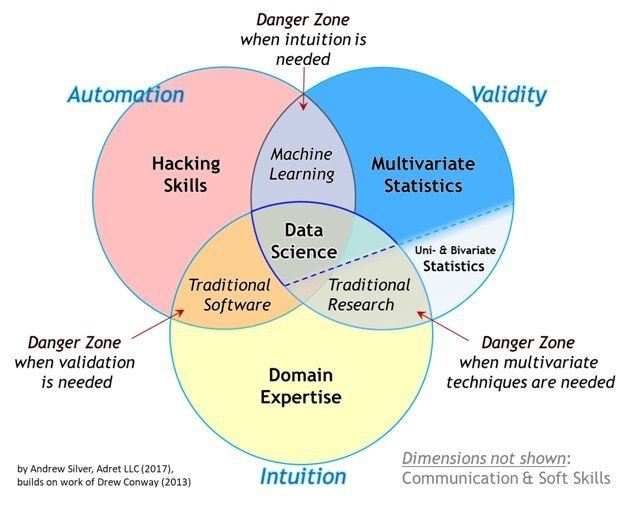]

---

## The Aim of Data Science 

### Generate

  + **Valid**  
      + <span style="color:#477acc"> scrutiny, discussion & limitations <span>
  + **Unbiased**
      + <span style="color:#477acc"> introspection, diversity & substantive knowledge <span>
  + **Reproducible** 
      + <span style="color:#477acc"> data provenance, code transparency & version control <span>
  + **Compelling** 
      + <span style="color:#477acc"> interpretable, intuitive & clear <span>
  
### insights using data to _influence and inform decision-making_.


---

## This Course focuses on

-  **Tools**: building a fundamental data science toolkit using `R`
    + Become a competent user of `R`
    + Promote self-learning: _don't just pass this course, make this part of your life_.
    + Master the art of managing errors
    
- **Data Management**: getting, tidying, and managing data 
    + Cleaning Dirty Data 
    + Structuring unstructured data types (like text)
    + Scraping 
    + Incorporating a "Never touch the data" philosophy
    
- **Analytic Approaches**: drawing insights
    + Exploring, Modeling, and Prediction

---

## Course Calendar

<center>

```{r,echo=F,message=F,tidy=T}
read_csv(here('Syllabus/fall-2020-timeline.csv')) %>% 
  {.[is.na(.)]="";.} %>% 
  select(-Date,-Assignment) %>%
  rename(Topics=Topic) %>% 
  slice(1:(n()-1)) %>%
  kable(., "html") %>% 
  kable_styling(font_size = 18,position = 'center')
```

---

**Who is the course for?**

- Anyone who (a) finds this stuff fascinating, (b) wants to understand how to fold data into their decision-making process, and (c) wants to build up their data skills.

- New `R` users; no programming experience assumed.

- This course is a survey of data science approaches using `R`. You'll walk out of this class being able to do a lot, but it is just a starting point. 

--

**What this course is not?**

- CS course on functional programming.

- A machine learning course (we dabble, but don't delve into any one concept in depth).

- A "big data" course: we won't delve into database structures, e.g. SQL and Hadoop, or cloud computing, e.g. Azure and AWS.


---

### Learning Virtually

- This class will meet virtually this semester. 

- Lecture will be divided into **_asynchronous_** and **_synchronous_** components.

--

- **_Asynchronous_** learning
  - Pre-recorded videos covering the main concepts for the week. 
  - Materials will be made available _one week prior_ to the scheduled class on the course website. 
  - Approx. 1 to 1.5 hours of content a week. 
  
--

- **_Synchronous_** learning
  - Meet over zoom at the scheduled class time.
  - Applied walkthroughs/hands-on examples
  - Approx. 1 to 1.5 hours a week. 
 
 
---

### Learning from afar?

![:space 5]

- **_All synchronous lectures will be recorded_** and saved to Canvas. 

![:space 2]

- Office hours Tuesdays **_9am to 11am_** (to accommodate different time zones).

![:space 2]

- Communication through **_Slack_** to coordinate with peers/TA/prof.

![:space 2]

- **Participation = f(Watching, Practicing, Questions)** 


---

class: newsection

# Reproducibility

---

## We focus on things like this...

<!-- 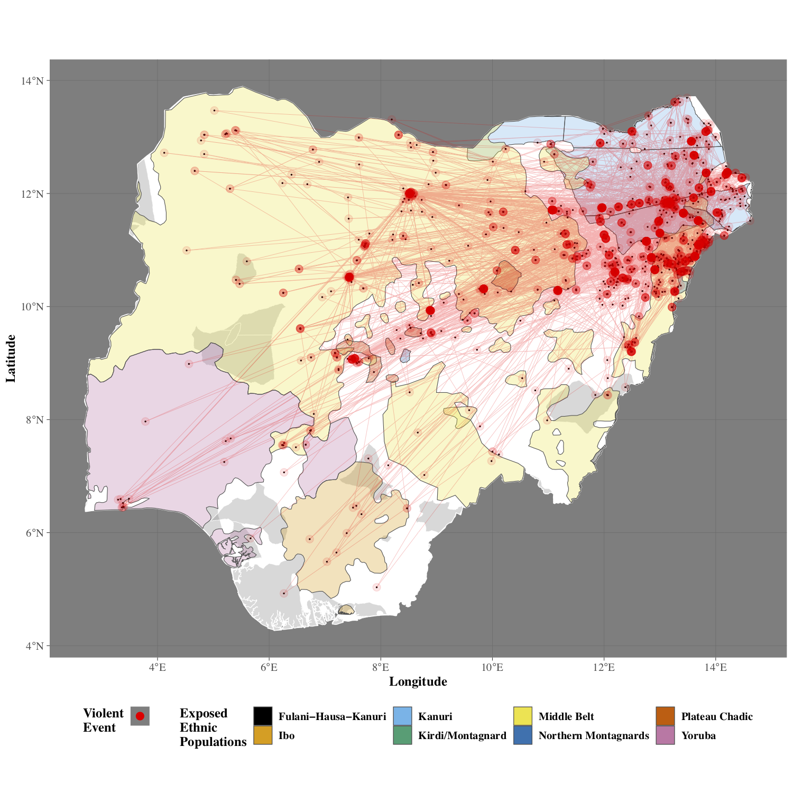 -->

.center[]

---

## And forget the reality that is this... 

.center[]


---


<br><br>
### Reproducibility is fundamental to the scientific method, but it is also a <u>practical reality</u>.

<br>

- juggling multiple versions of the same file

- collaboration can create conflicts across versions

- projects are picked up and put down &rarr; tracing the progression of a project across a spiderweb of files is not always easy (or possible)

- new people enter the fray &rarr; getting them up-to-speed means walking them through the labyrinth, which wastes time and resources.

---

# Generating Reproducible Work

<br>
### 1. Readable

### 2. Portable

### 3. Well-Named

### 4. Repeatable

### 5. Version Control

---

## Readable

```{r,eval=F}
x <- rnorm(100)
y <- 1 + 2*x + rnorm(100)
plot(y,x)
```

vs.

```{r,eval=F}
# Monte Carlo Simulation of a bivariate linear regression

sample_size <- 100  # simulated sample size

indep_var <- rnorm(sample_size) # independent variable

error     <- rnorm(sample_size) # simulate error

# generate dependent variable as function of the
# independent variable and some error.
dep_var <- 1 + 2*indep_var + error 

# plot values
plot(dep_var,indep_var)
```


???

- Well Commented Code and Functions**
- Well-Named Objects
- Leverage Spacing

To a degree, Code (like writing) should be more Hemmingway than Faulkner: concise,
clear, readable.

---

## Portable

![:space 3] 

- **Project can easily travel across computers**
    - e.g. R Project (`.rproj`), [`packrat`](https://rstudio.github.io/packrat/), and [`renv`](https://rstudio.github.io/renv/articles/renv.html)

--

- **Scripts avoid "machine" specific designations**
    + Avoid **specific file paths**: `/Users/my-user-name/data-projects/my-project`
    + **Retain software and packages versions** (e.g. `R`'s `packrat` package )

--

- **Use text files**
    + Not software dependent (e.g. .docx, .ia); Can open on any system
    + Can be easily searched via the commandline
    + Easy to track changes via version control
    
    
---

# Well-named

![:space 3] 

Maintain **designated folders** for different aspects of the project.

![:space 3]

```bash
data-project
├── raw_data/        # Where our input data lives
├── output_data/     # Where our manipulated data lives
├── R/               # Where our R functions live
├── figures/         # Where our generated figures live
├── reports/         # Where our text-based report output live
└── analysis/        # Where our the code for our analyses live
```

---

# Well-named

**No spaces!**
  + A space between designations can mean many things
  + spaces are ambiguous for the computer

.center[`data analysis 2.Rmd` <br> &darr; <br> `data-analysis-2.Rmd`]

--

**Names that state the purpose of the file** (no matter how long).

.center[`data-analysis-2.Rmd` <br> &darr; <br>`Analysis01_wrangling-census-data-for-visualization_v2.Rmd`]


---

## Repeatable

![:space 3]

- Every step of the **_project expressed as code_**

--

- **_Automate_** what you can

--

- Use **_functions_** to **_repeat common tasks_**

--

- Clearly **_state all dependencies_** (i.e. packages/modules) at the top of every script

```R
# Pacakges at the top
require(tidyverse)
require(sf)

# Then code
...
```

---

## Version Control
<br>

- **Retain a record of all changes** made throughout the project's lifespan

- **Easily handle collaboration**:
    + track who did what
    + uniform method dealing with conflicting changes
    
- **Provides a room for experimentation and non-linear exploration**

- No more **version file names**!

---

class: newsection

# Interacting with `R`

---

# R in a Nut Shell

![:space 5]

`R` is a statistical and graphical programming language that is based off a much older language called `S`. It's source code is written in C, Fortran, and R. And it's completely **free** under a [GNU General Public License](https://en.wikipedia.org/wiki/GNU_General_Public_License0).

--

### What this means for us:
- **No Barriers to Entry** &rarr; easy to acquire, easy to contribute

- **Active Community** &rarr; if you can think it, there is likely a package out there that does it.

- **Powerful and Adaptive** &rarr; build an estimator from scratch, scrape a web-site, automate the coding of a dataset. All is within one's reach.

---

# Why use R?

![:space 5]

`R` offers a powerful way to

![:space 3]

- **analyze** data
- **clean** excel spreadsheets (and any other data format) systematically
- **migrate** projects across platforms
- format and **clean** text
- **manage** _any_ data source
- produce compelling **graphics** and maps

---

# R Studio

![:space 10]

**R Studio** is a graphical user interface (GUI) for the R programming language. The software makes `R` more user-friendly adding some point-and-click functionality along with a complete integration of graphs, the data environment, and the coding script.

--

Think of it like this..
> `R` is the engine that runs all our commands, and R Studio is the leather seats and steering wheel. One does the work, the other eases how that work is done.

---

# Installing R and R Studio

![:space 1]

To install **R**, download R from CRAN via the following:

- Windows: https://cran.r-project.org/bin/windows/base/
- Mac: https://cran.r-project.org/bin/macosx/

To install **R Studio**, download from the following:

- https://www.rstudio.com/products/rstudio/download/

Useful **video tutorials**:

- [Prior TA's walkthrough](https://www.dropbox.com/s/7af77pyb1wh224w/R-startup.mp4?dl=0)
- Rstudio's Walkthrough:
  + [Install R](https://player.vimeo.com/video/203516510)
  + [Install RStudio](https://player.vimeo.com/video/203516968)

---

### Getting Familiar with R Studio

R Studio is broken up into **4 quandrants** that can be  arranged and customized to the users preference.

.center[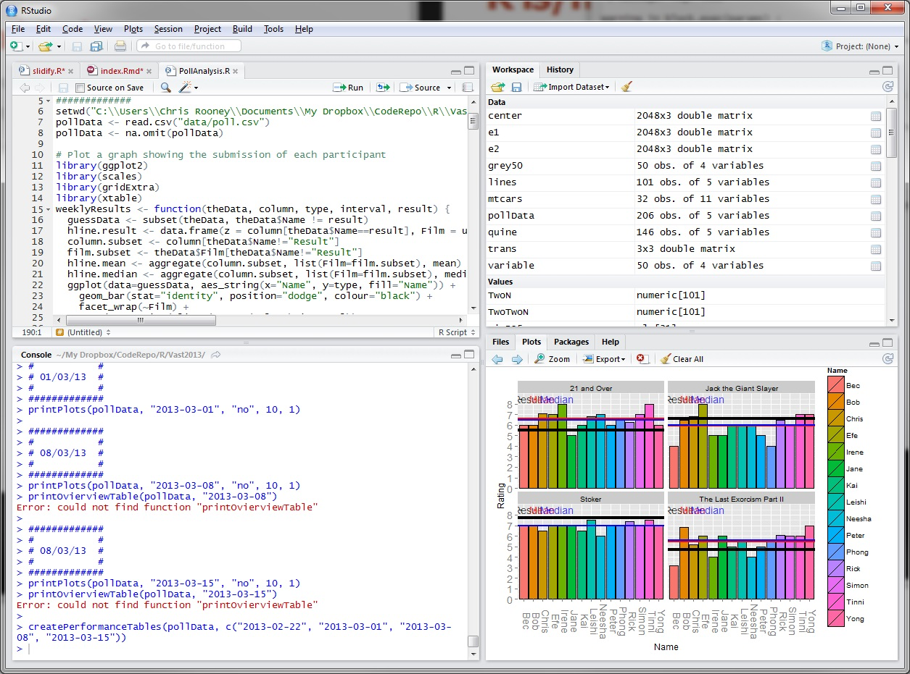]

---

### Getting Familiar with R Studio

.center[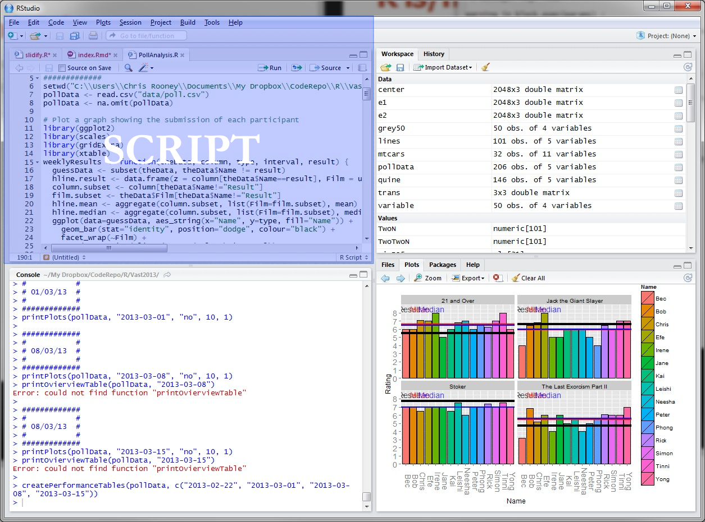]

---

### Getting Familiar with R Studio

.center[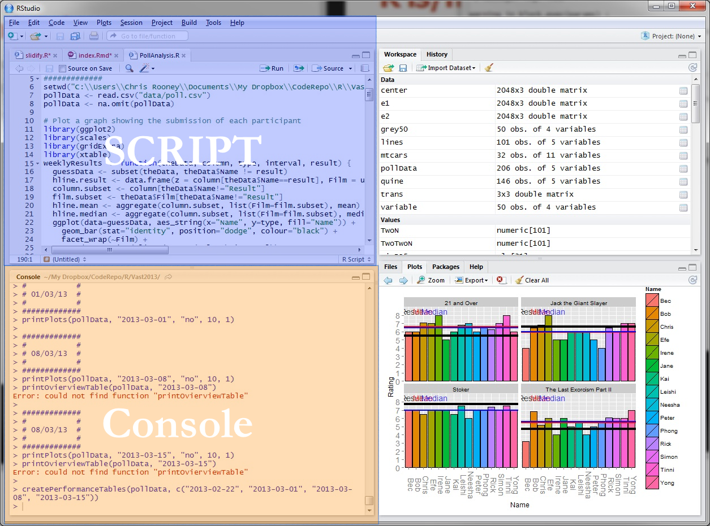]

---

### Getting Familiar with R Studio

.center[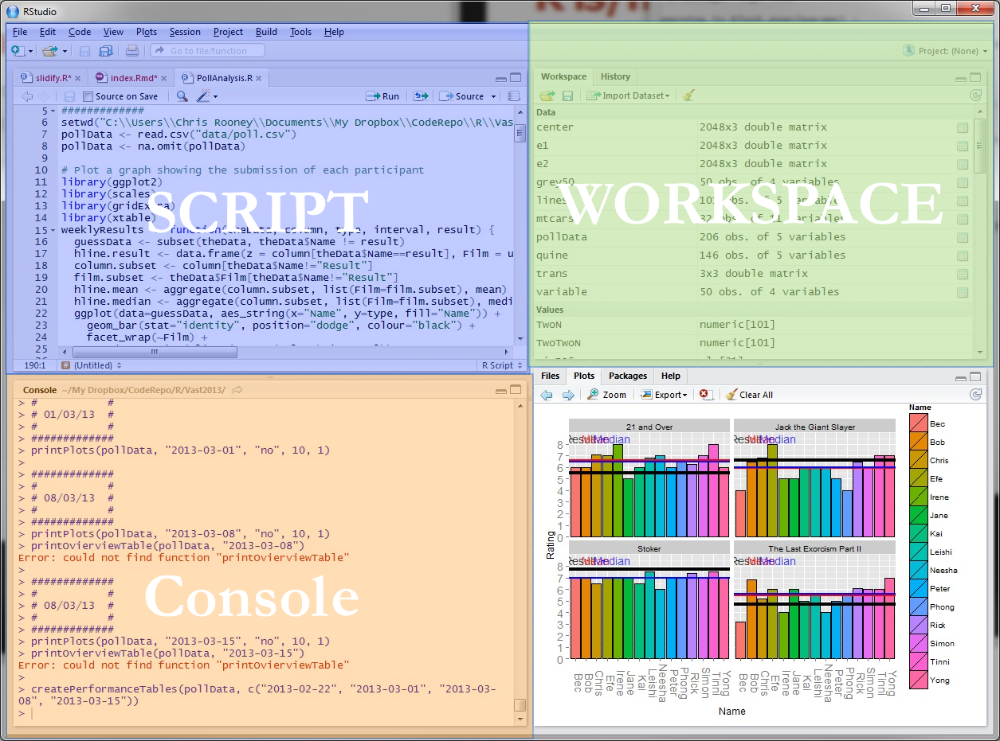]

---

### Getting Familiar with R Studio

.center[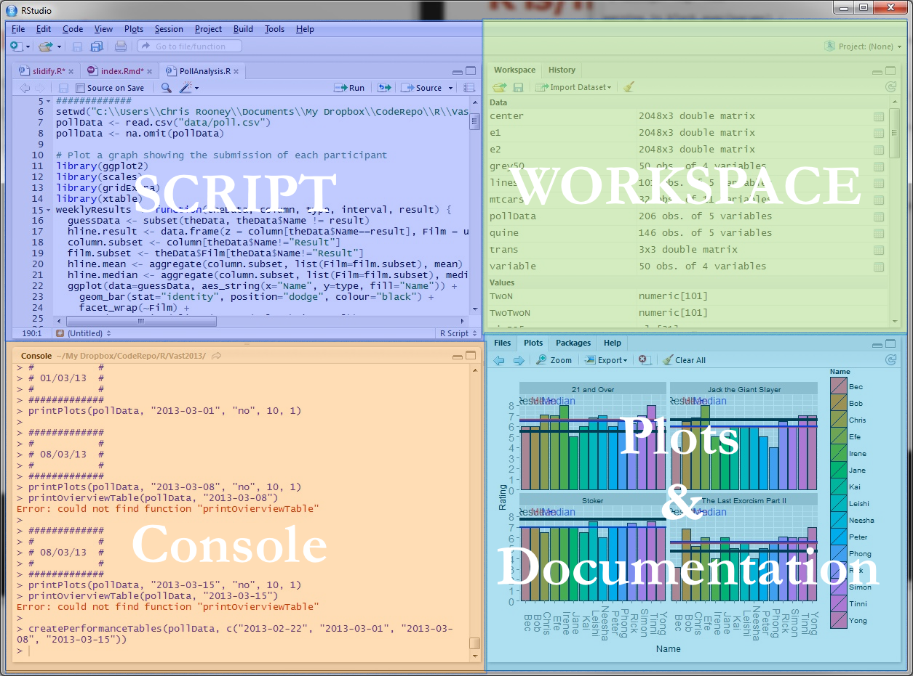]

---

# The Console

The console is where all the action happens. This is "`R`".

.center[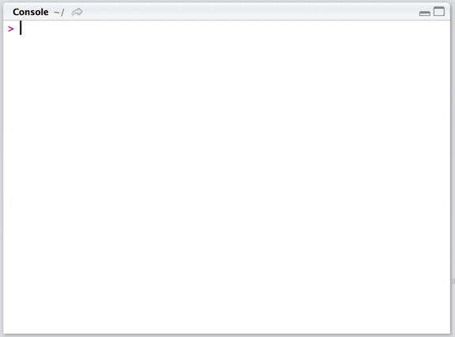]

---

# The Console

All commands are processed through the console directly (that is, one can type commands directly into it) or via a **script**.

.center[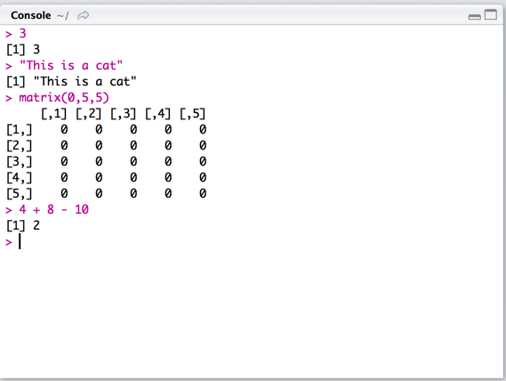]

---

# Scripts

A script is a `.R` text file where we write and run our code.

.center[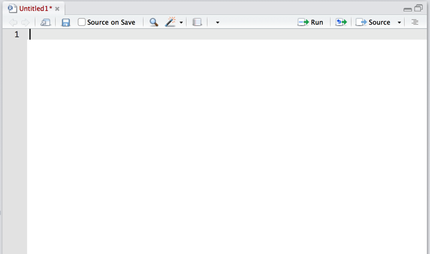]

---

# Scripts

A **RMarkdown** script is a `.Rmd` text file where we write **_prose_** and run our code together (more on this on Week 3).

.center[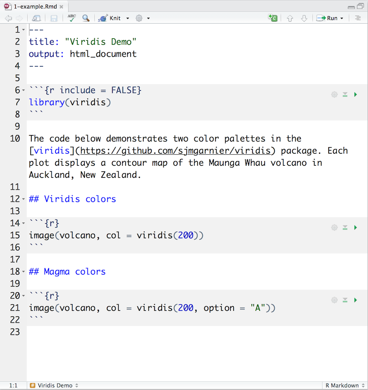]

---

# Scripts

When we write a line of code, we can run it in the console by highlighting the text and...
- clicking **`run`**
- pressing **`command + enter`** (mac)
- pressing **`control + enter`** (windows)

.left[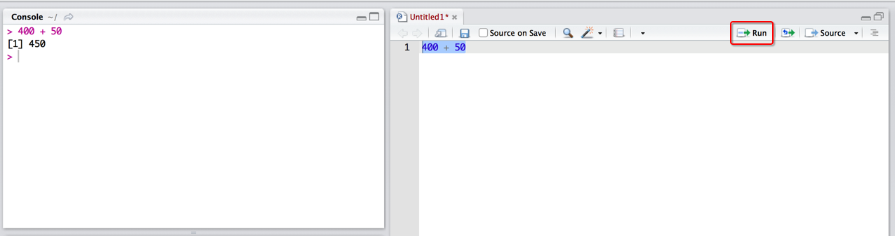]

---

# Scripts

Everything in a script will be treated as **code** -- that is if you run it, the line will be processed through the console.

However, we can leave comments and notes to ourselves by **commenting out** sections of the script using a **`#`**

.left[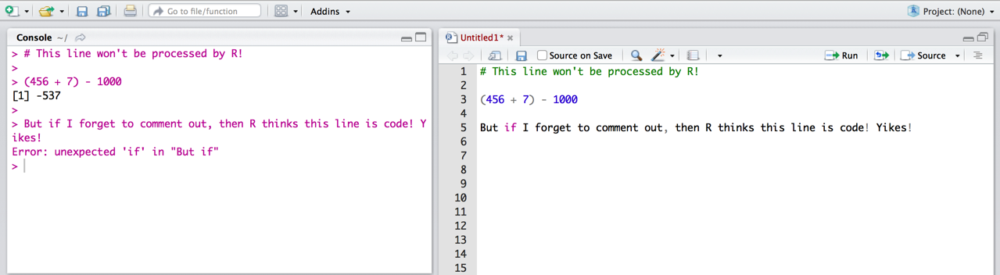]


