```{r setup, include=FALSE}
knitr::opts_chunk$set(echo = T,message=F,error=F,warning = F)
require(tidyverse)
require(here)
require(kableExtra)
```

layout: true

<div class="slide-footer"><span> 
PPOL670 | Introduction to Data Science for Public Policy

&emsp;&emsp;&emsp;&emsp;&emsp;&emsp;&emsp;&emsp;&emsp;

Week 1 <!-- Week of the Footer Here -->

&emsp;&emsp;&emsp;&emsp;&emsp;&emsp;&emsp;&emsp;&emsp;&emsp;&emsp;&emsp;

Work Flow and Reproducibility<!-- Title of the lecture here -->

</span></div> 


---

class: outline

# Plan for Today

- **Introduce the Course**

- **Reproducibility** 
  
    + what it means
    + how reproducible practices might save your life
    + how to build code that you and others can replicate and read

- **Version Control** 

    + why use it
    + how it works
    + how we'll use it
    
---

<br><br><br><br><br><br>
# What is data science?

---

<br>
.center[]

---

## The Aim of Data Science 

### Generate

  + **Valid**  
      + <span style="color:#477acc"> scrutiny, discussion & limitations <span>
  + **Unbiased**
      + <span style="color:#477acc"> introspection, diversity & substantive knowledge <span>
  + **Reproducible** 
      + <span style="color:#477acc"> data provenance, code transparency & version control <span>
  + **Compelling** 
      + <span style="color:#477acc"> interpretable, intuitive & clear <span>
  
### insights using data to _influence and inform decision-making_.


---

## This Course focuses on

-  **Tools**: building a fundamental data science toolkit using `R`
    + Become a competent user of `R`
    + Promote self-learning: _don't just pass this course, make this part of your life_.
    + Master the art of managing errors
    
- **Data Management**: getting, tidying, and managing data 
    + Cleaning Dirty Data 
    + Structuring unstructured data types (like text)
    + Scraping 
    + Incorporating a "Never touch the data" philosophy
    
- **Analytic Approaches**: drawing insights
    + Exploring, Modeling, and Prediction

---

## Course Calendar

<center>

```{r,echo=F,message=F,tidy=T}
read_csv(here('Syllabus/spring-2020-timeline.csv')) %>% 
  {.[is.na(.)]="";.} %>% 
  select(-Date,-Assignment) %>%
  rename(Topics=Topic) %>% 
  slice(1:(n()-1)) %>%
  kable(., "html") %>% 
  kable_styling(font_size = 18,position = 'center')
```

---

**Who is the course for?**

- Anyone who (a) finds this stuff fascinating, (b) wants to understand how to fold data into their decision-making process, and (c) wants to build up their data skills.

- New `R` users; no programming experience assumed.

- This course is a survey of data science approaches using `R`. You'll walk out of this class being able to do a lot, but it is just a starting point. 

--

**What this course is not?**

- CS course on functional programming.

- A machine learning course (we dabble, but don't delve into any one concept in depth).

- A "big data" course: we won't delve into database structures, e.g. SQL and Hadoop, or cloud computing, e.g. Azure and AWS.

---

## Installing `R` and `Rstudio`

<br>

**`R` Software**

To install `R`, download `R` from CRAN via the following:
 - Windows: https://cran.r-project.org/bin/windows/base/ (Links to an external site.)
 - Mac: https://cran.r-project.org/bin/macosx/
 
<br>

**`RStudio`**

To install `RStudio`, download from the following [site](https://www.rstudio.com/products/rstudio/download/) (scroll to the bottom):

---

class: newsection

# Reproducibility

---

## We focus on things like this...

<!--  -->

.center[]

---

## And forget the reality that is this... 

.center[]


---


<br><br>
### Reproducibility is fundamental to the scientific method, but it is also a <u>practical reality</u>.

<br>

- juggling multiple versions of the same file

- collaboration can create conflicts across versions

- projects are picked up and put down &rarr; tracing the progression of a project across a spiderweb of files is not always easy (or possible)

- new people enter the fray &rarr; getting them up-to-speed means walking them through the labyrinth, which wastes time and resources.

---

# Generating Reproducible Work

<br>
### 1. Readable

### 2. Portable

### 3. Well-Named

### 4. Repeatable

### 5. Version Control

---

## Readable

```{r,eval=F}
x <- rnorm(100)
y <- 1 + 2*x + rnorm(100)
plot(y,x)
```

vs.

```{r,eval=F}
# Monte Carlo Simulation of a bivariate linear regression

sample_size <- 100  # simulated sample size

indep_var <- rnorm(sample_size) # independent variable

error     <- rnorm(sample_size) # simulate error

# generate dependent variable as function of the
# independent variable and some error.
dep_var <- 1 + 2*indep_var + error 

# plot values
plot(dep_var,indep_var)
```


???

- Well Commented Code and Functions**
- Well-Named Objects
- Leverage Spacing

To a degree, Code (like writing) should be more Hemmingway than Faulkner: concise,
clear, readable.

---

## Portable

- **Project can easily travel across computers**
    - e.g. R Project (`.rproj`), [`packrat`](https://rstudio.github.io/packrat/), and [`renv`](https://rstudio.github.io/renv/articles/renv.html)

--

- **Scripts avoid "machine" specific designations**
    + Avoid **specific file paths**: `/Users/my-user-name/data-projects/my-project`
    + **Retain software and packages versions** (e.g. `R`'s `packrat` package )

--

- **Use text files**
    + Not software dependent (e.g. .docx, .ia); Can open on any system
    + Can be easily searched via the commandline
    + Easy to track changes via version control
---

# Well-named

- **No spaces!**
    + A space between designations can mean many things
    + spaces are ambiguous for the computer

.center[`data analysis 2.py` <br> &darr; <br> `data-analysis-2.py`]

--

- **Names that state the purpose of the file** (no matter how long).

.center[`data-analysis-2.py` <br> &darr; <br>`Analysis01_wrangling-census-data-for-visualization_v2.py`]

---

# Well-named

![:space 5] 

- Maintain **designated folders** for different aspects of the project.

```bash
data-project
├── raw-data/        # Where our input data lives
├── output-data/     # Where our manipulated data lives
├── py/              # Where our Python functions live
├── R/               # Where our R functions live
├── figures/         # Where our generated figures live
├── reports/         # Where our text-based (.tex/.md/.txt) live
└── analysis/        # Where our analyses live
```

---

## Repeatable

<br>

- Every step of the **_project expressed as code_**

- **Automate** what you can

- Use **_functions_** to **_repeat common tasks_**

- Clearly **_state all dependencies_** (i.e. packages/modules) at the top of every script

```R
# Pacakges at the top
require(tidyverse)
require(sf)

# Then code
...
```

---

## Version Control
<br>

- **Retain a record of all changes** made throughout the project's lifespan

- **Easily handle collaboration**:
    + track who did what
    + uniform method dealing with conflicting changes
    
- **Provides a room for experimentation and non-linear exploration**

- No more **version file names**!

---

class: newsection

# Version Control

---

## What is version control?

**Version control is a system that records changes to a file or set of files over time so that you can recall specific versions later.**

For many, "version-control" means something like this...

```
my-project
├── my-paper_v5.2.docx
├── Drafts/
    ├── my-paper_v5.1.docx
    ├── my-paper_v5.docx
    ├── my-paper_v4.7.docx
    ├── my-paper_v4.6.docx
    ├── my-paper_v4.5.docx
    ...
```

Version control in this manner is **error prone and complicates collaboration**

---

## What is `git`?

<br>
<br>

- `git` is one of many possible version control protocols (others include mercurial, bazaar, darc, ...)

- It is useful because it saves snapshots rather than just tracking differences. Treats **data as a stream of snapshots**.

- Changes are made **locally** and then can be easily incorporated and merged with the work of others. No network dependencies required.

- It’s impossible to change the contents of any file or directory without Git knowing about it.

---

## How `git` works...

Three states:

- **Committed** &rarr; data is safely stored in your local database.
- **Modified** &rarr; changed the file but have not committed it to the database yet.
- **Staged** &rarr; marked a modified file in its current version to go into the next commit snapshot.


.center[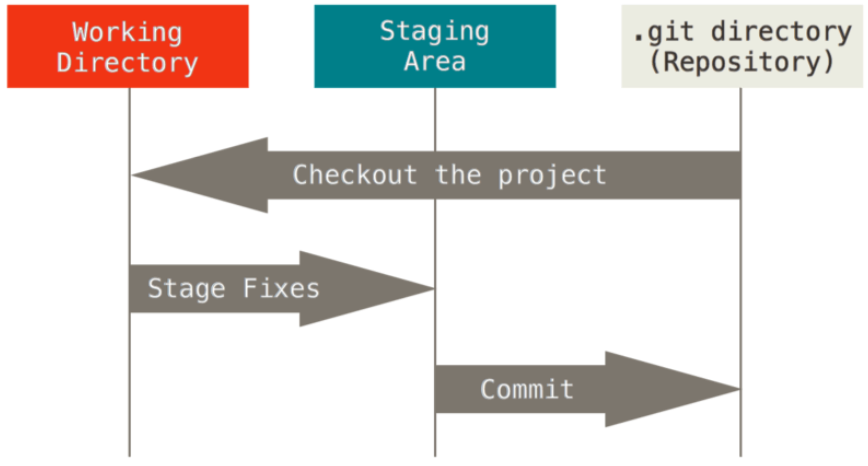]

---
## What is Github?
<br>
<br>
<br>
- single largest host for Git repositories (i.e. the `.git` that the `git init` produces)

- can `push` our changes to the repository to upload our changes to the remote.

- Recall that a git repository is an **entire snapshot** of a project and all its data, so the fact that we can upload and download files, work on them locally, and then incorporate those changes back into the main work flow is quite powerful!

---

## Create a new `git` repository

First, **create an account at [Github.com](https://github.com/).** The proceeding steps will go through how to create a `git` repository through Github. 

Then, 

.center[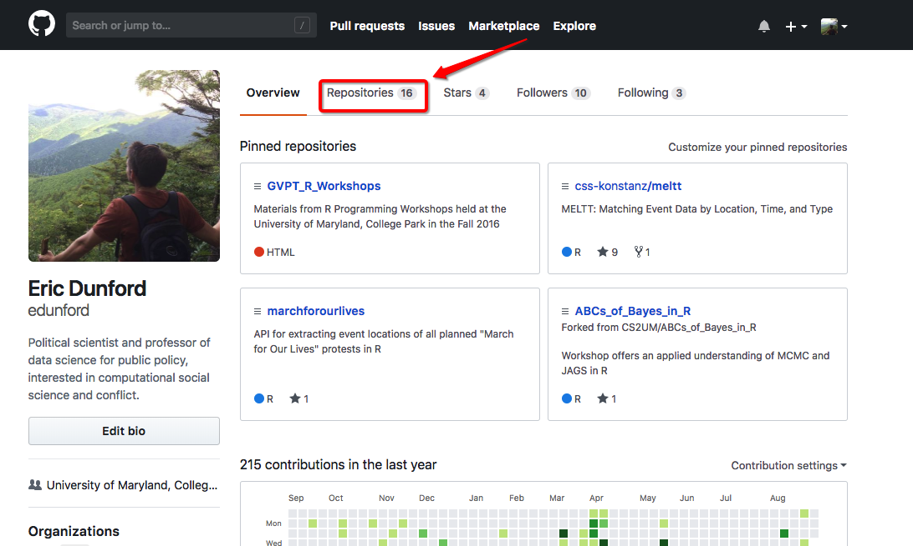]

---
## Create a new `git` repository

.center[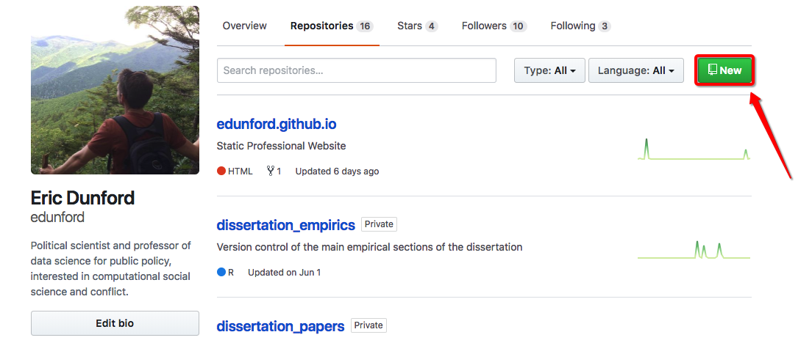]

---
## Create a new `git` repository

.center[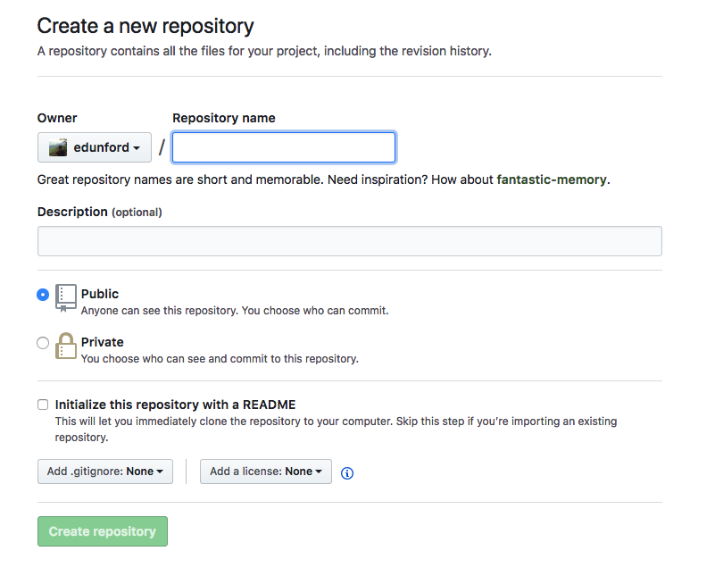]

---
## Create a new `git` repository

.center[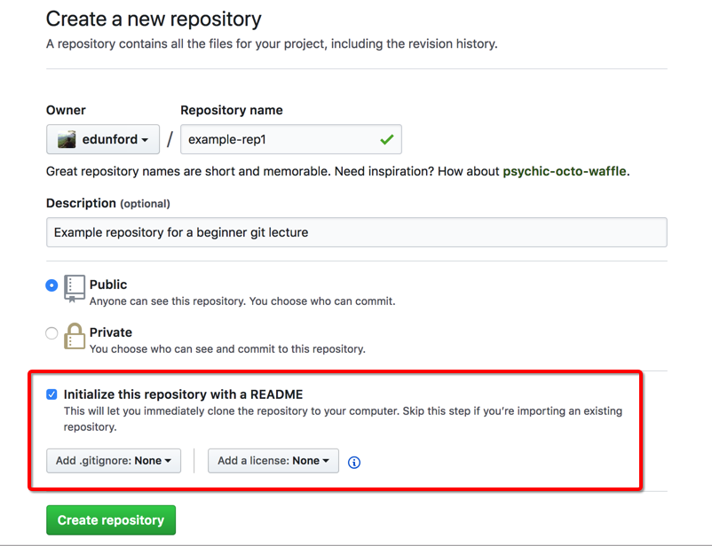]

---
## Create a new `git` repository

.center[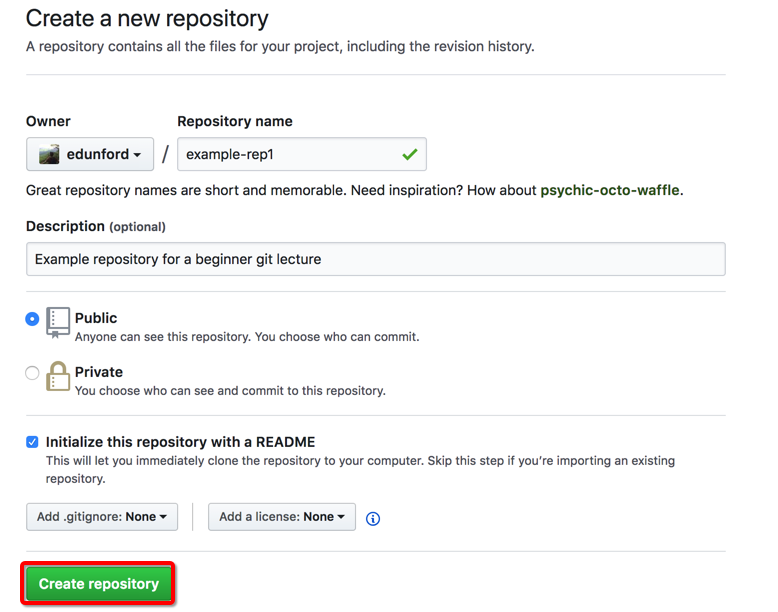]

---
## Create a new `git` repository

.center[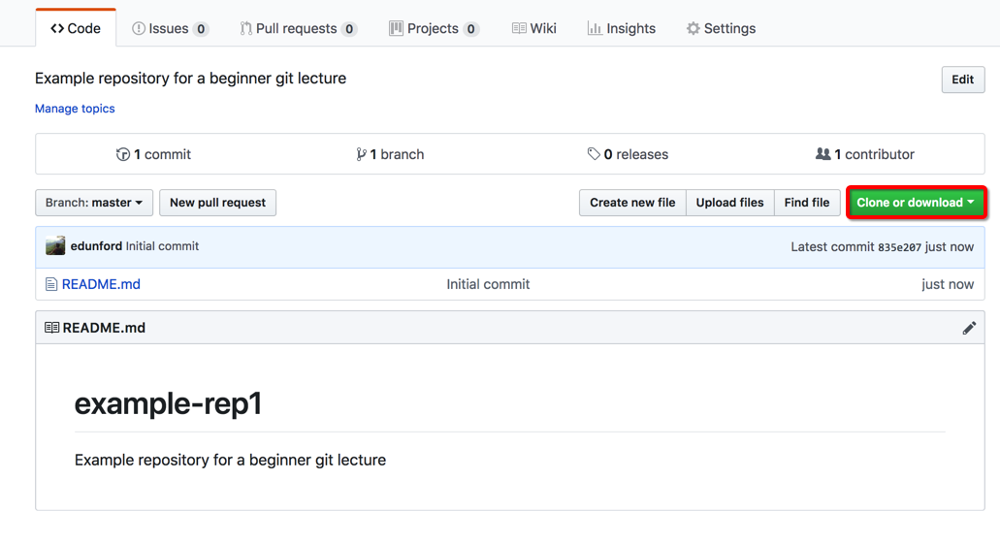]

---
## Create a new `git` repository

.center[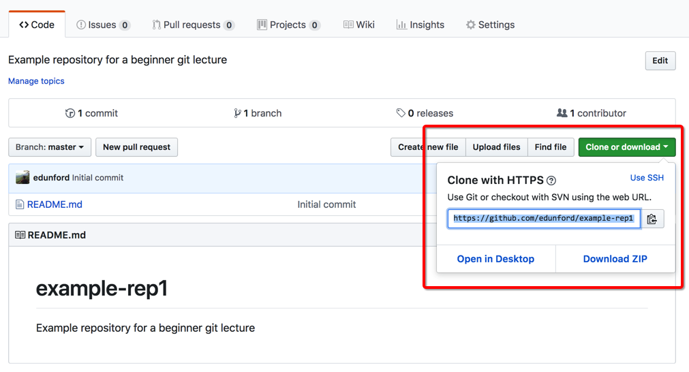]

---

## Using `git` within Rstudio

<br>

All current versions of Mac-OS come pre-installed with `git`. If that's not the case, or you have a windows computer, you can download `git` here: https://git-scm.com/downloads

Once installed, we'll access git using `RStudio`. Here are two useful tutorials for connecting `git` with `R` Studio. 

- [RStudio Blog - Getting Started with Version Control using Git](https://support.rstudio.com/hc/en-us/articles/200532077-Version-Control-with-Git-and-SVN) 
- [UChicago cfss post - Using Git within RStudio](https://cfss.uchicago.edu/git05.html#). Also, note that I've put an `.html` version of this walkthrough on the class website.
- Also consult the [screencast](https://www.dropbox.com/s/qdw38hbvy0kj630/git.mp4?dl=0) the TA made on this. 

---

## Using `git` within Rstudio

<br>
### 1
.center[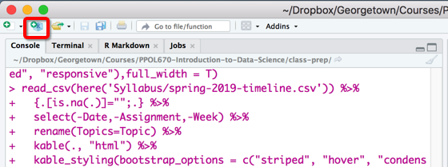]

---

## Using `git` within Rstudio

<br>
### 2
.center[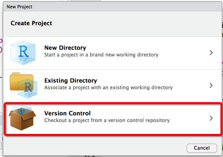]

---

## Using `git` within Rstudio

<br>
### 3
.center[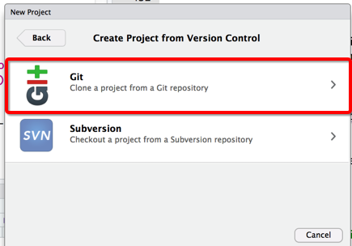]

---

## Using `git` within Rstudio

<br>
### 4
.center[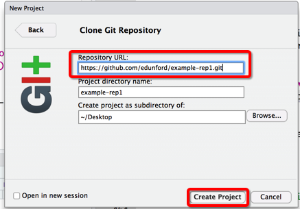]


