```{r setup, include=FALSE}
require(tidyverse)
knitr::opts_chunk$set(echo = T,message=F,error=F,warning = F,cache=T)
```

layout: true

<div class="slide-footer"><span> 
PPOL670 | Introduction to Data Science for Public Policy

&emsp;&emsp;&emsp;&emsp;&emsp;&emsp;&emsp;&emsp;&emsp;

Week 2 <!-- Week of the Footer Here -->

&emsp;&emsp;&emsp;&emsp;&emsp;&emsp;&emsp;&emsp;&emsp;&emsp;&emsp;&emsp;

Introduction to R <!-- Title of the lecture here -->

</span></div> 

---
class: outline

# Outline for Today 

<br> 

- **Interacting** with `R` and `RStudio`

- **Objects** & **Functions**

- **Data Structures** and **accessing** data points

- **Importing/Exporting** data & setting the **working directory**

- Mathematical & Logical **Operators**


---

class: newsection

# Interacting with `R`

---

# R in a Nut Shell

![:space 5]

`R` is a statistical and graphical programming language that is based off a much older language called `S`. It's source code is written in C, Fortran, and R. And it's completely **free** under a [GNU General Public License](https://en.wikipedia.org/wiki/GNU_General_Public_License0).

--

### What this means for us:
- **No Barriers to Entry** &rarr; easy to acquire, easy to contribute

- **Active Community** &rarr; if you can think it, there is likely a package out there that does it.

- **Powerful and Adaptive** &rarr; build an estimator from scratch, scrape a web-site, automate the coding of a dataset. All is within one's reach.

---

# Why use R?

![:space 10]

`R` offers a powerful way to

- **analyze** data
- **clean** excel spreadsheets (and any other data format) systematically
- **migrate** projects across platforms
- format and **clean** text
- **manage** _any_ data source
- produce compelling **graphics** and maps

---

# R Studio

![:space 10]

**R Studio** is a graphical user interface (GUI) for the R programming language. The software makes `R` more user-friendly adding some point-and-click functionality along with a complete integration of graphs, the data environment, and the coding script.

--

Think of it like this..
> `R` is the engine that runs all our commands, and R Studio is the leather seats and steering wheel. One does the work, the other eases how that work is done.

---

# Installing R and R Studio

![:space 5]

To install **R**, download R from CRAN via the following:

- Windows: https://cran.r-project.org/bin/windows/base/
- Mac: https://cran.r-project.org/bin/macosx/

To install **R Studio**, download from the following:

- https://www.rstudio.com/products/rstudio/download/

Useful **video tutorials**:

- [Prior TA's walkthrough](https://www.dropbox.com/s/7af77pyb1wh224w/R-startup.mp4?dl=0)
- Rstudio's Walkthrough:
  + [Install R](https://player.vimeo.com/video/203516510)
  + [Install RStudio](https://player.vimeo.com/video/203516968)

---

### Getting Familiar with R Studio

R Studio is broken up into **4 quandrants** that can be  arranged and customized to the users preference.

.center[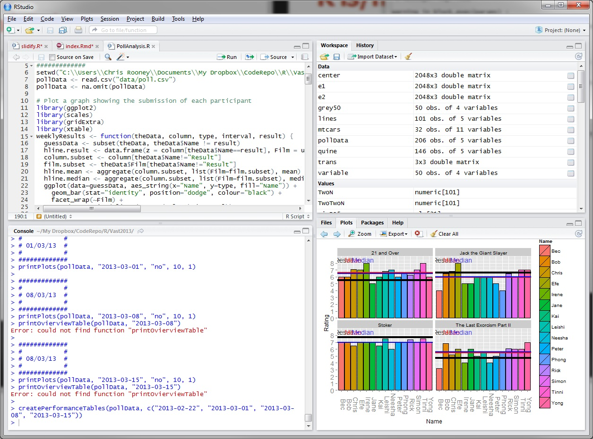]

---

### Getting Familiar with R Studio

.center[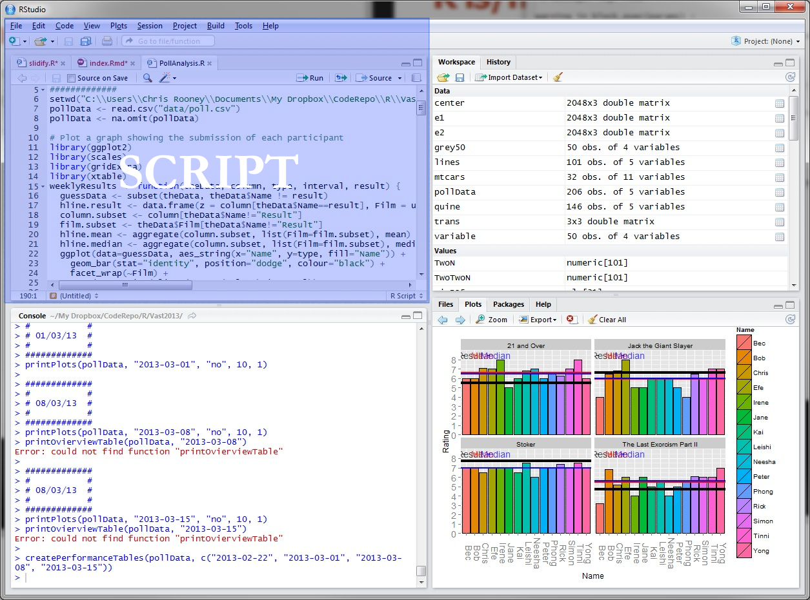]

---

### Getting Familiar with R Studio

.center[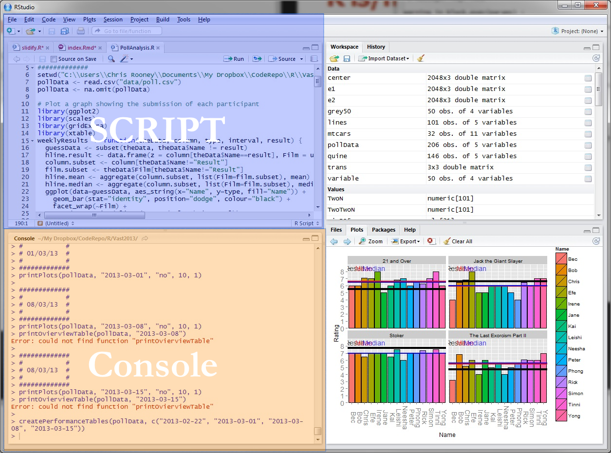]

---

### Getting Familiar with R Studio

.center[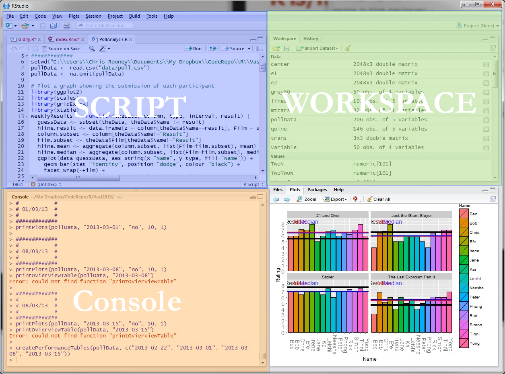]

---

### Getting Familiar with R Studio

.center[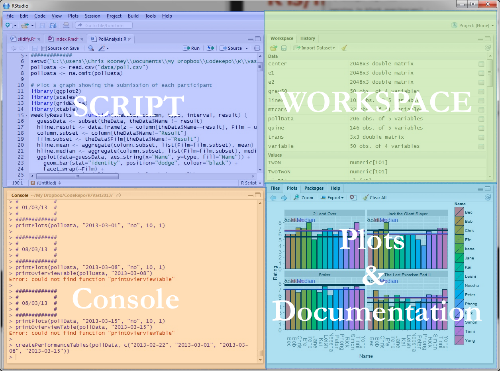]

---

# The Console

The console is where all the action happens. This is "`R`".

.center[]

---

# The Console

All commands are processed through the console directly (that is, one can type commands directly into it) or via a **script**.

.center[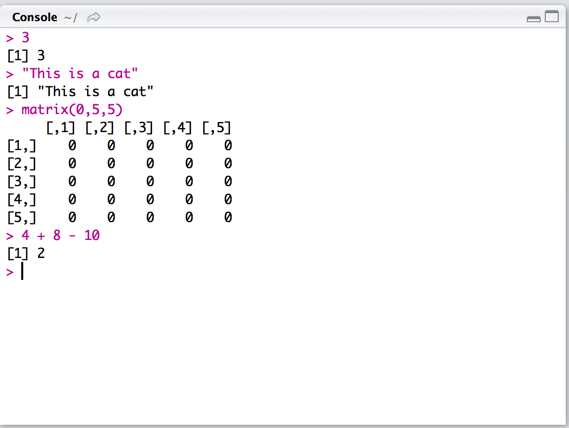]

---

# Scripts

A script is a `.R` text file where we write and run code our code.

.center[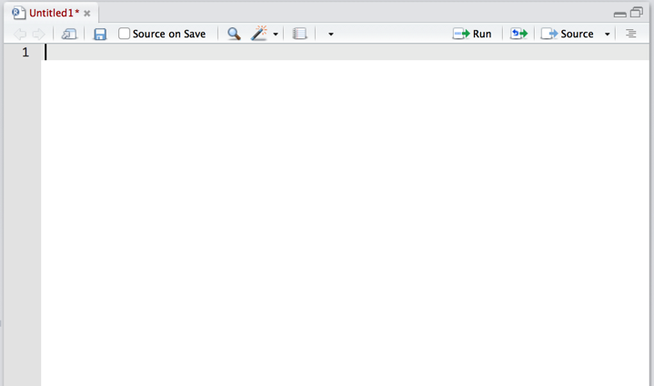]

---

# Scripts

When we write a line of code, we can run it in the console by highlighting the text and...
- clicking **`run`**
- pressing **`command + enter`** (mac)
- pressing **`control + enter`** (windows)

.left[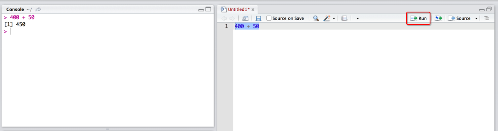]

---

# Scripts

Everything in a script will be treated as **code** -- that is if you run it, the line will be processed through the console.

However, we can leave comments and notes to ourselves by **commenting out** sections of the script using a **`#`**

.left[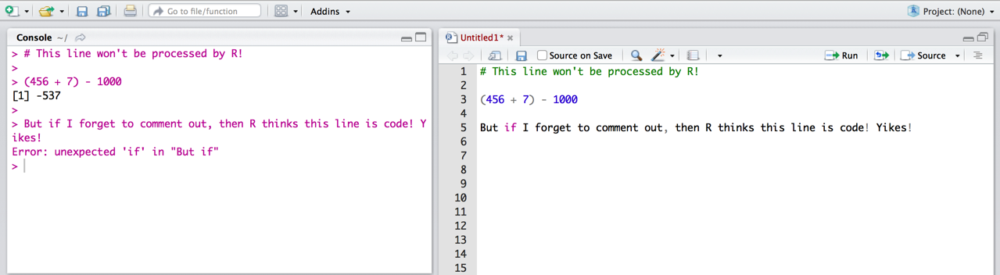]

---

class: newsection

# Objects

---

# Objects

![:space 10]

R uses a specific set of rules to govern how it looks up values in the environment.

We manage data by assigning it a name, and referencing that name when we need to use the information again.

Officially, this is called `lexical scoping`, which comes from the computer science term "[lexing](https://en.wikipedia.org/wiki/Lexical_analysis)". Lexing is the process by which text represents meaningful pieces of information that the programming language understands.

---

# Assigning an Object

![:space 10]

In simple terms, an `object` is a bit of text that represents a specific value.
```{r}
x <- 3
x
```

Here we've assigned the value `3` to the letter `x`. Whenever we type `x`, `R` understands that we really mean `3`.

---

# Assigning an Object

![:space 5]

There are three standard assignment operators:
- `<-`
- `=`
- `assign()`

"Best practice" is to use the `<-` assignment operator.
```{r}
x1 <- 3
x2 = 3
assign("x3",3)
c(x1, x2, x3)
```

---

# Assigning an Object

![:space 5]

Note that lexical scoping is flexible. Objects can be written and re-written when necessary.
```{r}
object <- 5
object
object <- "A Very Vibrant Shade of Purple"
object
```

<br>

> Down the road it will help to give objects <u>meaningful names</u>!

---

# Objects

One can see all the objects in the environment by either looking at the user interface in RStudio (specifically, the **environment tab**)...

.center[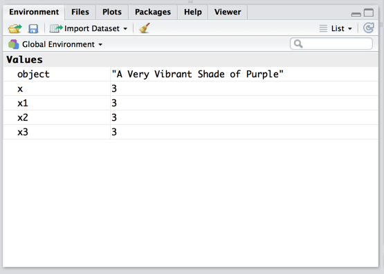]

---

# Objects

![:space 10]

One can see all the objects in the environment by either looking at the user interface in RStudio (specifically, the **environment tab**)... or by typing `ls()` in the console.

```{r}
ls()
```

---

# Object Classes

![:space 10]

Once assigned, an object has a **class**. A class describes the properties of the **data type** or **data structure** assigned to an object.

We can use the function `class()` to find out what kind of data type or structure our object is.
```{r}
class(x) 
``` 

The object `x` is of class `numeric`, i.e. a number.

---

# Object Classes

There are [many classes](https://www.tutorialspoint.com/r/r_data_types.htm) that an object can take.

```{r}
obj1 <- "This is a sentence"
obj2 <- TRUE
obj3 <- factor("This is a sentence")
c(class(obj1),class(obj2),class(obj3))
```
<br>
<br>

--

> Understanding what class of object one is dealing with is important --- as it will determine what kind of manipulations one can do or what functions an object will work with.

---

# Object Classes

![:space 10]

As noted, there are many different **data types** in `R`. We will primarily run into the following types:
<br>
<br>
.center[
| Type | Example|
|---|---|
| Integer | `7` |
| Numeric/Double | `4.56` |
| Character | "Hello!" |
| Logical | `TRUE` |
| Factor | `"cat" (1)` |
]

---

# Object Coercion

![:space 10]

When need be, an object can be **coerced** to be a different class.
```{r}
x
as.character(x)
```
Here we transformed `x` -- which was an object containing the value `3` --  into a character. `x` is now a string with the text "3".

---

# Removing objects from the Environment

![:space 10]

We often want to get rid of objects after creating them. To **delete** (or drop) an object from the working directory, use the function `rm()` -- which stands for "remove".
```{r}
ls()
rm(x,x1,x2,x3,X)
ls()
```

---

# Clearing the Environment

We can also remove **<u>_all_</u>** objects from the environment at once by typing the following command.

```{r,eval=F}
rm(list=ls(all=T))
```

Or we can do so from R Studio by clicking on the `broom icon`.

.center[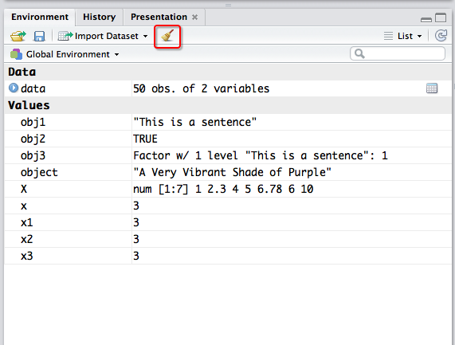]

---

# Objects: So what's the point?

![:space 5]

**Objects** offer a way to **reference different data**. This means that we can play around with _a lot_ of different data type simultaneously.

This makes it easier to:

--
  + **manage** and use multiple datasets at the same time
  + **extract** and manipulate single variables
  + **work** with little bits of data at a time to make sure your calculations work.

--
> Note that the only way to <u>hold onto information</u> is to assign it as an object! Else the information is printed but instantly forgotten by `R`

---

class:newsection

# Data Structures

---

## Data Structures

![:space 10]

There are also many ways data can be **organized** in `R`.

The same object can be organized in different ways depending on the needs to the user. Some commonly used data structures include:

- `vector`
- `matrix`
- `data.frame`
- `list`
- `array`

---

# Vector

![:space 10]

```{r}
X <- c(1, 2, 4, 5, 44, 6, 10)
X
class(X)
length(X)
```

---

# Data Frame

![:space 10]

```{r}
data.frame(X)
```

---

# Matrix

![:space 10]

```{r}
matrix(X)
```

---

# List

![:space 10]

```{r}
list(X)
```

---

# Array

![:space 10]

```{r}
array(X,dim = c(2,2,2))
```

---

# The point...

![:space 5]


- **Many ways to organize the same piece of information `R`**
  + different data structures afford us different advantages and bring with them different limitations.
  
-  We need to understand the **_structure_** of a data object to understand how to **_access_** the information inside.

- As you become more acquainted with `R`, you'll see and use other types of data structures more often.

- We'll rely mainly on a special type of `data.frame` called a `tibble` data frame. (More on this next time!)


---

class:newsection

# Accessing<br>Relational<br>Data

---

## Accessing a `data.frame` Object

![:space 10]

One must understand the **structure of an object** in order to systematically access the material contained within it.

--

Let's use a dataset inherent to `R` called `cars`. There are a number of datasets that are built into `R`. These are for demonstration purposes.

Note that these data will not appear in the environment <u>**until we assign them to an object**</u>.

```{r}
data <- cars
class(data)
```

---

## `data.frame`: relational structure

An easy way to see what's inside a data object is to just `print()` it. `R` prints objects automatically in the console.
```{r}
data
```


---

## `data.frame`: relational structure

We can look at the **structure** of a data object by using the `str()` function.
```{r}
str(data)
```

Or grad that variable names using the `colnames()` function.
```{r}
colnames(data)
```

---

## Accessing data in a `data.frame` 

We can leverage what we know about the dimensionality of the data to extract parts of it.

We do this by using brackets `[]` alongside the data object. We then can access the **dimensions** in the data by specifying the row and column

<br><br><br>
`data[`<font color = 'red'>`row`</font>`,`<font color = 'blue'>`column`</font>`]`

---

```{r,echo=FALSE,fig.align="center"}
source('explain_data_frames.R')
explain_df(1,Row)
```

---

```{r,fig.align="center",echo=F}
explain_df(3,Row)
```

---

```{r,fig.align="center",echo=F}
explain_df(1:3,Row)
```

---

```{r,fig.align="center",echo=F}
explain_df(1,Col)
```

---

```{r,fig.align="center",echo=F}
explain_df(3,Col)
```

---

```{r,fig.align="center",echo=F}
explain_df(2:4,Col)
```
    
---


```{r,echo=FALSE,fig.align="center"}
explain_df2(2,1)
```


---

```{r,echo=FALSE,fig.align="center"}
explain_df2(1:3,2)
```

---

```{r,echo=FALSE,fig.align="center"}
explain_df2(2:3,3:4)
```

---

## Dimensions

![:space 10]

The function `dim()` can tell use about the dimensions of a data object.

```{r}
dim(data)
```

We now know that the object `data` has **50 rows** and **2 columns**.

---

## Accessing relational data 

![:space 10]

```{r}
data[,2] # Access the entire 2nd column
data[49,] # Access just the 49th row
```


---

## Accessing relational data 

![:space 5]

```{r}
data[1,2] # Access just a cell
```

--

```{r}
data[2:3,1:2] # partial subset
```

--

The key is to keep in mind the dimensions. We can't access data that isn't there.

```{r}
data[51,]
```

---

## Accessing variables 

Most data objects can be accessed using `$` call sign.

`$` acts as a **key** by which we can extract a specific variable or data feature.

If we hit **Tab** after specifying the `$` after our data object, R Studio will offer a list of all available variables.

.center[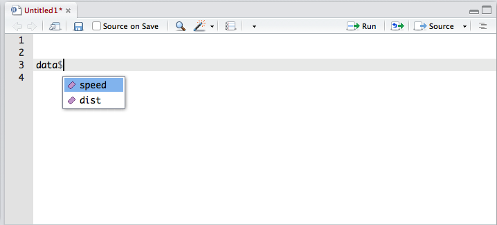]

---

## Accessing variables 

![:space 10]

Here we call the `speed` variable from our dataset.
```{r}
data$speed
```


---

![:space 15]

There are many functions designed to help us understand the **dimensions** of a data structure.
```{r}
dim(data) # Dimensions
nrow(data) # Number of Rows
ncol(data) # Number of Columns
```


---

![:space 10]

There are also some useful functions built into R to view portions of a data structure.

```{r}
head(data,3) # Reports the 3 first entries
tail(data,3) # Reports the 3 last entries
```

---

![:space 15]

`summary()` allows for one to quickly summarize the distributions across a set of variables
```{r}
summary(data)
```

---

class:newsection

# Operators

---


## Mathematical Operators

Broadly speaking, `R` functions as general calculator that can process a variety of data types.

As we can see, most operators in `R` are the usual suspects, but some forms are particular to `R`.

.center[
| Operation       |      Calc      |     Out |
|-----------------|-----------------|-----------------|
|Addition     |         `3 + 4`     |      `7`|
|Subtraction  |          `3 - 4`    |       `-1`|
|Multiplication    |    `3 * 4`       |    `12`|
|Division           |   `3 / 4`     |     `.75`|
|Exponentiation     |   `3 ^ 4`      |     `81`|
|Modulo     |  `4%%3`     |     `1`|
]

In the example, we'll walk through a few more operators.

---

# Mathematical Functions

![:space 10]

There are a range of functions designed to ease mathematical calculations. Some of these functions are to calculate specific values, such as the **natural log** or **Euler's number** ($e^a$).

```{r}
log(4)
exp(5)
```

---

![:space 10]

There are a range of functions designed to ease mathematical calculations. Others can be used to find the **sum** for a numerical vector, the **mean**, or the **median**

```{r}
x <-  c(1,3,7,100)
sum(x)
mean(x)
median(x)
```

---

# Logical Operators

Boolean statement (i.e. true/false statements) are central to any computer programming environment. Boolean statements allow us to make quick conditional evaluations, which are key to **subsetting** data.

--

The following outlines the various types of boolean statements available.

```{r, eval=F}
x == y      # equals to
x != y      # does not equal
x >= y      # greater than or equal to
x <= y      # less than or equal to
x > y       # greater than
x < y       # less than
```


--

Statements can be combined using **and** (`&`) **or** (`|`) statements to make more specific queries.
```{r,eval=F}
x==1 & y==5 # "and" conditional statements
x==1 | y==5 # "or" conditional statements
```


---

![:space 10]

Boolean statements can be fed directly into data objects via the brackets method `[]`. This offers a powerful and simple way to subset data.

```{r}
x <-  c(1,33,100,.6,5,77)
x
x[x > 30]
```

---

![:space 10]

There are also a number of base functions that provide useful boolean evaluations. Here are just a few examples...

```{r}
is.character("hello") # for class
all(c(T,F,F)) # are all entries True?
identical(1+1,2) # are these entries the same?
```

---

![:space 10]

Finally, boolean statements have a nice property in `R`. If we convert a boolean statement to a **numeric class**, `TRUE` values convert to `1` and `FALSE` values convert to `0`.

This offers us a quick way of generating **dichotomous** values.

```{r}
x <- 1:10
x >= 5
as.numeric(x >= 5)
```

---

## Subsetting with logical operators

We can combine what we know about logical and accessing the columns and rows in a relational `data.frame` to a powerful effect. 

--

```{r,tidy=T}
d <- data.frame(x = c(100,200,300,400),
                y = c("a","b","b","a"))
d
```

--

```{r}
d[ d$x > 2, ]
```

---

# Tutorial

<br>
<br>
.center[**Try for yourself!**]
<br>
<br>
<br>
The following link will take you to an interactive notebook where you can try out some of the concepts we just discussed in class
<br>
<br>
<br>
.center[**[Objects, Data Structures, and Operators](https://dunforde.shinyapps.io/week02-interactive-practice-01/)**]


---

class: newsection

# Functions

---

# What are functions?

![:space 10]

A **function** is a type of object in `R` that can perform a specific task. Unlike objects that hold data, functions take **arguments** and return the output of some manipulation.

--

A function is specified first with the object name and then parentheses. For example, the function `log()` calculates the natural log of any number placed inside the parentheses.
```{r}
log(4)
```

---

# Where are functions exactly?

![:space 10]

Functions operate in the **background**.

There are a number of functions in `R`, known as **base functions**, that are always running when you turn `R` on.

When we need to do things that are <u>**not**</u> a part of the base functionality, we can import new functions by installing **packages**. But more on this later.

---

# Some common functions

![:space 5]

We've already come a across a few functions, and we'll learn a lot more moving forward. Just keep in mind that whenever something is wrapped in parentheses `()`, it's a function.

Here are examples of a few common base functions that we'll see.

.center[
| Function | Description |
| :---: | :---: |
| `c()` | links entries together as a vector |
| `as.character()` | coerces the input to be a character class |
| `length()` | reports how "long" a vector or data frame is |
| `dim()` | reports the dimensions of a data frame |
| `class()` | reports the class of an object |
]

---

## Figuring out what a function does...

All functions in `R` contain rich documentation regarding how a function works, the inputs it requires, and example code. We can access this documentation by using `?` in front of the function.
```{r,eval=F}
?c()
```

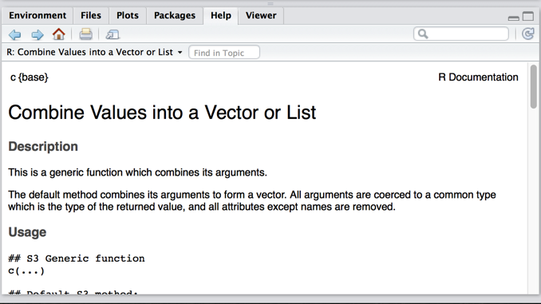

---

class:newsection

# Packages

---

## R Packages

![:space 10]

There are a number of `packages` that are supplied with the R distribution. These are known as "[base packages](https://stat.ethz.ch/R-manual/R-devel/library/base/html/00Index.html)" and they are in the background the second one starts a session in R.

--

- A **`package`** is a set of functions and programs that perform specific tasks. 

- By installing packages, **we introduce new forms of functionality to the R environment**.

---

## R Packages

![:space 10]

To use the content in a package, one first needs to **install it**. One can do this by utilizing the following function: `install.packages()`. By inserting the name of a specific package, we can connect to an R "mirror" and download the binary of the package.

```{r,eval=F}
install.packages("tidyverse")
```

The version of that package is then saved on your computer and can be called at any time (on or offline).

---

## R Packages

![:space 10]

Once installed, it's on the system for good. You can then reference or load the package any time you wish to use a function from it.

There are two functions we can use to load a package: `library()` and `require()`.

```{r,eval=F}
library(tidyverse)

# or

require(tidyverse)
```

> You must <u>load</u> the package before you can use any function in it.

---

`R Studio` also offers us a way to install packages through the interface.

If we click on the `Packages` tab and then click `Install`, we can download a package by typing its name.

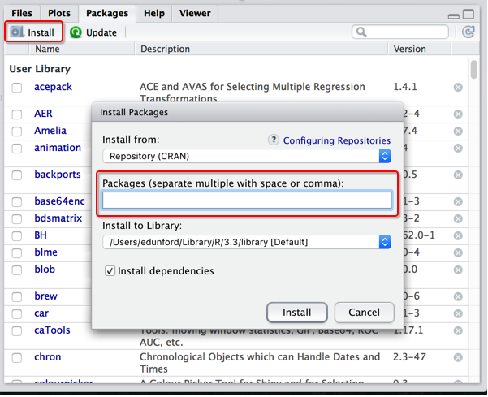

---

We then can **load** the package from R Studio by clicking the check box beside the packages name.

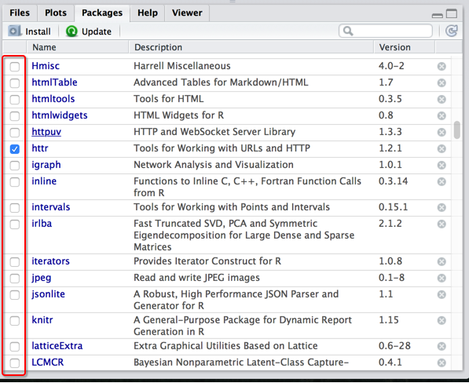

---

Sometimes one has _a lot_ of packages running simultaneously.

No problem: we can see what packages are up and running by typign `sessionInfo()` into the console.

This will tell us everything about the version of R and the packages we are using to run our analysis.
```{r,eval=T}
sessionInfo()
```

---

## Remember to Load Your Package!

If you ever try to run a function and you get the following prompt...

    Error: could not find function "qplot"

It's likely you forgot to <font size=10 color="blue", style="bold"> <u>load the package</u> </font>.
```{r,eval=F}
require(ggplot2) # First Load the package
qplot() # Then run the function
# Wah-la!
```

---

class:newsection

# Importing & Exporting Data

---


`R` allows you to import a large variety of datasets into the environment. However, `R`'s base packages <u>only support a few data types</u>.

--

No Fear: there is usually always an **external package** that can do the job!

We are going to focus on **three packages** to import different data types:

- `readr` --- an expansive array of functions to read different data types
- `readxl` --- for excel spreadsheets
- `haven` --- for SPSS, SAS, and .dta

---


First, we need to **install** these packages onto our computer.
```{r,eval=F}
install.packages("readr")
install.packages("readxl")
install.packages("haven")
```

And then **load** them into our current `R` Session.
```{r,eval=F}
require(readr)
require(readxl)
require(haven)
```

---

# Importing data

Here we will review how to import five separate data types:
- `.dta` --- STATA file format
- `.csv` --- comma seperated file format
- `.sav` --- SPSS file format
- `.xlsx` --- standard Excel file format
- `.Rdata` --- R's file format

---

# .dta

![:space 10]

For all versions of STATA
```{r,eval=F}
require(haven)
data <- read_dta(file = "data.dta")
```
<br>
Other packages:
- `readstata13`
- `foreign`

---

# .csv

`read.csv()` and `read.table()` are both **base functions** in `R`.
```{r,eval=F}
data <- read.csv(file = "data.csv",
                stringsAsFactors = F)
# Or

data <- read.table(file = "data.csv",
                  header = T,
                  sep=",",
                  stringsAsFactors = F)
```

These functions have specific **arguments** that we are referencing:
- `stringsAsFactors` means that we don't want all `character` vectors in the `data.frame` to be converted to `factors`.
- `header` means the first row of the data are column names.
- `sep` means that entries are separated by commas.

---

# .csv

![:space 10]

The `readr` package provides a much simpler approach.
```{r,eval=F}
require(readr)
data <- read_csv("data.csv")
```
- `characters` aren't converted to `factors`.
- More efficient as $N$ increase

---

# .sav

![:space 10]

For `SPSS` and `SAS` file formats, the `haven` packages offers a simple way of reading in data.
```{r,eval=F}
require(haven)
data <- read_sav(file = "data.sav") # SPSS
```

---

# .xlsx

![:space 10]

```{r,eval=F}
require(readxl)
data <- read_excel("data.xlsx")
```

Even select from specific sheets.
```{r,eval=F}
excel_sheets("data.xlsx") # list avail. sheets
```
    [1] Sheet1, Sheet2
```{r,eval=F}
data <- read_excel("data.xlsx",
                   sheet = 'Sheet1')
```


---

# .Rdata

![:space 10]

`.Rdata` is the data source inherent to `R`. It saves and loads `objects`.
```{r,eval=F}
load(file='data.Rdata')
```

---

# Importing Data Using R Studio

There is also a point-and-click option for importing and exporting data in R.

If we go into the `Environments` tab and then click `Import Dataset`

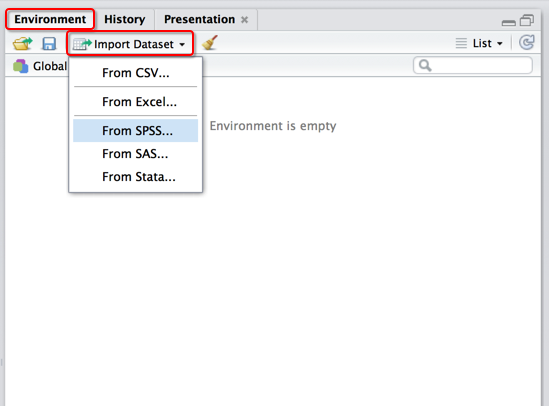

---

# Exporting data

Exporting data is the same process in reverse. Instead of **reading** the data, we want to **write** a new version of it.

There are a series of functions (each provided by their respective packages) that allow us to do just that.

Each require that you input the **data** that you're looking to export and specify the **file name** and **paths** to tell the computer where the file is going.

---

# Exporting data

![:space 10]

```{r,eval=F}
write_dta(data,path ="data.dta")

write_csv(data,path ="data.csv")

write_sav(data,path ="data.sav")

write_sas(data,path ="data.sas")

write_tsv(data,path ="data.tab")

# etc.
```

---

# .Rdata

![:space 10]

`.Rdata` offers two options to save data. We can either save a single data object, or save the entire workspace
```{r,eval=F}
# Save just an object
save(data, file="data.Rdata")


# Save the entire workspace
save.image(file="workspace.Rdata")
```

---

class: newsection

# But where is my data exactly?


---

# But where is my data exactly?

![:space 10]

`R` doesn't intuitively know where your data is. If the data is in a special folder entitled "`my_data`", we have to tell `R` how to get there.

We can do this three ways:

--

  1. Set the **working directory** to that folder
  2. Set the directory via a point-and-click option in `R Studio`
  3. Establish the **path** to that directly to the folder

---

# Setting the Working Directory

![:space 10]

Every time `R` boots up, it does so in the same place, unless we tell it to go somewhere else.

We can find out which directory we are in by using the `getwd()` function.
```{r,eval=F}
getwd() # Get the current working directory
```
    /Users/edunford/


---

# Setting the Working Directory

![:space 10]

Every time `R` boots up, it does so in the same place, unless we tell it to go somewhere else.

We can then set a new working director by establishing the path to the folder we want to work in as a **string** in the function `setwd()`
```{r,eval=F}
setwd("/Users/edunford/Desktop/my_data")
getwd()
```
     /Users/edunford/Desktop/my_data/

---

# Setting the WD via R Studio

![:space 10]

R Studio also makes setting the working directory really easy.

Click: `Session` &rarr; `Set Working Directory` &rarr; `Choose Directory...`

This will allow you to set the working directly quickly. The downside is that you have to do it **manually every time you return to this project**. By writing a script for everything you do, it is easier to replicate (and for others to replicate) your work.

---

# Establishing the Path

![:space 10]

Finally, we can also just point directly to the data by outlining the specific path.

Here we are assigning a sting containing our **path** to the object `path`.
```{r,eval=F}
path <- "~/Desktop/my_data/data.csv"
```

We then load the data using that path.
```{r,eval=F}
read.csv(path)
```

---

# Beyond Working Directories

![:space 10]

Working directories are limiting:

- If files are **moved** or **renamed**, <font color = "red"> a script won't run </font>.
<br>
<br>
- Analyses cannot be easily transported across computers or users.

---

# Beyond Working Directories

The solutions:

1. **R Projects**

.center[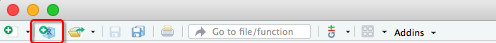]

.center[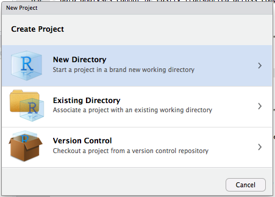]

---

# Beyond Working Directories

The solutions:

1. **R Projects**

2. **R Projects** + the package [`here()`](https://github.com/jennybc/here_here)
  - To easily move around the project's subfiles
  - `here()` works like `file.path()`, but where the path root is implicitly set to “the path to the top-level of my current project”.
