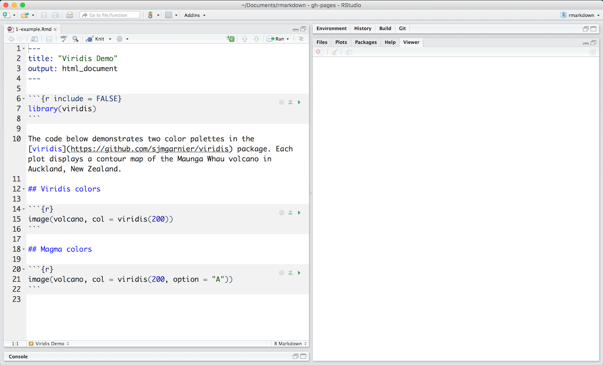

```{r setup, include=FALSE}
knitr::opts_chunk$set(echo = T,message=F,error=F,warning = F)
```

layout: true

<div class="slide-footer"><span> 
PPOL670 | Introduction to Data Science for Public Policy

&emsp;&emsp;&emsp;&emsp;&emsp;&emsp;&emsp;&emsp;&emsp;

Week 3 <!-- Week of the Footer Here -->

&emsp;&emsp;&emsp;&emsp;&emsp;&emsp;&emsp;&emsp;&emsp;&emsp;&emsp;&emsp;

Reproducibility in Practice <!-- Title of the lecture here -->

</span></div> 

---
class: outline

# Outline for Today 

![:space 3]

- More on **_basic programming in `R`_**
  
  - **__** and **__**
  
  - **__**

- Using **_`R` Markdown_**


- Generating **_Reproducible Examples_**

---

class: newsection

# Iteration

---

### Indexing Refresher

Recall that we can index data objects in `R`. By taping into each object's structure and using integers to extract data that belong to specific **positions**. 

```{r}
x = c(-5:5)
x
```

```{r}
x[1]
```

```{r}
x[9]
```

---

### Indexing Refresher

We can call hole ranges of numbers using colon (`:`) operator.

```{r}
x[4:8]
```

--

And when using the negative, we can use indices as exclusion calls (i.e. "give me back everything _but_ these positions")

```{r}
x[-4:-8]
```

--

We can also use specific index position to extract elements out of the original order.

```{r}
x[c(1,10,5,2)]
```

---

### Indexing Refresher

Likewise, we can do the same with `data.frame` or `matric` objects -- except this time we have two index positions to keep track of: `rows` and `columns`. 

```{r}
str(mtcars)
```

---

### Indexing Refresher

![:space 3]

```{r}
mtcars[1,]
```

```{r}
mtcars[,1]
```

```{r}
mtcars[1:2,1:2]
```

---

## `for` loops

A **loop** is offers a way to iterate through a series of items stored as data object in `R`. 

The below codes pulls out each item once at a time, stores it in the object `i` and then prints it. 

```{r}
items <- c("grapes","bananas","chocolate","bread")

for(i in items){
  print(i)
}
```

---

The code in the last slide is equivalent to this.

```{r}
i <- items[1]
print(i)
i <- items[2]
print(i)
i <- items[3]
print(i)
i <- items[4]
print(i)
```

---

### `for` loop components

There are two thing really important features of a loop. 

1. the **_`for()` function_** which we use to specify 
  
  a. what object we're drawing from and 
  
  b. what object we are writing to.

<br> 

```{}
            for( i  in  items  )
                 ^        ^
                 |        |___ object we are drawing from
                 |
          obj. we write each item to 
```

---

### `for` loop components

Second, the **_brackets `{}`_**. Inside the brackets we <u>house the code that is going to happen each iteration</u>. 

<br> 
```{}
        for( i  in  items  ){
          |~~~~~~~~~~~~~~~~|   
          |~~~~~~~~~~~~~~~~|
          |~~~~~~~~~~~~~~~~| code we need perform on each iteration.
          |~~~~~~~~~~~~~~~~|
          |~~~~~~~~~~~~~~~~|
        }
```

<br> 
Together, `for` loops allow us to repeat complicated processes. This prevents us from having to arduously repeat the same chunk of code over and over again. 

---

### `for` loop components

```{r}
# Create an array of numbers
numbers = c(10,100,-1000,345,-7,999,21345,444457)

# Iterate from the 2nd index until the last
for(i in 2:length(numbers)){
  
  # Multiply the two numbers together 
  new_number <- numbers[i]*numbers[i-1] 
  
  print(new_number) # print the numbers 
}
```

---

## `while()` loops

Similar to `for` loops, `while()` loops only stop when some condition is met. As long as the statement within `while()` is `TRUE`, will the loop keep looping.  

In the below example, as long as `i` is less than `5` the loop will keep looping. 

```{r}
i <- 0
while( i < 5 ){
  print(i)
  i <- i + 1
}
```

---

### `for()` loops and storing output

```{r}
letters
```


```{r}
# Container with 10 spaces
container <- rep(0,10)
container
```


```{r}
# Each loop, we store the output of some code.
for(i in 1:10){
  container[i] <- paste0(letters[i],letters[i+1])
}
container
```


---

### Container &rarr; any non-scalar data structure

```{r}
dat_container <- as.data.frame(matrix(0, nrow = 5,ncol = 2))
dat_container
```


```{r}
for( i in 1:5){
  dat_container[i,1] <- i
  dat_container[i,2] <- letters[i]
}
dat_container
```


---

## `for()` loops and binding output

Likewise, we can build objects up by binding them together.

```{r}
containter2 <- c()
containter2
```


```{r}
tmp_data <- data.frame(v1=1,v2=2)
tmp_data
```


```{r}
containter2 <- rbind(containter2,tmp_data)
containter2 <- rbind(containter2,tmp_data)
containter2 
```


---

## `for()` loops and binding output

```{r}
containter2 <- c()
for( i in 1:10){
  
  tmp_data <- data.frame(v1=i,v2=letters[i])
  
  containter2 <- rbind(containter2,tmp_data)
  
}
containter2
```

---

## Which is most efficient?

![:space 5]

**Contender 1**: Filling a pre-defined container
```{r}
require(tictoc) # for counting how long it takes R to run
N = 5000
tic()
dat_container <- as.data.frame(matrix(0, nrow = N,ncol = 2))
for( i in 1:N){
  dat_container[i,1] <- i
  dat_container[i,2] <- 1/i
}
toc()
```

---

## Which is most efficient?

![:space 5]

**Contender 2**: Binding each iteration
```{r}
N = 5000
tic()
dat_container <- c()
for( i in 1:N){
  tmp <- data.frame(V1 = i,V2 = 1/i)
  dat_container <- rbind(dat_container,tmp)
}
toc()
```


---

class: newsection

# Control Statements

---

## `if` - `else`

```{r}
if(TRUE){
  print("Hello")
}else{
  print("Goodbye")
}
```

```{r}
if(FALSE){
  print("Hello")
}else{
  print("Goodbye")
}
```

---

**_Boolean statement dictates whether one code chunk is executed, or another is executed_**. 

We can combine these conditionals with `for()` loops to powerful effect. 

```{r}
for(i in 1:10){
  if(i <= 5){
    print("Hello")
  }else{
    print("Goodbye")
  }
}
```


---

## `ifelse()`

Same idea just vectorized.

```{r}
ifelse(T,"Hello","Goodbye")
```

```{r}
ifelse(F,"Hello","Goodbye")
```

```{r}
x <- 1:10
ifelse(x<5,"Hello","Goodbye")
```

---


class: newsection

# `R` Markdown

---

## Toward Reproducibility
<br>
<br>
<br>
Throughout the course, we will use `Rmarkdown` (or otherwise referred to as `R` "notebooks") to write code and to document our analyses.

`Rmarkdown` embodies all the principles we discussed above. Allowing for use to implement best practices in our research and empirical work.

<br>
<br>

For the "pitch" and valuable tutorials, see here

## <center> [`R` Markdown](https://rmarkdown.rstudio.com/lesson-1.html) </center>

---


# R Notebooks


.left[]

---

# R Notebooks


.left[]

---

# R Notebooks


.left[]

---

# R Notebooks


.left[]

---

# R Notebooks


.left[]

---

### Compiling documents

To turn code into a report (`.html`,`.pdf`,`.doc`, ect) we need to **_knit_** (or "compile" the document). 

The YAML headers gives `R` the instructions for how to do this. Specifically, we tell `R` what type of output we want.

`.html`
```
    output: html_document 
```
`.docx`
```
    output: word_document
```
`.pdf` ... requires a [LaTex distribution](https://miktex.org/download)
```
    output: pdf_document
```

---

### Compiling documents

To turn code into a report (`.html`,`.pdf`,`.doc`, ect) we need to **_knit_** (or "compile" the document). 

The YAML headers gives `R` the instructions for how to do this. Specifically, we tell `R` what type of output we want.

<br> 

`.nb.html`
```
output: html_notebook
```

An **_`R` Markdown Notebook_** allows you to write code and then see the rendered code in _real time_. 

---

### Compiling documents

We can **`knit`** a R Markdown document in one of three ways: 

![:space 2]

i. click the `Knit` button in `RStudio`

.center[]

![:space 2]

ii. Use the keyboard shortcut

- Mac: `command + shift + k`
- Windows: `control + shift + k`

![:space 2]

ii. Knit the document using the `knit()` function in the `knitr` package.

---

### Using Markdown

![:space 10]

.center[
.pull-left[ 
```

# Header

## Header

### Header

#### Header
```
] 

.pull-right[
# Header
## Header
### Header
#### Header

]
]

---

### Using Markdown

![:space 10]

```
**Bold** or _italize_ text. Or **_both_**! ~~Even cross things out~~
```

.center[**Bold** or _italicize_ text. Or **_both_**! ~~Even cross things out~~]

--

<br>

```
> We can emphasize text and quotes.
```

> We can emphasize text and quotes.


---

### Using Markdown

![:space 10]

**Generate lists**
```
- Important point!
    + And another...
    + And another...
```

.center[&darr;]

- Important point!
    + And another...
    + And another...
    
---

### Using Markdown

![:space 7]

**Enumerated Lists**

```
Things to do:

1. "Do Research"
2. Stare blankly at the wall and wonder why I came to grad school.
3. Eat chipotle.
```

.center[&darr;]

Things to do:

1. "Do Research"
2. Stare blankly at the wall and wonder why I came to grad school.
3. Eat chipotle.

---

### Using Markdown

Even write some fancy math!

--

**inline**
```
...assume $x \sim N(\mu,\sigma)$ and $x \ge 0$ so that....
```
.center[&darr;]

...assume $x \sim N(\mu,\sigma)$ and $x \ge 0$ so that....

--

**its own line**
```
$$\hat{y_i} = \beta_0 + \beta_1x_i + \beta_2_ix^2 + \epsilon_i$$
```

.center[&darr;]

$$\hat{y_i} = \beta_0 + \beta_1x_i + \beta_2x_i^2 + \epsilon_i$$
---

### Code Chunks

The real point of `R` Markdown is to embed your R code in your working script so that the document is **_reproducible_** and **_transparent_**. 

**_To write code_**, we need to create a **_code chunk_**. We can do this by:

- click `insert`, and select an `R` code chunk.
- press `cmd` + `option/alt` + `i` or `ctrl` + `option/alt` + `i`

.center[]

This will yield a discolored chunk that looks like this. Everything written in this chunk will be evaluated as `R` code. Everything written outside of it will be evaluated as prose.


---

### Code Chunks

![:space 15]

Chunk output can be customized with options, arguments supplied to chunk header. Knitr provides almost [60 options](http://yihui.name/knitr/options/) that you can use to customize your code chunks.


---

### Code Chunks

.center[
|Option |Run code |	Show code |	Output	|Plots |	Messages |	Warnings| errors|
|:-----|:-----:|:-----|:-----:|:-----:|:-----:|:-----:|:-----:|
|`eval = FALSE` | &#10006; | | &#10006; |&#10006; | &#10006; |&#10006; |&#10006;
|`include = FALSE` | | &#10006; | &#10006;| &#10006;| &#10006;| &#10006;|&#10006;
|`echo = FALSE` |	| &#10006; | | | | | |
|`results = "hide"` | | |&#10006; | | | ||
|`fig.show = "hide"` | | | | &#10006;|  | | |
|`message = FALSE`	 | | | | |&#10006; | | |
|`warning = FALSE`	 | | | | | |&#10006; | |
|`error = FALSE`	 | | | | | | | &#10006; |
]

---

### YAML Header

Finally there are a bunch of different ways that the YAML can be set up. Different configurations yield different layouts.

As we already saw, we can change how the document is compiled. 

```
---
title: "Markdown Basics"
author: "Prof. Dunford"
date: "Fall 2019"
output: html_notebook
---
```

```
---
title: "Markdown Basics"
author: "Prof. Dunford"
date: "Fall 2019"
output: pdf_notebook
---
```

---

### YAML Header

We can customize the YAML to include different output themes, table of contents, parameters, and more!  

<br>

```
---
title: "Markdown Basics"
author: "Prof. Dunford"
date: "Fall 2019"
output:
  html_document:
    theme: spacelab
    highlight: espresso
    toc: true
    toc_depth: 2
---
```

---

## Best practices

### 1. Code chunks should be broken up

### 2. No excessive output
  
  - i.e don't print of pages and pages of a data frame.
  
### 3. Figures should be appropriately sized for the rendered document


### 4. All data and code should be self-contained

  - Given the data and the `.Rmd` file, the `R` Markdown down document should knit.


<!-- Go through this together... -->

---

class: newsection

# Reprex

---

### Life as an new `R` user....

So you ran into an issue...

--

![:space 5]

You can't find answer on the internet...

--

![:space 5]

.center[
****
]

--

![:space 5]

<!-- .center[ -->
<!-- <a title="JM Gif"></a><div style="font-size:11px;"></div>] -->


When asking for help, you need to make the problem as transparent and easy to work through as possible.

---

### Generating reproducible examples

![:space 5]

```{r,eval = F}
require(reprex)
```

.center[]

---

### Generating reproducible examples

**Steps**:

1. **_Reduce the problem down into a workable example_**.
  
  - Small toy example that doesn't require loading in data.
  
  - Replicate the issue.
  
2. **_Copy that code_**.

3. **_Then run `reprex()` in the consol_**. 

  - a html rendering of the example will render.
  
  - everything you need to post will be copied to your clipboard
  
---

### Generating a small toy example

![:space 5 ]

You'll need to run this in your console.

```{r,eval=F}

# Copy this...
x = 1:5
for(i in x){
  print(i)
}

# Then run this in the console...
reprex()

# Finally, click 'paste' in where ever you're 
# posting the issue (e.g. slack)
```


---

### Output examples for any venue...

**_Github_** (or Slack!)

```{r,eval=F}
reprex(venue = "gh")
```


**_Stack Overflow_**

```{r,eval=F}
reprex(venue = "so")
```


**_HTML only slides_**

```{r,eval=F}
reprex(venue = "html")
```


Finally, produce an example with all your **_session info_** (really useful for Stack Overflow)

```{r,eval=F}
reprex(venue = "gh",si = T) 
```

---


### Generating a small toy example

`reprex` requires that all the code and data exist in the example. This is so that one can reproduce it by copying and pasting the example.

Your issue might be due to something wrong with your data or your code, so often, it helps to give a little sample of the data you're using. 

--

Steps for **generating reproducible data** (for your reproducible example):

1. Generate a **_small subset_** of data (when you're copying and pasting, size matters)
  - use `head()`, `tail()` or sample randomly (we'll learn this next time!)
2. Break the data down into a **_raw structure_** using the base function `dput()`
3. **_Paste_** this raw data **_at the top of the code_** you're aiming to reproduce.

---


### Generating a small toy example

```{r}
mtcars
```


---


### Generating a small toy example

```{r}
small_mtcars <- head(mtcars)
small_mtcars
```


---


### Generating a small toy example

```{r}
dput(small_mtcars)
```


---


### Generating a small toy example

```{r,eval=F}
# (Mote I'm assigning the data structure to an object)
dat <- structure(list(mpg = c(21, 21, 22.8, 21.4, 18.7, 18.1), 
                      cyl = c(6, 6, 4, 6, 8, 6), 
                      disp = c(160, 160, 108, 258, 360, 225), 
                      hp = c(110, 110, 93, 110, 175, 105), 
                      drat = c(3.9, 3.9, 3.85, 3.08, 3.15, 2.76), 
                      wt = c(2.62, 2.875, 2.32, 3.215, 3.44, 3.46), 
                      qsec = c(16.46, 17.02, 18.61, 19.44, 17.02, 20.22), 
                      vs = c(0, 0, 1, 1, 0, 1), 
                      am = c(1, 1, 1, 0, 0, 0), 
                      gear = c(4, 4, 4, 3, 3, 3), 
                      carb = c(4, 4, 1, 1, 2, 1)), 
                 row.names = c("Mazda RX4", "Mazda RX4 Wag", "Datsun 710", 
                               "Hornet 4 Drive", "Hornet Sportabout", "Valiant"), 
                 class = "data.frame")

dat$mgq # Fake issue: mispelled the column name

# Copy the above and run
reprex(venue = "gh",si = T) 
```


