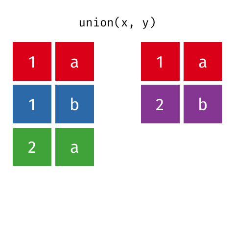
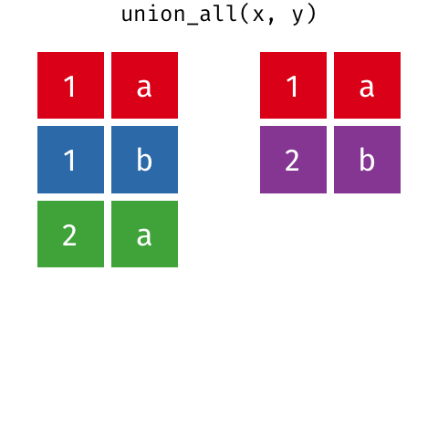
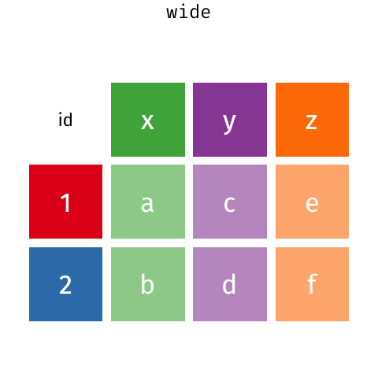

```{r setup, include=FALSE}
require(tidyverse)
require(here)
knitr::opts_chunk$set(echo = T,message=F,error=F,warning = F,cache=T)
```

layout: true

<div class="slide-footer"><span> 
PPOL670 | Introduction to Data Science for Public Policy

&emsp;&emsp;&emsp;&emsp;&emsp;&emsp;&emsp;&emsp;&emsp;

Week 4 <!-- Week of the Footer Here -->

&emsp;&emsp;&emsp;&emsp;&emsp;&emsp;&emsp;&emsp;&emsp;&emsp;&emsp;&emsp;

Data Wrangling <!-- Title of the lecture here -->

</span></div> 

---
class: outline

# Outline for Today 

90% of data science is **data wrangling**, which involves...

- **manipulating** 

- **piping**

- **joining**  

- **reshaping** 

...data!

---

class: newsection

# Data Wrangling

---

# What is data wrangling?

- **raw &rarr; processed**: the process of transforming data from one format to another.

- **converting the structure** to facilitate some analysis
  + **_altering the unit of analysis_**: going from individuals in a state in a given year to state-year by
  
  + changing from a **_"wide"_** (many columns, few rows) **_to a "long" structure_** (few colums, many rows)
  
  + **_summarizing data_** across specific subgroups 

---

## Thinking about Data Generation

- **Data rarely works "out of the box"** 

  + constructed for a different purpose
  
  + requires adding additional information (merging other data to it)
  
- **Codebooks offer clues, but not the story**

  + If a codebook exists, it can outline the data generation process, variable names, issues with the data, etc. 
  
  + Codebooks can't won't reveal underlying issues or biases in the data. locating these requires exploration through summarization, visualization, and reshaping the data structure. 

---

## Thinking about Data Generation
 
- **Data Provenance**

  + Data changes hands, edits are made, variables/observations are accidentally dropped. Without probing, one might overlook flaws.


- **Automated Data**

  + Scraping data can ease collection, but difficult to know where/if the process broke down. 
  
  + Manipulating data can reveal algorithmic failure/limitations. 
  
  + Never assume "everything worked"
 
---

## `tidyverse` approach 

Throughout this course, we are going to cover the basics of data manipulation and visualization in `R`. By focusing on a suite of packages known as the "[tidyverse](https://www.tidyverse.org)". 

These packages were designed to ease the process of data manipulation and management so that it is more intuitive, efficient, and interpretable.

Specifically, the `tidyverse` is a housing package that holds the following packages:
- [readr](http://readr.tidyverse.org/) - for reading data in (_which we encountered last time_)
- [tibble](https://tibble.tidyverse.org/) - for "tidy" data structures
- [dplyr](http://dplyr.tidyverse.org/) - for data manipulation
- [ggplot2](http://ggplot2.tidyverse.org/) - for data visualization
- [tidyr](http://tidyr.tidyverse.org/) - for cleaning
- [purrr](http://purrr.tidyverse.org/) - functional programming toolkit

---

## `tidyverse` approach 

Most of everything we will do will require in data manipulation just **one** package

```{r,eval=F}
# Install tidyverse package
install.packages('tidyverse')

# Load the package
require(tidyverse)
```
  
---

class:newsection

# Tidy Data

---

The same data can be represented in many different ways...
<br><br><br>
.center[
```{r,echo=F}
tab <- 
  tribble(
    ~country, ~year, ~cases, ~population,
    'Afghanistan',  1999,    745,   19987071,
    'Afghanistan',  2000,   2666,   20595360,
    'Brazil'     ,  1999,  37737,  172006362,
    'Brazil'     ,  2000,  80488,  174504898,
    'China'      ,  1999, 212258, 1272915272,
    'China'      ,  2000, 213766, 1280428583
  )

tab %>% kableExtra::kable(.,align = 'c')
```
]

---

<br><br>
.center[
```{r,echo=F}
tab %>% 
  gather(type,count,-country,-year) %>% 
  arrange(country,year) %>% 
  kableExtra::kable(.,align = 'c')
```
]

---

<br><br><br>
.center[
```{r, echo = F}
tab %>% 
  unite('rate',c('cases','population'),sep = "/") %>% 
  kableExtra::kable(.,align = 'c')
```
]

---

<br><br>
.center[
```{r,echo=F}
tab %>% 
  select(-population) %>% 
  spread(year,cases) %>% 
  kableExtra::kable(.,align = 'c',caption = "Cases")
```
]

<br>

.center[
```{r,echo=F}
tab %>% 
  select(-cases) %>% 
  spread(year,population) %>% 
  kableExtra::kable(.,align = 'c',caption = "Population")
```
]


---

There are three interrelated rules which make a dataset **tidy**:
<br><br>
1. **Each variable must have its own column.**

2. **Each observation must have its own row.**

3. **Each value must have its own cell.**

.center[]

---

## Tidy!

<br><br>

.center[
```{r,echo=F}
tab %>% kableExtra::kable(.,align = 'c')
```
]

---

## `tibble()` data frames

> "Tibbles _are_ data frames, but they tweak some older behaviours to make life a little easier."

Differences between `tibbles` and `data.frames`

1. Tibbles have a refined print method that shows only the first 10 rows, and all the columns that fit on screen. This makes it much easier to work with large data.

2. More explicit errors: tibbles are strict. They throw lots of errors, meaning we catch mistakes early. 

---

class: newsection

# Manipulating

---

<br><br>
The `dplyr` package (part of the `tidyverse`) offers an intuitive **verb based** approach to data management in `R`. The goal of the `dplyr` logic is to provide an easy, intuitive naming convention for ubiquitous to data management tasks.

<br><br>
> Note that the tidyverse moves to a `tibble` data.frame, which is a special kind of data.frame class that keeps the best parts of `data.frame` but drops the unnecessary bits, such as printing the entire data object.

---

## 6 main `dplyr` verbs

- **`select()`**: Pick variables by their names.

- **`filter()`**: Pick observations by their values

- **`arrange()`**: Reorder the rows.

- **`mutate()`**: Create new variables with functions of existing variables.

- **`summarise()`**: Collapse many values down to a single summary.

- **`group_by()`**: changes the scope of each function from operating on the entire dataset to operating on it group-by-group. 
---

class:biglist


## How they work...

<br>
<br>

**All verbs work similarly:**

1. The first argument is a data frame.

2. The subsequent arguments describe what to do with the data frame, using the variable names (without quotes).

3. The result is a new data frame.

---

To walk through the performance of the main `dplyr` verbs, we'll use an internal dataset called `presidential`.

```{r,eval=F}
?presidential # for information on the data
```
```{r}
dat <- presidential
head(dat)
```


---

# `select()`

.center[]

---

```{r}
select(dat,name,party)
```

---

Or variable ranges using `:`

The following will provide all variables in-between `name` and `end`.

```{r}
select(dat,name:end)
```

---

The **order** in which variables are selected will translate to the output. Thus, one can easily **reorder columns** with `select()`.
```{r}
select(dat,name,end,start)
```

---

We can also easily **rename** variables by simply providing a new name within the function.
```{r}
select(dat,president=name,
       startdate=start,
       enddate=end)
```

---

Lastly, `select()` offers us a convenient way to drop variables by using the same logic that we employed with putting a **negative sign** in front of a dimension. The only difference here is that we can do the same but with a variable name.

Here we **drop** the `start` date variable.
```{r}
select(dat,-start)
```

---

## `filter()`

.center[]

---

```{r}
filter(dat,party == "Republican")
```

---

## `arrange()`

.center[]
---

```{r}
arrange(dat,party)
```

---

`arrange()` with the internal function `desc()` can change to a **descending** ordering.
```{r}
arrange(dat,desc(start))
```

---

## `mutate()`

.center[]

---

```{r}
mutate(dat,
       # in office during cold war
       CW = start <= '1990-03-11')
```

---

`mutate()` also allows us to **_instantly_** use variables we just created.

```{r}
mutate(dat,
       CW = start <= '1990-03-11',
       CW = as.numeric(CW))
```

---

Like `mutate()`, `transmute()` provides a method for generating a new variable, but unlike the former, it **returns only the newly created variable**.

```{r}
transmute(dat,CW = start <= '1990-03-11')
```

---

## `summarize()`

```{r}
summarize(presidential,
          days_in_office = mean(end-start),
          max = max(end-start),
          min = min(end-start))
```

---

There are a number of internal functions that can be used with `mutate()`, `transmute()`,
and `summarize()`.

- `n()` ::: counts the number of observations
- `n_distinct()` ::: counts the number of distinct entries

```{r}
summarize(dat,N=n(),N_party=n_distinct(party))
```

---

## `group_by()`

.center[]

---

When used in conjunction with some of the other functions, `group_by()` becomes a powerful **clustering function**.
```{r}
# group by party
x <- group_by(presidential,party)
summarize(x,min_in_office = min(end-start))
```


---

### Other functions in the tidyverse...

`tally()` or `count()` offers quick counts of a variable which can be quite useful when used alongside some of the other functions.

Here we are seeing how many observations we have _by group_.
```{r}
x <- group_by(dat,party)
count(x)
```


---

### Other functions in the tidyverse...

`recode()` allows you to quickly **recode a variable** (though conditional statements prove to be the most efficient way to do this)
```{r}
mutate(dat,party = recode(party,'Republican'=1,'Democratic'=0))
```

---

### And much more...

We've only covered a few functions here. Here are some more...
- `sample_n()` - Grab an N random sample of your data
- `sample_frac()` - Grab a random sample that is some fraction of your total data
- `top_n()` - get the top N number of entries from a data frame
- `slice()` - grab specific row ranges
- `glimpse()` - quickly preview the data

See [here](https://github.com/rstudio/cheatsheets/raw/master/data-transformation.pdf) to download a cheatsheet containing an entire list of the tidyverse `dplyr` verbs.

---

class:newsection

# Piping 

---

## Combining `dplyr` functions

When we need to do a series of manipulations, we can **perform each manipulation individually and save each entry as a new object** that we write over.
```{r}
x <- filter(presidential,party=='Republican')
x <- group_by(x,name)
x <- transmute(x,t_in_office = end-start)
x <- arrange(x,t_in_office)
x
```

---

Or we can **nest** functions _within_ each other.
```{r}
arrange(
  transmute(
    group_by(
      filter(presidential,party=='Republican'),name),
    t_in_office = end-start),
  t_in_office)
```

--

> The issue with **nesting functions** is that it is <font color = 'red'> difficult to (a) read and (b) detect a mistake!</font>

---

### Piping Functions

The **pipe** is a useful tool that allows us to **pass** output from one function to the next.

To pipe we write **`%>%`** _in-between_ each function.

.center[`data %>% function1() %>% function2()`]

We pass the output to specific locations in the proceeding function using the pointer `.`

.center[`data %>% function1(arg = .)`]

Piping offers is a clean way of manipulating data that is **intuitive and easy to read**.

---

Here we **pass** our `data` to `filter()` then to `group_by()` then to `transmute()` and then finally to `arrange()` which returns our output!

```{r}
presidential %>%
  filter(party=='Republican') %>%
  group_by(name) %>%
  transmute(t_in_office = end-start) %>%
  arrange(t_in_office)
```

---

### Two things to keep in mind when piping...

1. Functions **_must_** be linked with `%>%`

2. When functions have **multiple arguments**, point to where the data should go with a period (`.`)
```{r,eval=F}
data %>% function(arg1= ., arg2=TRUE)
```


---

# PRACTICE: 

![:space 5]

Please **_download and complete_** the following practice on your own:

.center[ **[Download the Data Wrangling Practice Set](practice/week04-practice-01_Data-Wrangling.Rmd)** (`.Rmd`)]

![:space 5]

Then **_compare your answers_** to the answers in the **_answer key_**:

.center[ **[Download Answer Key](practice/week04-practice-01_Data-Wrangling_ANSWERS.Rmd)** (`.Rmd`)]

---

class:newsection

# Joining


---

## `_join` functions (dplyr)

`dplyr` offers a range of joining/merging functions that are more intuitive to use. These functions provide a **SQL framework** that is easier to read and more efficient.
- `left_join()`
- `right_join()`
- `inner_join()`
- `full_join()`
- `anti_join()`

When joining data, you must have a **unique** identifier on the dimension you're matching on.

---

Consider the following two example datasets...
```{r,echo=F}
data_A = data.frame("country"=c("Nigeria","England","Botswana"),
                    "Var1"=c(4,3,6),stringsAsFactors = F)
data_B = data.frame("country"=c("Nigeria","United States","Botswana"),
                    "Var2"=c("Low","High","Medium"),stringsAsFactors = F)
```
```{r}
data_A
data_B
```

---

## `left_join()`

.center[]

.center[]

---

## `left_join()`

.center[]

```{r}
left_join(data_A,data_B,by="country")
```


---

## `right_join()`

.center[]

.center[]

---

## `right_join()`

.center[]

```{r}
right_join(data_A,data_B,by="country")
```

---

## `inner_join()`

.center[]

.center[]

---

## `inner_join()`

.center[]

```{r}
inner_join(data_A,data_B,by="country")
```

---

 ### `full_join()` 
 
.center[]

.center[]


---

### `full_join()`

<center>  </center>

```{r}
full_join(data_A,data_B,by="country")
```

---

### `anti_join()` 
 
.center[]

.center[]

---

### `anti_join()` 

.center[]

```{r}
anti_join(data_A,data_B,by="country")
```

---

## `bind_rows()`

<center>  </center>
```{r}
bind_rows(data_A,data_B)
```

---

## `bind_cols()`

<center>  </center>
```{r}
bind_cols(data_A,data_B)
```

---

## Disparate column names

Sometimes the naming conventions of two datasets don't perfectly align. When this happens, we can specify how data merges onto one another more explicitly using the `by=` argument.

Moreover, we can merge on **_more_ than one dimension** by specifying all relevant column names.

---

Once again, consider the following example data..
```{r,echo=F}
data_A = data.frame("country"=c("Nigeria","England","Botswana"),
                    'year'=c(1999,2001,2000),
                    "Var1"=c(4,3,6),stringsAsFactors = F)
data_B = data.frame("country_name"=c("Nigeria","United States","Botswana"),
                    'year'=c(1999,2004,2003),
                    "Var2"=c("Low","High","Medium"),stringsAsFactors = F)
```
```{r}
data_A
data_B
```

---

```{r}
full_join(data_A,data_B,
          by=c('country'='country_name',
               'year'))
```


---

## Merging as a subsetting strategy 

Using set operations to subset and join data...

.center[]

---

## Merging as a subsetting strategy 

Using set operations to subset and join data...

.center[]

---

## Merging as a subsetting strategy 

Using set operations to subset and join data...
<br><br><br>
.center[]

---

## Merging as a subsetting strategy 

Using set operations to subset and join data...
<br><br><br><br>
.center[]

---

class:newsection

# Reshaping

---

Often, we need to alter the structure of a `data.frame` from a **wide format**...
<br><br>

.center[
```{r,echo=F,fig.align="center"}
D <-
  expand.grid(
  country = c("Nigeria","Iran","Cambodia","Australia"),
  year = c("1992","1993","1994")
)
set.seed(123)
D$var <- round(rnorm(nrow(D),10,.5),2)

# Present as table
D %>% 
  spread(year,var) %>% 
  kableExtra::kable(.,align = 'c')
```
]

---

...into a **long format**

.center[
```{r,echo=F}
D %>% arrange(country) %>% 
  kableExtra::kable(.,align = 'c')
```
]


---

## `tidyr`

`tidyr` is a tidyverse package built to help reshape data. The package contains an array of functions that are all useful cleaning a data construct. 

`tidyr` eases tasks such as:

- dropping missing values
- filling missing values
- separating a column into two variables or uniting two columns into one

We'll focus on two important functions designed to reshape data: **`gather()`** and **`spread()`**

---

<br>
.center[]


---

## `gather()`: from wide-to-long

.center[]

---

```{r,echo=F}
dat <- 
  D %>% 
  rename(X=var) %>% 
  mutate(Y = rpois(n = n(),1.5))
```


## `gather()`: from wide-to-long

Two arguments:

- `key`: name of the variable that all the _variable **names**_ will be stored as. 
- `value`: name of the variable that all the _variable **values**_ will be stored as.

```{r}
dat
```

---

## `gather()`: from wide-to-long

Two arguments:

- `key`: name of the variable that all the _variable **names**_ will be stored as. 
- `value`: name of the variable that all the _variable **values**_ will be stored as.

```{r}
dat %>% gather(key,value)
```


---

## `gather()`: from wide-to-long

Two arguments:

- `key`: name of the variable that all the _variable **names**_ will be stored as. 
- `value`: name of the variable that all the _variable **values**_ will be stored as.

```{r}
dat %>% gather(var_names,var_values) # Any naming convention works
```

---

## `gather()`: from wide-to-long

Two arguments:

- `key`: name of the variable that all the _variable **names**_ will be stored as. 
- `value`: name of the variable that all the _variable **values**_ will be stored as.

```{r}
# variables can be excluded from the reshape
dat %>% gather(var_names,var_values,-country,-year) 
```


---

## `spread()`: from long-to-wide

.center[]

---

## `spread()`: from long-to-wide

Two arguments:

- `key`: name of the variable that will be spread out into columns. 
- `value`: variable that will be spread out along the key variable.
- `fill`: what values should fill missing cells? (`NA` by default)

```{r}
dat 
```

---

## `spread()`: from long-to-wide

Two arguments:

- `key`: name of the variable that will be spread out into columns. 
- `value`: variable that will be spread out along the key variable.
- `fill`: what values should fill missing cells? (`NA` by default)

```{r}
dat %>% spread(key = country, value = X)
```

---

## `spread()`: from long-to-wide

Two arguments:

- `key`: name of the variable that will be spread out into columns. 
- `value`: variable that will be spread out along the key variable.
- `fill`: what values should fill missing cells? (`NA` by default)

```{r}
dat %>% spread(key = country, value = X, fill = 0) 
```

---

## `spread()`: from long-to-wide

Two arguments:

- `key`: name of the variable that will be spread out into columns. 
- `value`: variable that will be spread out along the key variable.
- `fill`: what values should fill missing cells? (`NA` by default)

```{r}
dat %>% spread(key = year, value = Y, fill = 0) 
```


---

# PRACTICE: 
## 

![:space 2]


Please **_download and complete_** the following practice on your own:

.center[ **[Download the Joining & Reshaping Practice Set](practice/week04-practice-02_joining-reshaping.Rmd)** (`.Rmd`)]

![:space 5]

Then **_compare your answers_** to the answers in the **_answer key_**:

.center[ **[Download Answer Key](practice/week04-practice-02_joining-reshaping_ANSWERS.Rmd)** (`.Rmd`)]
