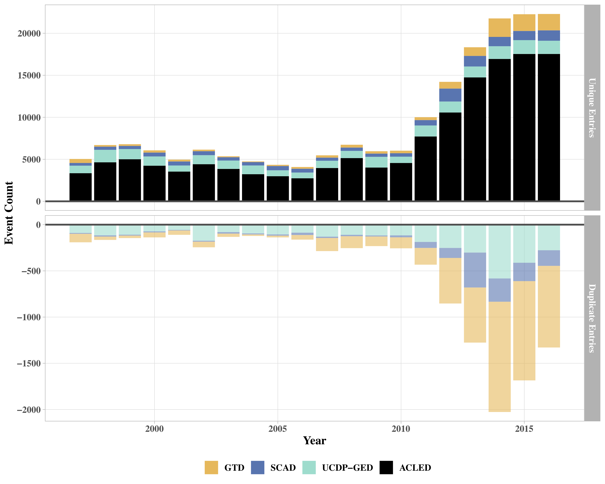
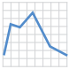

```{r setup, include=FALSE}
knitr::opts_chunk$set(echo = T,message=F,error=F,warning = F,cache = T)
require(lubridate)
require(tidyverse)
require(ggthemes)
require(gghighlight)
```

layout: true

<div class="slide-footer"><span> 
PPOL670 | Introduction to Data Science for Public Policy

&emsp;&emsp;&emsp;&emsp;&emsp;&emsp;&emsp;&emsp;&emsp;

Week 5 <!-- Week of the Footer Here -->

&emsp;&emsp;&emsp;&emsp;&emsp;&emsp;&emsp;&emsp;&emsp;&emsp;&emsp;&emsp;

Data Visualization <!-- Title of the lecture here -->

</span></div> 

---
class: outline

# Outline for Today 

<br><br>

- The **components** of a quantitative visualization

- Grammar of graphics with **`ggplot2`**

- Step-by-step **examples** of visualizing data

- Handling **dates**

---

.center[

]

---

class: newsection

# The Components of Data Visualization

---

### What do you see?

```{r,echo=F,fig.align="center",fig.width=10,fig.height=7,dpi=600}
set.seed(123)
x <- rnorm(1000)
y <- 1 + 2*x + 1*x^2 - .5*x^3  + rnorm(1000,sd=3)
tibble(y,x) %>% 
  mutate(color = ifelse(x>=0,"Post-Treatment","Pre-Treatment"),
         y = ifelse(x>=0,y+5,y),
         color = fct_rev(color)) %>% 
  ggplot(aes(x,y,color=color,pch=color)) +
  geom_point(size=3,alpha=.5) +
  theme_fivethirtyeight() +
  scale_color_manual(values=c("grey30","steelblue")) +
  labs(color="",pch="",x="X",y="Y",
       title="Simulated Discontinuity",
       subtitle="Data is completely fake and shouldn't be confused with reality.",
       caption = "Discontinuity occurs at x = 0") +
  theme(legend.position = "bottom",
        plot.title = element_text(size=20,family='serif'),
        text = element_text(size=20,family='serif'),
        axis.text = element_text(size=18,family='serif'),
        axis.title = element_text(size=18,family='serif'))
```


---

### Mapping data to space

.center[]

---

### Aesthetics

<br>
.center[]
<br><br>
.center[]

---


### Color as a tool to distinguish

.center[]

---

### Color as a tool to represent values

.center[]


---

### Color as a tool to highlight

```{r,echo=F,fig.align="center",fig.width=10,fig.height=7,dpi=600}
set.seed(123)
d <- purrr::map_dfr(
  letters,
  ~ data.frame(
      idx = 1:400,
      value = cumsum(runif(400, -1, 1)),
      type = .,
      flag = sample(c(TRUE, FALSE), size = 400, replace = TRUE),
      stringsAsFactors = FALSE
    )
)
ggplot(d,aes(idx,value,color=type)) +
  geom_line(size=1.5) + 
  gghighlight(max(value) > 20|min(value) < -20,use_direct_label = F) +
  scale_color_manual(values=c("steelblue","darkred")) +
  labs(x="Periods",y="Values") +
  theme_minimal() + 
  theme(legend.position = "none")
```


---

### Presentation as information

```{r,echo=F,fig.align="center",fig.width=8,fig.height=3}
set.seed(123)
D = map2_df(.x=c(1,5,3,10),.y=c("A","B","C","D"),
            .f= function(x,y) {tibble(v=rnorm(50,mean=x),grp=y)})
ggplot(D,aes(v)) +
  geom_density(fill="grey",alpha=.5) +
  labs(x="Variable",y="Density") +
  theme_hc()
```

--

```{r,echo=F,fig.align="center",fig.width=8,fig.height=4}
ggplot(D,aes(v,fill=factor(grp))) +
  geom_density(alpha=.5,color="white") +
  labs(x="Variable",y="Density",fill="Group") +
  theme_hc()
```


---

### Presentation as distortion

```{r,echo=F,fig.align="center",fig.width=8,fig.height=3}
ggplot(D,aes(v)) +
  geom_density(fill="grey",alpha=.5) +
  labs(x="Variable",y="Density") +
  theme_hc()
```

--

```{r,echo=F,fig.align="center",fig.width=8,fig.height=4}
ggplot(D,aes(v,fill=factor(grp))) +
  geom_histogram(alpha=.5,color="white",binwidth = .2) +
  geom_rug() +
  labs(x="Variable",y="Density",fill="Group") +
  theme_hc()
```

---

### The data type drives the visualization decisions

Think carefully about what you're trying to convey and what information you're using to make your point. 

<br>

.center[

| Data Type   | Example |  Scale  |
|-------------|---------|---------|
| Numerical   | `1.3`, `800`, `10e3` | Continuous | 
| Integer     | `1`, `2`, `3` | Discrete | 
| Categorical | `"dog"`, `"Nigeria"`, `"A"` | Discrete |
| Ordered     | `"Small"`, `"Medium"`, `"Large"` | Discrete |
| Dates/Time  | `2009-01-02`, `5:32:33` | Continuous |

]


---

### The data type drives the visualization decisions


.center[
.center[]
.center[]
.center[]
.center[]
]

---

class:newsection

# Grammar of Graphics

---

.pull-left[<br><br><br><br>]

.pull-right[
`ggplot2` (a part of the `tidyverse` package) is a power graphics package that offers a flexible and intuitive graphics language capable of building sophisticated graphics.

<br><br>

`ggplot` has a **special syntax** that we'll have to get used to, _but_ once we understand the basics, we'll be able to produce some advanced and sophisticated graphics with ease!
]

---


.pull-left[<br><br><br><br>]

.pull-right[

`ggplot2` is based on a **grammar of graphics**. In essence, you can build every graph from the same components that follow the same intuitive naming conventions.

Every graph is composed of

1. a **dataset**

2. **coordinate system**

2. **mappings** &rarr; the variables we're aiming to visualize

3. **geom**etric expressions of how the data should be projected onto a space

]

---

### (1) data

Let's use the `diamonds` data, which is an example dataset provided by `ggplot` that contains the prices and other attributes of almost 54,000 diamonds.

```{r}
glimpse(diamonds)
```

---

### (2) coordinate system

Use the `ggplot()` function to establish the coordinate system. 

```{r,fig.align="center",fig.height=4,dpi=600}
ggplot(data=diamonds)
```


---

### (3) mappings

What variables from the data do we want to map to the projected space?

- What variable makes up the y-axis?
- What variable makes up the x-axis?
- Are there any variables to group by? (More on this later)

--

<br><br>

Need to use a special function `aes()` (short for "aesthetics") to map variables from the data to the geometric space.

Whenever we want to plot a variable feature, we **_must_** wrap it in the `aes()` function.

---

### (3) mappings

What variables from the data do we want to map to the projected space?


```{r,fig.align="center",fig.height=4,dpi=600}
ggplot(data=diamonds,aes(x=price,y=carat))
```

---

### (4) geom &rarr; projection

How should your mappings be projected onto the coordinate space?

```{r,fig.align="center",fig.height=3.75,highlight=T,dpi=600}
ggplot(data=diamonds,aes(x=price,y=carat)) +
  geom_point() #<<
```

---

### (4) geom &rarr; projection

How should your mappings be projected onto the coordinate space?

.pull-left[

- `geom_` are aesthetic **layers** that are mapped onto the plot.

- We "add" layers and design preferences `+`.

- We can add as many layers as we want. Layers placed on top of one another in accordance with the order that they are specified.

- Plots can be assigned as objects and rendered later.

]

.pull-right[
```{r,fig.align="center",fig.height=6,highlight=T,dpi=600}
ggplot(data=diamonds,
       aes(x=price,y=carat)) +
  geom_point() 
```
]


---

.center[
<font color = "green">`ggplot`</font>(data = `<DATA>`) 

`+` 

<font color = "green">`<GEOM_FUNCTION>`</font>(mapping = <font color = "green">aes</font>(`<MAPPINGS>`))
]

--

.center[

`+` 

<font color = "green">`<GEOM_FUNCTION>`</font>(mapping = <font color = "green">aes</font>(`<MAPPINGS>`)) 

`+` 

<font color = "green">`<GEOM_FUNCTION>`</font>(mapping = <font color = "green">aes</font>(`<MAPPINGS>`)) 

`+` 

<font color = "green">`<GEOM_FUNCTION>`</font>(mapping = <font color = "green">aes</font>(`<MAPPINGS>`)) 

$$\vdots$$

]


---

.center[
<font color = "green">`ggplot`</font>(data = `<DATA>`) 

`+` 

<font color = "green">`<GEOM_FUNCTION>`</font>(mapping = <font color = "green">aes</font>(`<MAPPINGS>`))
]

.center[

`+` 

<font color = "red">`<SCALE_FUNCTION>`</font>(mapping = <font color = "green">aes</font>(`<MAPPINGS>`)) 

`+` 

<font color = "blue">`<THEME_FUNCTION>`</font>(mapping = <font color = "green">aes</font>(`<MAPPINGS>`)) 

`+` 

<font color = "orange">`<FACET_FUNCTION>`</font>(mapping = <font color = "green">aes</font>(`<MAPPINGS>`)) 

$$\vdots$$

]

---

### One variable?

.center[
| Expression   | Function   |     |
|----|----|-----|
| Area  | `geom_area()` |   | 
| Density  | `geom_density()` |   | 
| Dots  | `geom_dotplot()` |   | 
| Frequencies  | `geom_freqpoly()` |   | 
| Histogram  | `geom_histogram()` |   | 
]

---

### Two variables?

.center[
| Expression   | Function   |     |
|----|----|-----|
| Continuous Points  | `geom_point()` |   | 
| Continous Lines  | `geom_line()` |   | 
| Discrete Counts  | `geom_count()` |   | 
| Continuous and Discrete Distributions  | `geom_boxplot()` |   | 
| Densities  | `geom_hex()` |   | 
]

---

### Three variables?

.center[
| Expression   | Function   |     |
|----|----|-----|
|  Densities  | `geom_contour()` |   | 
|  Intensities  | `geom_tile()` |   | 
|  Intensities  | `geom_raster()` |   | 
|  Spatial  | `geom_map()` |   | 
]

--

Just a taste. Wide array of ways to express data in a geometric space. See reading and [data visualization cheatsheet](https://github.com/tidyverse/ggplot2) for guidance.

---

### Function Types in `ggplot2`

| Type | Function Header | Description |
|------|-----------------|-------------|
|  Generate layers from data   |  `geom_` | Use a geom function to represent data points, use the geom’s aesthetic properties to represent variables. Each function returns a layer. |
|   Construct statistics layers   |  `stat_` | A stat builds new variables to plot (e.g., count, prop) |
|   Change mapping characteristics   |  `scale_` | Scales map data values to the visual values of an aesthetic. To change a mapping, add a new scale. |
|   Generate subplots   |  `facet_` | Facets divide a plot into subplots based on the values of one or more discrete variables.  |
|   Alter the plots theme   |  `theme_` | Change the aesthetics of the plot background and feature (e.g. axes, text, grid lines, etc.)  |

---

### Exporting Plots

Note that `ggplot` objects can assigned to an object. 

```{r,fig.align="center",fig.width=4,fig.height=2}
my_plot <- ggplot(cars,aes(speed,dist)) + geom_point()
my_plot
```

--

We can export (or build off of) these plot objects using `ggsave()`

```{r,eval=F}
ggsave(plot = my_plot,filename = "my_plot.pdf",device = "pdf",width=5,height = 5)
ggsave(plot = my_plot,filename = "my_plot.png",device = "png",dpi = 300)
```

> Supports "eps", "ps", "tex" (pictex), "pdf", "jpeg", "tiff", "png", "bmp", "svg" or "wmf" (windows only).

---

class:outline

# Example 1
<br>
<br>
<br>

Let's examine the relationship between **regime type** and **economic development**


<br>
<br>

Let's progressively construct a plot using `ggplot`.

---

### The data 

```{r,echo=F}
pol = read_csv(here::here("Lectures/week_05/R-code/dem-gdp-data.csv")) %>%
  mutate(polity = round(polity)) %>%
  mutate(type = case_when(polity >= 6 ~ "Democracy",
                          polity <=-6 ~ "Autocracy",
                          T ~ "Competitive Authoritarian")) %>%
  filter(year >=1990)
```

Data draw from the World Bank Indicators for population and GDP and the [Center for Systemic Peace](http://www.systemicpeace.org/polityproject.html), which tracks yearly data on regime type. The Polity scale ranges from -10 (autocracy) to 10 (democracy).

```{r}
glimpse(pol)
```

---

### The data 

Data draw from the World Bank Indicators for population and GDP and the [Center for Systemic Peace](http://www.systemicpeace.org/polityproject.html), which tracks yearly data on regime type. The Polity scale ranges from -10 (autocracy) to 10 (democracy).

```{r}
summary(pol)
```


---

```{css,echo=F,eval=T}
.remark-code, .remark-inline-code { 
  font-family: 'Source Code Pro', 'Lucida Console', Monaco, monospace;
  font-size: 60%;
}
```


<br><br><br>

.pull-left[
```{r dem_gdp1, eval=FALSE,dpi=600}
pol %>%
  ggplot(aes(polity,lngdppc)) +
  geom_point()
```
]

.pull-right[
```{r, ref.label="dem_gdp1", echo=FALSE,dpi=600}
```
]

---

<br><br><br>

.pull-left[
```{r dem_gdp2, eval=FALSE}
pol %>%
  ggplot(aes(factor(polity),lngdppc)) +
  geom_jitter(alpha=.2)
```
]

.pull-right[
```{r, ref.label="dem_gdp2", echo=FALSE,dpi=600}
```
]


---

<br><br><br>

.pull-left[
```{r dem_gdp3, eval=FALSE}
pol %>%
  ggplot(aes(factor(polity),lngdppc)) +
  geom_jitter(alpha=.2,color="steelblue")
```
]

.pull-right[
```{r, ref.label="dem_gdp3", echo=FALSE,dpi=600}
```
]

---

<br><br><br>

.pull-left[
```{r dem_gdp4, eval=FALSE}
pol %>%
  ggplot(aes(factor(polity),lngdppc)) +
  geom_boxplot(alpha=.2,color="steelblue")
```
]

.pull-right[
```{r, ref.label="dem_gdp4", echo=FALSE,dpi=600}
```
]

---

<br><br><br>

.pull-left[
```{r dem_gdp5, eval=FALSE}
pol %>%
  ggplot(aes(factor(polity),lngdppc)) +
  geom_boxplot(alpha=.2,color="steelblue") +
  theme_minimal()
```
]

.pull-right[
```{r, ref.label="dem_gdp5", echo=FALSE,dpi=600}
```
]

---

<br><br><br>

.pull-left[
```{r dem_gdp6, eval=FALSE}
pol %>%
  ggplot(aes(factor(polity),lngdppc)) +
  geom_boxplot(alpha=.2,color="steelblue") +
  theme_minimal() +
  facet_wrap(~type,scales="free_x")
```
]

.pull-right[
```{r, ref.label="dem_gdp6", echo=FALSE,dpi=600}
```
]


---

<br><br><br>

.pull-left[
```{r dem_gdp7, eval=FALSE}
pol %>%
  ggplot(aes(factor(polity),lngdppc,
             fill=type)) +
  geom_boxplot(alpha=.2,color="grey30") +
  theme_minimal() +
  facet_wrap(~type,scales="free_x")
```
]

.pull-right[
```{r, ref.label="dem_gdp7", echo=FALSE,dpi=600}
```
]


---

<br><br><br>

.pull-left[
```{r dem_gdp8, eval=FALSE}
pol %>%
  ggplot(aes(factor(polity),lngdppc,
             fill=type)) +
  geom_boxplot(alpha=.2,color="grey30") +
  theme_minimal() +
  facet_wrap(~type,scales="free_x") +
  theme(legend.position = "bottom")
```
]

.pull-right[
```{r, ref.label="dem_gdp8", echo=FALSE,dpi=600}
```
]


---

<br><br><br>

.pull-left[
```{r dem_gdp9, eval=FALSE}
pol %>%
  ggplot(aes(factor(polity),lngdppc,
             fill=type)) +
  geom_boxplot(alpha=.2,color="grey30") +
  theme_minimal() +
  facet_wrap(~type,scales="free_x") +
  scale_fill_manual(values=c("darkred",
                             "grey40",
                             "steelblue")) +
  theme(legend.position = "bottom")
```
]

.pull-right[
```{r, ref.label="dem_gdp9", echo=FALSE,dpi=600}
```
]


---

<br><br><br>

.pull-left[
```{r dem_gdp10, eval=FALSE}
pol %>%
  ggplot(aes(factor(polity),lngdppc,
             fill=type)) +
  geom_boxplot(alpha=.2,color="grey30") +
  theme_minimal() +
  facet_wrap(~type,scales="free_x") +
  scale_fill_manual(values=c("darkred",
                             "grey40",
                             "steelblue")) +
  labs(x="Polity Score",
       y="Log GDP per capita",
       fill=""
       ) +
  theme(legend.position = "bottom")
```
]

.pull-right[
```{r, ref.label="dem_gdp10", echo=FALSE,dpi=600}
```
]


---

<br><br><br>

.pull-left[
```{r dem_gdp11, eval=FALSE}
pol %>%
  ggplot(aes(factor(polity),lngdppc,
             fill=type)) +
  geom_boxplot(alpha=.2,color="grey30") +
  theme_minimal() +
  facet_wrap(~type,scales="free_x") +
  scale_fill_manual(values=c("darkred",
                             "grey40",
                             "steelblue")) +
  labs(x="Polity Score",
       y="Log GDP per capita",
       fill="",
       title="Regime type on Economic Development",
       subtitle="Data on polity and GDP per capita from 1990 - 2016"
       ) +
  theme(legend.position = "bottom")
```
]

.pull-right[
```{r, ref.label="dem_gdp11", echo=FALSE,dpi=600}
```
]

---

<br><br><br>

.pull-left[
```{r dem_gdp12, eval=FALSE}
pol %>%
  ggplot(aes(factor(polity),lngdppc,
             fill=type)) +
  geom_boxplot(alpha=.2,color="grey30") +
  theme_minimal() +
  facet_wrap(~type,scales="free_x") +
  scale_fill_manual(values=c("darkred",
                             "grey40",
                             "steelblue")) +
  labs(x="Polity Score",
       y="Log GDP per capita",
       fill="",
       title="Regime type on Economic Development",
       subtitle="Data on polity and GDP per capita from 1990 - 2016"
       ) +
  theme(legend.position = "bottom",
        plot.title = element_text(hjust=.5),
        plot.subtitle = element_text(hjust=.5))
```
]

.pull-right[
```{r, ref.label="dem_gdp12", echo=FALSE,dpi=600}
```
]


---

<br><br><br>

.pull-left[
```{r dem_gdp13, eval=FALSE}
pol %>%
  ggplot(aes(factor(polity),lngdppc,
             fill=type)) +
  geom_boxplot(alpha=.2,color="grey30") +
  theme_minimal() +
  facet_wrap(~type,scales="free_x") +
  scale_fill_manual(values=c("darkred",
                             "grey40",
                             "steelblue")) +
  labs(x="Polity Score",
       y="Log GDP per capita",
       fill="",
       title="Regime type on Economic Development",
       subtitle="Data on polity and GDP per capita from 1990 - 2016"
       ) +
  theme(legend.position = "bottom",
        plot.title = element_text(hjust=.5),
        plot.subtitle = element_text(hjust=.5),
        panel.spacing.x = unit(15,units="mm"))
```
]

.pull-right[
```{r, ref.label="dem_gdp13", echo=FALSE,dpi=600}
```
]

---


```{r,fig.align="center",echo=F,fig.width=10,fig.height=8,dpi=600}
pol %>%
  ggplot(aes(factor(polity),lngdppc,fill=type)) +
  geom_boxplot(alpha=.2,color="grey30") +
  theme_minimal() +
  facet_wrap(~type,scales="free_x") +
  scale_fill_manual(values=c("darkred",
                             "grey40",
                             "steelblue")) +
  labs(x="Polity Score",
       y="Log GDP per capita",
       fill="",
       title="Regime type on Economic Development",
       subtitle="Data on polity and GDP per capita from 1990 - 2016") +
  theme(legend.position = "bottom",
        plot.title = element_text(hjust=.5,size=20),
        text = element_text(size=18),
        plot.subtitle = element_text(hjust=.5),
        panel.spacing.x = unit(15,units="mm"))
```


---

class:outline

# Example 2
<br>
<br>
<br>

This time let's examine the **process of democratization** in South America from 1850 to present.


---

### The data


```{r,echo=F}
pol2 = read_csv(here::here("Lectures/week_05/R-code/dem-gdp-data.csv")) %>%
  filter(country %in% c("Chile","Argentina","Ecuador",
                        "Brazil","Venezuela","Paraguay",#"Guyana","Suriname",
                        "Columbia","Peru","Bolivia")) %>%
  filter(year>=1850)
```

Same data as was used in Example 1; however, I've subsetted the data to only retain South American countries (with complete data) from 1850 to 2016.

```{r}
summary(pol2)
```

```{r}
unique(pol2$country)
```

---

<br><br><br>

.pull-left[
```{r sa_dem1, eval=FALSE}
pol2 %>%
  ggplot(aes(x=year,y=polity)) +
  geom_line(color="grey20",size=.75)
```
]

.pull-right[
```{r, ref.label="sa_dem1", echo=FALSE,dpi=600}
```
]

---

<br><br><br>

.pull-left[
```{r sa_dem2, eval=FALSE}
pol2 %>%
  ggplot(aes(x=year,y=polity,
             group=country)) +
  geom_line(color="grey20",size=.75)
```
]

.pull-right[
```{r, ref.label="sa_dem2", echo=FALSE,dpi=600}
```
]


---

<br><br><br>

.pull-left[
```{r sa_dem3, eval=FALSE}
pol2 %>%
  ggplot(aes(x=year,y=polity,
             group=country)) +
  geom_line(color="grey20",size=.75) +
  facet_wrap(~country)
```
]

.pull-right[
```{r, ref.label="sa_dem3", echo=FALSE,dpi=600}
```
]

---

<br><br><br>

.pull-left[
```{r sa_dem4, eval=FALSE}
pol2 %>%
  ggplot(aes(x=year,y=polity,
             group=country)) +
  geom_line(color="grey20",size=.75) +
  facet_wrap(~country,ncol=2)
```
]

.pull-right[
```{r, ref.label="sa_dem4", echo=FALSE,dpi=600}
```
]

---

<br><br><br>

.pull-left[
```{r sa_dem5, eval=FALSE,highlight=T}
pol2 %>%
  ggplot(aes(x=year,y=polity,
             group=country)) +
  geom_line(color="grey20",size=.75) +
  facet_wrap(~country,ncol=2) +
  ggthemes::theme_fivethirtyeight() #<<
```
]

.pull-right[
```{r, ref.label="sa_dem5", echo=FALSE,dpi=600}
```
]


---

<br><br><br>

.pull-left[
```{r sa_dem6, eval=FALSE,highlight=T}
pol2 %>%
  ggplot(aes(x=year,y=polity,
             group=country)) +
  geom_line(color="grey20",size=.75) +
  facet_wrap(~country,ncol=2) +
  ggthemes::theme_fivethirtyeight() +
  labs(y="Polity",
       x="Year",
       title="The Path to Democracy") 
```
]

.pull-right[
```{r, ref.label="sa_dem6", echo=FALSE,dpi=600}
```
]


---

<br><br><br>

.pull-left[
```{r sa_dem7, eval=FALSE,highlight=T}
pol2 %>%
  ggplot(aes(x=year,y=polity,
             group=country)) +
  geom_line(color="grey20",size=.75) +
  facet_wrap(~country,ncol=2) +
  ggthemes::theme_fivethirtyeight() +
  labs(y="Polity",
       x="Year",
       title="The Path to Democracy",
       subtitle = "Democratization and democratic backsliding in South America* from 1850 to 2016",
       caption = "* Only South American countries with complete data from 1850 to 2016 are shown"
       ) 
```
]

.pull-right[
```{r, ref.label="sa_dem7", echo=FALSE,dpi=600}
```
]

---

<br><br><br>

.pull-left[
```{r sa_dem8, eval=FALSE,highlight=T}
pol2 %>%
  ggplot(aes(x=year,y=polity,
             group=country)) +
  geom_line(color="grey20",size=.75) +
  facet_wrap(~country,ncol=2) +
  ggthemes::theme_fivethirtyeight() +
  labs(y="Polity",
       x="Year",
       title="The Path to Democracy",
       subtitle = "Democratization and democratic backsliding in South America* from 1850 to 2016",
       caption = "* Only South American countries with complete data from 1850 to 2016 are shown"
       )  +
  theme(axis.title = element_text(),
        plot.caption = element_text(hjust=0))
```
]

.pull-right[
```{r, ref.label="sa_dem8", echo=FALSE,dpi=600}
```
]

---

```{r,echo=F,fig.align="center",fig.height=5.5,dpi=600}
pol2 %>%
  ggplot(aes(x=year,y=polity,
             group=country)) +
  geom_line(color="grey20",size=.75) +
  facet_wrap(~country,ncol=2) +
  ggthemes::theme_fivethirtyeight() +
  labs(y="Polity",
       x="Year",
       title="The Path to Democracy",
       subtitle = "Democratization and democratic backsliding in South America* from 1850 to 2016",
       caption = "* Only South American countries with complete data from 1850 to 2016 are shown"
       )  +
  theme(axis.title = element_text(),
        plot.caption = element_text(hjust=0))
```

---

class:outline

# Example 3
<br>
<br>
<br>

Again let's examine the **process of democratization** in South America from 1850 to present. But this time where we can get a better sense of the transitions occurring across the board in South America. Can we visualize the "**democratic wave**"?

---

<br><br><br>

.pull-left[
```{r sa_wave1, eval=FALSE,highlight=T}
pol2 %>%
  ggplot(aes(country,year)) +
  geom_tile()
```
]

.pull-right[
```{r, ref.label="sa_wave1", echo=FALSE,dpi=600}
```
]


---

<br><br><br>

.pull-left[
```{r sa_wave2, eval=FALSE,highlight=T}
pol2 %>%
  ggplot(aes(country,year)) +
  geom_tile(aes(fill=polity))
```
]

.pull-right[
```{r, ref.label="sa_wave2", echo=FALSE,dpi=600}
```
]

---

<br><br><br>

.pull-left[
```{r sa_wave3, eval=FALSE,highlight=T}
pol2 %>%
  ggplot(aes(country,year)) +
  geom_tile(aes(fill=polity)) +
  coord_flip()
```
]

.pull-right[
```{r, ref.label="sa_wave3", echo=FALSE,dpi=600}
```
]

---

<br><br><br>

.pull-left[
```{r sa_wave4, eval=FALSE,highlight=T}
pol2 %>%
  ggplot(aes(country,year)) +
  geom_tile(aes(fill=polity)) +
  coord_flip() +
  scale_fill_gradient(low="steelblue", #<<
                      high="white")  #<<
```
]

.pull-right[
```{r, ref.label="sa_wave4", echo=FALSE,dpi=600}
```
]

---

<br><br><br>

.pull-left[
```{r sa_wave5, eval=FALSE,highlight=T}
pol2 %>%
  ggplot(aes(country,year)) +
  geom_tile(aes(fill=polity)) +
  coord_flip() +
  scale_fill_gradient(low="steelblue",
                      high="white")
```
]

.pull-right[
```{r, ref.label="sa_wave5", echo=FALSE,dpi=600}
```
]

---

<br><br><br>

.pull-left[
```{r sa_wave6, eval=FALSE,highlight=T}
pol2 %>%
  ggplot(aes(country,year)) +
  geom_tile(aes(fill=polity)) +
  coord_flip() +
  scale_fill_gradient(low="steelblue",
                      high="white") +
  ggthemes::theme_tufte() #<<
```
]

.pull-right[
```{r, ref.label="sa_wave6", echo=FALSE,dpi=600}
```
]

---

<br><br><br>

.pull-left[
```{r sa_wave7, eval=FALSE,highlight=T}
pol2 %>%
  ggplot(aes(country,year)) +
  geom_tile(aes(fill=polity)) +
  coord_flip() +
  scale_fill_gradient(low="steelblue",
                      high="white") +
  ggthemes::theme_tufte() +
  labs(fill="Regime Type",
       x="",y="",
       title = "The Democratic Wave",
       subtitle = "Regime transitions over time in South America*",
       caption = "* Only South American countries with complete data from 1850 to 2016 are shown")
```
]

.pull-right[
```{r, ref.label="sa_wave7", echo=FALSE,dpi=600}
```
]

---

<br><br><br>

.pull-left[
```{r sa_wave8, eval=FALSE,highlight=T}
pol2 %>%
  ggplot(aes(country,year)) +
  geom_tile(aes(fill=polity)) +
  coord_flip() +
  scale_fill_gradient(low="steelblue",
                      high="white") +
  ggthemes::theme_tufte() +
  labs(fill="Regime Type",
       x="",y="",
       title = "The Democratic Wave",
       subtitle = "Regime transitions over time in South America*",
       caption = "* Only South American countries with complete data from 1850 to 2016 are shown"
      ) +
  theme(text=element_text(size=14),
        plot.caption = element_text(hjust=0))
```
]

.pull-right[
```{r, ref.label="sa_wave8", echo=FALSE,dpi=600}
```
]

---

<br><br><br>

.pull-left[
```{r sa_wave9, eval=FALSE,highlight=T}
pol2 %>%
  ggplot(aes(country,year)) +
  geom_tile(aes(fill=polity)) +
  coord_flip() +
  scale_fill_gradient(low="steelblue",
                      high="white") +
  ggthemes::theme_tufte() +
  labs(fill="Regime Type",
       x="",y="",
       title = "The Democratic Wave",
       subtitle = "Regime transitions over time in South America*",
       caption = "* Only South American countries with complete data from 1850 to 2016 are shown"
      ) +
  theme(text=element_text(size=18),
        plot.caption = element_text(hjust=0),
        axis.text= element_text(size=20,
                                face="bold"))
```
]

.pull-right[
```{r, ref.label="sa_wave9", echo=FALSE,dpi=600}
```
]

---

<br><br><br>

.pull-left[
```{r sa_wave10, eval=FALSE,highlight=T}
pol2 %>%
  ggplot(aes(country,year)) +
  geom_tile(aes(fill=polity)) +
  coord_flip() +
  scale_fill_gradient(
    low="steelblue",
    high="white",
    breaks = c(10,-9), #<<
    labels=c("Democracy", "Autocracy") #<<
  ) +
  ggthemes::theme_tufte() +
  labs(fill="",
       x="",y="",
       title = "The Democratic Wave",
       subtitle = "Regime transitions over time in South America*",
       caption = "* Only South American countries with complete data from 1850 to 2016 are shown"
      ) +
  theme(text=element_text(size=18),
        plot.caption = element_text(hjust=0),
        axis.text= element_text(size=20,
                                face="bold"))
```
]

.pull-right[
```{r, ref.label="sa_wave10", echo=FALSE,dpi=600}
```
]

---

```{r,echo=F,fig.align="center",fig.width=10,fig.height=8,dpi=600}
pol2 %>%
  ggplot(aes(country,year)) +
  geom_tile(aes(fill=polity)) +
  coord_flip() +
  scale_fill_gradient(
    low="steelblue",
    high="white",
    breaks = c(10,-9), 
    labels=c("Democracy", "Autocracy")) +
  ggthemes::theme_tufte() +
  labs(fill="",
       x="",y="",
       title = "The Democratic Wave",
       subtitle = "Regime transitions over time in South America*",
       caption = "* Only South American countries with complete data from 1850 to 2016 are shown"
      ) +
  theme(text=element_text(size=18),
        plot.caption = element_text(hjust=0),
        axis.text= element_text(size=20,face="bold"))
```

---

class: newsection

# Dates

---

## Dates and Time

`R` has a specific `Date` class. We will use the function `as.Date()` to coerce a relevant string into a date class.

```{r}
str <- "2006-04-30"
class(str)
date_str <- as.Date(str)
class(date_str)
```

---

Objects of class date have some nice properties, that makes analysis and manipulation easy.

```{r}
date_str
date_str + 30 # date in 30 days
date_str - 3000 # date 300 days ago.
```

---

This also allows us to look at the distance between two dates.
```{r,echo=F}
date1 = as.Date("2015-06-07")
date2 = as.Date("2013-02-14")
```
```{r}
date1
date2
date1-date2
```


---

## Formatting Dates

That said, dates come in many different formats. To let `R` know that a specific string is a date, we have to tell it the **date format**.

```{r,eval=F}
example <- "February 3, 1987"
as.Date(example)
```

---

## Formatting Dates

That said, dates come in many different formats. To let `R` know that a specific string is a date, we have to tell it the **date format**.
```{r}
example <- "February 3, 1987"
as.Date(example, format = "%B %d, %Y")
```

---

**Formatting dates** is requires that we articulate to `R`via special syntax what each date feature is. In a string (i.e. using " "), we specify the exact pattern of the date with **_all appropriate punctuation and spacing_**.

The following are the main expressions used in formatting.

.center[
| Expression  | Type of Date |
|------|-----------------|
| `%d` | day as a number | 
| `%a` | abbreviated weekday |
| `%A` | unabbreviated weekday |
| `%m` | month as number |
| `%b` | abbreviated month |
| `%B` | unabbreviated month
| `%y` | 2 digit year |
| `%Y` | 4 digit year |
]

---

```{r}
as.Date("Friday March 13, 2009","%A %B %d, %Y")
```

```{r}
as.Date("11/13/14","%m/%d/%y")
```

```{r}
as.Date("7th of May 2000","%dth of %B %Y")
```

---

## Practice

How would we convert this date: `03Feb2009`?

--

```{r}
as.Date("03Feb2009","%d%b%Y")
```

--

How would we convert this date: `01/10/02`?

--

```{r}
# Tricky... Which is the month? Year? Day?
as.Date("01/10/02","%d/%m/%y")
```
```{r}
# ???
as.Date("01/10/02","%y/%m/%d")
```
```{r}
# ???
as.Date("01/10/02","%m/%y/%d")
```

---

## Lubridate

The `lubridate` package offers a useful toolkit for dealing with date features in `R`. It offers a number of parsing features that dramatically ease date manipulation. 

```{r,eval=F}
install.package("lubridate")
require(lubridate)
```

--

```{r}
our_date = as.Date("1990-05-03")
our_date
```

```{r}
year(our_date)
```

```{r}
month(our_date)
```

```{r}
day(our_date)
```

---

Quick parsing features

```{r}
ymd("1990/05/03")
```

```{r}
ydm("1990/03/05")
```

```{r}
dmy("03/05/1990")
```

--

Gather qualitative labels

```{r}
wday(our_date,label=T)
```

```{r}
wday(our_date+5,label=T)
```

---

More complex expressions of time.

```{r}
our_date2 <- "2009-05-04 05:11:33"
ymd_hms(our_date2)
```

Specify time zone

```{r}
tt <- ymd_hms(our_date2,tz = "EST")
tt
```

Convert time zone.

```{r}
with_tz(tt,tzone = "America/Boise")
```

---

## Rounding dates 

```{r}
our_date
```


```{r}
round_date(our_date,unit = "week")
```

```{r}
round_date(our_date,unit = "month")
```

```{r}
round_date(our_date,unit = "year")
```


```{r}
floor_date(tt,unit = "hour")
```


```{r}
ceiling_date(tt,unit = "minute")
```


---

## Durations

```{r}
dyears(3)
```

```{r}
dweeks(3)
```

```{r}
# How many seconds of your youth am I taking from you?
dhours(2.5) 
```

---

### Dates are frustrating... but they don't need to be

![:space 5]

- Dates in `R` can be frustrating, but **lubridate** eases manipulation and is readable to boot!

<br>

- Check out the [Cheatsheet](https://rawgit.com/rstudio/cheatsheets/master/lubridate.pdf) for a quick guide on date formating.

<br>

- See reading from last week, check out the [Dates and Times](https://r4ds.had.co.nz/dates-and-times.html) chapter from the reading. 
