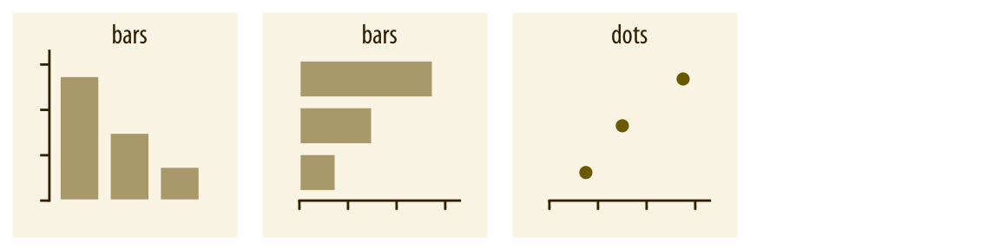
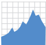
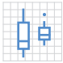

```{r setup, include=FALSE}
knitr::opts_chunk$set(echo = T,message=F,error=F,warning = F,cache = T)
require(lubridate)
require(tidyverse)
require(ggthemes)
require(gghighlight)
```

layout: true

<div class="slide-footer"><span> 
PPOL670 | Introduction to Data Science for Public Policy

&emsp;&emsp;&emsp;&emsp;&emsp;&emsp;&emsp;&emsp;&emsp;

Week 5 <!-- Week of the Footer Here -->

&emsp;&emsp;&emsp;&emsp;&emsp;&emsp;&emsp;&emsp;&emsp;&emsp;&emsp;&emsp;

Data Visualization <!-- Title of the lecture here -->

</span></div> 

---
class: outline

# Outline for Today 

<br><br>

- The **components** of a quantitative visualization

- Grammar of graphics with **`ggplot2`**

- Step-by-step **examples** of visualizing data

- Handling **dates**

---

class: newsection

# The Components of Data Visualization

---

### What do you see?

```{r,echo=F,fig.align="center",fig.width=10,fig.height=7,dpi=600}
set.seed(123)
x <- rnorm(1000)
y <- 1 + 2*x + 1*x^2 - .5*x^3  + rnorm(1000,sd=3)
tibble(y,x) %>% 
  mutate(color = ifelse(x>=0,"Post-Treatment","Pre-Treatment"),
         y = ifelse(x>=0,y+5,y),
         color = fct_rev(color)) %>% 
  ggplot(aes(x,y,color=color,pch=color)) +
  geom_point(size=3,alpha=.5) +
  theme_fivethirtyeight() +
  scale_color_manual(values=c("grey30","steelblue")) +
  labs(color="",pch="",x="X",y="Y",
       title="Regression Discontinuity",
       subtitle="Simulation of a regression discontinuity with discontinuity set to occur at x = 0",
       caption = "\nSource: Simulated Data") +
  theme(legend.position = "bottom",
        plot.title = element_text(size=20,family='serif'),
        text = element_text(size=20,family='serif'),
        axis.text = element_text(size=18,family='serif'),
        axis.title = element_text(size=18,family='serif'))
```


---

### Mapping data to space

.center[]

---

### Aesthetics

<br>
.center[]
<br><br>
.center[]

---


### Color as a tool to distinguish

.center[]

---

### Color as a tool to represent values

.center[]


---

### Color as a tool to highlight

```{r,echo=F,fig.align="center",fig.width=10,fig.height=7,dpi=600}
set.seed(123)
d <- purrr::map_dfr(
  letters,
  ~ data.frame(
      idx = 1:400,
      value = cumsum(runif(400, -1, 1)),
      type = .,
      flag = sample(c(TRUE, FALSE), size = 400, replace = TRUE),
      stringsAsFactors = FALSE
    )
)
ggplot(d,aes(idx,value,color=type)) +
  geom_line(size=1.5) + 
  gghighlight(max(value) > 20|min(value) < -20,use_direct_label = F) +
  scale_color_manual(values=c("steelblue","darkred")) +
  labs(x="Periods",y="Values") +
  theme_minimal() + 
  theme(legend.position = "none")
```


---

### Presentation as information

```{r,echo=F,fig.align="center",fig.width=8,fig.height=3}
set.seed(123)
D = map2_df(.x=c(1,5,3,10),.y=c("A","B","C","D"),
            .f= function(x,y) {tibble(v=rnorm(50,mean=x),grp=y)})
ggplot(D,aes(v)) +
  geom_density(fill="grey",alpha=.5) +
  labs(x="Variable",y="Density") +
  theme_hc()
```

--

```{r,echo=F,fig.align="center",fig.width=8,fig.height=4}
ggplot(D,aes(v,fill=factor(grp))) +
  geom_density(alpha=.5,color="white") +
  labs(x="Variable",y="Density",fill="Group") +
  theme_hc()
```


---

### Presentation as distortion

```{r,echo=F,fig.align="center",fig.width=8,fig.height=3}
ggplot(D,aes(v)) +
  geom_density(fill="grey",alpha=.5) +
  labs(x="Variable",y="Density") +
  theme_hc()
```

--

```{r,echo=F,fig.align="center",fig.width=8,fig.height=4}
ggplot(D,aes(v,fill=factor(grp))) +
  geom_histogram(alpha=.5,color="white",binwidth = .2) +
  geom_rug() +
  labs(x="Variable",y="Density",fill="Group") +
  theme_hc()
```

---

### The data type drives the visualization decisions

Think carefully about what you're trying to convey and what information you're using to make your point. 

<br>

.center[

| Data Type   | Example |  Scale  |
|-------------|---------|---------|
| Numerical   | `1.3`, `800`, `10e3` | Continuous | 
| Integer     | `1`, `2`, `3` | Discrete | 
| Categorical | `"dog"`, `"Nigeria"`, `"A"` | Discrete |
| Ordered     | `"Small"`, `"Medium"`, `"Large"` | Discrete |
| Dates/Time  | `2009-01-02`, `5:32:33` | Continuous |

]


---

### The data type drives the visualization decisions


.center[
.center[]
.center[]
.center[]
.center[]
]

---

class:newsection

# Grammar of Graphics

---

.pull-left[<br><br><br><br>]

.pull-right[
`ggplot2` (a part of the `tidyverse` package) is a power graphics package that offers a flexible and intuitive graphics language capable of building sophisticated graphics.

<br><br>

`ggplot` has a **special syntax** that we'll have to get used to, _but_ once we understand the basics, we'll be able to produce some advanced and sophisticated graphics with ease!
]

---


.pull-left[<br><br><br><br>]

.pull-right[

`ggplot2` is based on a **grammar of graphics**. In essence, you can build every graph from the same components that follow the same intuitive naming conventions.

Every graph is composed of

1. a **dataset**

2. **coordinate system**

2. **mappings** &rarr; the variables we're aiming to visualize

3. **geom**etric expressions of how the data should be projected onto a space

]

---

### (1) data

Let's use the `diamonds` data, which is an example dataset provided by `ggplot` that contains the prices and other attributes of almost 54,000 diamonds.

```{r}
glimpse(diamonds)
```

---

### (2) coordinate system

Use the `ggplot()` function to establish the coordinate system. 

```{r,fig.align="center",fig.height=4,dpi=600}
ggplot(data=diamonds)
```


---

### (3) mappings

What variables from the data do we want to map to the projected space?

- What variable makes up the y-axis?
- What variable makes up the x-axis?
- Are there any variables to group by? (More on this later)

--

<br><br>

Need to use a special function `aes()` (short for "aesthetics") to map variables from the data to the geometric space.

Whenever we want to plot a variable feature, we **_must_** wrap it in the `aes()` function.

---

### (3) mappings

What variables from the data do we want to map to the projected space?


```{r,fig.align="center",fig.height=4,dpi=600}
ggplot(data=diamonds,aes(x=price,y=carat))
```

---

### (4) geom &rarr; projection

How should your mappings be projected onto the coordinate space?

```{r,fig.align="center",fig.height=3.75,highlight=T,dpi=600}
ggplot(data=diamonds,aes(x=price,y=carat)) +
  geom_point() #<<
```

---

### (4) geom &rarr; projection

How should your mappings be projected onto the coordinate space?

.pull-left[

- `geom_` are aesthetic **layers** that are mapped onto the plot.

- We "add" layers and design preferences `+`.

- We can add as many layers as we want. Layers placed on top of one another in accordance with the order that they are specified.

- Plots can be assigned as objects and rendered later.

]

.pull-right[
```{r,fig.align="center",fig.height=6,highlight=T,dpi=600}
ggplot(data=diamonds,
       aes(x=price,y=carat)) +
  geom_point() 
```
]


---

.center[
<font color = "green">`ggplot`</font>(data = `<DATA>`) 

`+` 

<font color = "green">`<GEOM_FUNCTION>`</font>(mapping = <font color = "green">aes</font>(`<MAPPINGS>`))
]

--

.center[

`+` 

<font color = "green">`<GEOM_FUNCTION>`</font>(mapping = <font color = "green">aes</font>(`<MAPPINGS>`)) 

`+` 

<font color = "green">`<GEOM_FUNCTION>`</font>(mapping = <font color = "green">aes</font>(`<MAPPINGS>`)) 

`+` 

<font color = "green">`<GEOM_FUNCTION>`</font>(mapping = <font color = "green">aes</font>(`<MAPPINGS>`)) 

$$\vdots$$

]


---

.center[
<font color = "green">`ggplot`</font>(data = `<DATA>`) 

`+` 

<font color = "green">`<GEOM_FUNCTION>`</font>(mapping = <font color = "green">aes</font>(`<MAPPINGS>`))
]

.center[

`+` 

<font color = "red">`<SCALE_FUNCTION>`</font>(mapping = <font color = "green">aes</font>(`<MAPPINGS>`)) 

`+` 

<font color = "blue">`<THEME_FUNCTION>`</font>(mapping = <font color = "green">aes</font>(`<MAPPINGS>`)) 

`+` 

<font color = "orange">`<FACET_FUNCTION>`</font>(mapping = <font color = "green">aes</font>(`<MAPPINGS>`)) 

$$\vdots$$

]

---

### One variable?

.center[
| Expression   | Function   |     |
|----|----|-----|
| Area  | `geom_area()` |   | 
| Density  | `geom_density()` |   | 
| Dots  | `geom_dotplot()` |   | 
| Frequencies  | `geom_freqpoly()` |   | 
| Histogram  | `geom_histogram()` |   | 
]

---

### Two variables?

.center[
| Expression   | Function   |     |
|----|----|-----|
| Continuous Points  | `geom_point()` |   | 
| Continous Lines  | `geom_line()` |   | 
| Discrete Counts  | `geom_count()` |   | 
| Continuous and Discrete Distributions  | `geom_boxplot()` |   | 
| Densities  | `geom_hex()` |   | 
]

---

### Three variables?

.center[
| Expression   | Function   |     |
|----|----|-----|
|  Densities  | `geom_contour()` |   | 
|  Intensities  | `geom_tile()` |   | 
|  Intensities  | `geom_raster()` |   | 
|  Spatial  | `geom_map()` |   | 
]

--

Just a taste. Wide array of ways to express data in a geometric space. See reading and [data visualization cheatsheet](https://github.com/tidyverse/ggplot2) for guidance.

---

### Function Types in `ggplot2`

| Type | Function Header | Description |
|------|-----------------|-------------|
|  Generate layers from data   |  `geom_` | Use a geom function to represent data points, use the geom’s aesthetic properties to represent variables. Each function returns a layer. |
|   Construct statistics layers   |  `stat_` | A stat builds new variables to plot (e.g., count, prop) |
|   Change mapping characteristics   |  `scale_` | Scales map data values to the visual values of an aesthetic. To change a mapping, add a new scale. |
|   Generate subplots   |  `facet_` | Facets divide a plot into subplots based on the values of one or more discrete variables.  |
|   Alter the plots theme   |  `theme_` | Change the aesthetics of the plot background and feature (e.g. axes, text, grid lines, etc.)  |

---

### Exporting Plots

Note that `ggplot` objects can assigned to an object. 

```{r,fig.align="center",fig.width=4,fig.height=2}
my_plot <- ggplot(cars,aes(speed,dist)) + geom_point()
my_plot
```

--

We can export (or build off of) these plot objects using `ggsave()`

```{r,eval=F}
ggsave(plot = my_plot,filename = "my_plot.pdf",device = "pdf",width=5,height = 5)
ggsave(plot = my_plot,filename = "my_plot.png",device = "png",dpi = 300)
```

> Supports "eps", "ps", "tex" (pictex), "pdf", "jpeg", "tiff", "png", "bmp", "svg" or "wmf" (windows only).

