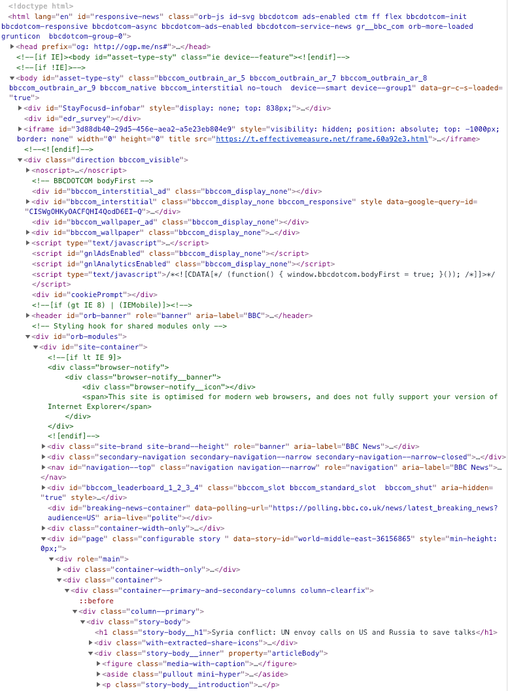

```{r setup, include=FALSE}
knitr::opts_chunk$set(echo = T,message=F,error=F,warning = F,cache=F)
require(rvest)
require(tidyverse)
require(lubridate)
```

layout: true

<div class="slide-footer"><span> 
PPOL670 | Introduction to Data Science for Public Policy

&emsp;&emsp;&emsp;&emsp;&emsp;&emsp;&emsp;&emsp;&emsp;

Week 6 <!-- Week of the Footer Here -->

&emsp;&emsp;&emsp;&emsp;&emsp;&emsp;&emsp;&emsp;&emsp;&emsp;&emsp;&emsp;

Webscraping <!-- Title of the lecture here -->

</span></div> 

---

class: newsection

##  Functions

---

## Writing Functions

![:space 5]

```{r}
# Basic Set Up

my_function = function(x,y) # Arguments broken up by commas
{ # Brackets that house the code 
  
  # Some code to execute 
  z = x*y
  
  return(z) # Return a data value
}

my_function(5,6)
```

---

## When to Write Functions

![:space 10]
### (1) Using the same code more than once

<br>

### (2) Complicated operation 

<br>

### (3) Vectorization 

---

class: newsection

## So you wanna scrape the web...

---

### What does it mean to "scrape" something off the web?

--

<br>
<br>

- leveraging the structure of a website to **grab it's contents**

- using a programming environment (such as R, Python, Java, etc.) to **systematically extract** that content.

- accomplishing the above in an "unobtrusive" and **legal** way.

---

### Website 

As internet consumers, we interact with the interface (or a **rendered version**) of a [webpage](https://www.bbc.com/news/world-middle-east-36156865). Since websites are just rendered code, every piece of that code can be tapped into.

.pull-left[

]

.pull-right[

]

---

### The many faces of HTML code

Keep in mind that there is 5 types of coding playing out simultaneously when rendering a website:

--

- **HTML**: generates/creates the actual content of a website
- **XML**: used to transmit data to a webpage from a server
- **PHP**: relays information between a server and the page (think passwords)
- **CSS**: responsible for the design of the website
- **JavaScript**: handles changes and animation.

--

All these different pieces of code work in conjunction (so all will be simultaneously present when viewing a website).

When scraping, we care primarily about **CSS** and **XML**.


---

### The Sturcture of HTML

![:space 5]

HTML code is structured using tags, and information is organized hierarchcially (like a list or an array) from top to bottom. When scraping, the tags that are of most use are:

- **p** – paragraphs
- **a href** – links
- **div** – divisions
- **h** – headings
- **table** – tables

We can examine the HTML of a website by inspecting the content within it.

---

### R Packages

There are many packages that can be effectively used to download content from a website. Here I highlight a few, but new stuff is coming out all the time.

<br><br>

```{r,eval=F}
require(rvest) # existing in the tidyverse 
require(httr) # great for interacting with APIs
require(xml2) # rvest draw from this package
require(RCurl) # older but stable. Behaves well with other packages
require(XML) # older but stable. Behaves well with other packages
require(jsonlite) # for dealing with json output
```


---

class:newsection

## Scraping Content

---

### ABCs of Webscraping 

Let's scrape content off of the following BBC [news story](https://www.bbc.com/news/blogs-trending-54121992).

--

<br>

When scraping data online, keep the following procedure in mind:

- (**A**) identify what information you want
- (**B**) examine the HTML structure and elements
- (**C**) download website
- (**D**) extract element (i.e. it's position)
- (**E**) clean element
- (**F**) store outcome

---

### ABCs of Webscraping 

Let's scrape content off of the following BBC [news story](https://www.bbc.com/news/blogs-trending-54121992).

<br>

Here let's aim to extract three pieces of information from the BBC story:

- **Headline**

- **Date**

- **Story Content**

---

### Download the website

![:space 5]

```{r}
require(rvest) 

url <-  "https://www.bbc.com/news/blogs-trending-54121992"
site <- read_html(url)
site
```

![:space 5]

Here the entire information located on the website is no retained in a single object. **Why is this useful?**

---

### Extract and clean the desired element

![:space 5]

Let's locate the XML code for the headline.

```{r}
headline.path = '//*[@id="comp-blog-story-content"]/h2/span'
headline = site %>% html_node(.,xpath = headline.path)
headline
```

![:space 5]

Still jargon ...


---

### Extract and clean the desired element

![:space 5]

We need to clarify what _kind_ of element we are seeking to retrieve (think of this as translating the HTML).

```{r}
headline = headline %>% html_text(.)
headline
```

![:space 5]

**Success!**

---

### Extraction takes many forms

```{r}
site %>% 
  html_node(.,xpath = headline.path) %>% 
  html_name(.)
```

```{r}
site %>% 
  html_node(.,xpath = headline.path) %>% 
  html_attrs(.)
```

```{r}
site %>% 
  html_node(.,xpath = headline.path) %>% 
  html_structure(.)
```

---

### Rinse, wash, and repeat: Date

![:space 5]

```{r}
# Grab the date using CSS
date.path = '#comp-blog-story-content > div.with-extracted-share-icons > div > div > div.mini-info-list-wrap > ul > li > div'

# So long! That's why I prefer XML
date = site %>% 
  html_node(.,css = date.path) %>% 
  html_text(.)

# format date into a usable "R format"
date = as.Date(date,"%d %b %Y")
date
```

---

### Rinse, wash, and repeat: Story

![:space 5]

To get **all** of the body text, we really need to think about what it is we are grabbing. Here comprehending the structure of the website can be really useful.

```{r}
body.path = '//*[@id="comp-blog-story-content"]/div[3]/p[1]'

site %>% 
  html_node(.,xpath=body.path) %>% 
  html_text(.)
```

This will only give us a piece of the story – **p[1]**

---

### Rinse, wash, and repeat: Story

But we want the _whole_ thing

```{r,highlight=T}
body.path = body.path = '//*[@id="comp-blog-story-content"]/div[3]/p'

body <- 
  site %>% 
  html_nodes(.,xpath=body.path) %>% #<<
  html_text(.) 
body
```

---

### Storage

![:space 5]

```{r}
output <- 
  tibble(headline,
         date,
         body = paste0(body,collapse=" "))  #<<
output
```

```{r,tidy=F}
# Number of characters in the variable entry
nchar(output$body) 
```

---

### Sidenote on `html_table`s

![:space 10]

Sometimes data is conveniently organized as **_tables_** in the html code, i.e. there is a table tag in the `<table>`.

For example, let's look at this [Wikipedia post on English Towns and Cities](https://en.wikipedia.org/wiki/List_of_towns_in_England)... should look familiar ;).

Extracting the **_table in the post_** is a breeze thanks to the `html_table()` function.

_Note that there can be many tables on a page, `html_table()` downloads them all and then stores the content as a list._

---

### Sidenote on `html_table`s

```{r, highlight=T}
url <- 'https://en.wikipedia.org/wiki/List_of_towns_in_England'

d <- read_html(url) %>% 
  html_table(fill = TRUE)

d[[1]] # Data returned as a list #<< 
```

---

class:newsection

## Building a Scraper

---

### Got the bones? Get the goods

Once you have a blueprint of the HTML structure, you can easily find your way around.

We can **systematically use the information** we know about the HTML structure to grab new information with ease.

This allows us to draw similar information from similarly composed html pages. 
--

### HTML structure changes over time!

Websites are constantly being updated, reformatted, and changed in other ways. This presents a real challenge when scraping, because we need to understand the variability in the structure and adapt our code to it.

---

### Building a "BBC Scraper"

![:space 5]

The aim: 

- wrap the three steps from the example into a convenient function. 

- the function takes in a _url_ as **input**, and

- **outputs** the desired web content. 

---

```{r}
bbc_scraper <- function(url){
  
  # Download website   
  raw = read_html(url)
  
  # Extract headline
  headline = raw %>% 
    html_nodes(xpath='//*[@id="comp-blog-story-content"]/h2/span') %>% 
    html_text()
  
  
  # Extract dat3
  date = raw %>% 
    html_nodes(xpath='//*[@id="comp-blog-story-content"]/div[2]/div/div/div[1]/ul/li/div') %>% 
    html_text()
  
  # Extract Story
  story = raw %>% 
    html_nodes(xpath='//*[@id="comp-blog-story-content"]/div[3]/p') %>% 
    html_text() %>% paste0(.,collapse = " ")
  
  # Output as data frame and return
  data.out = tibble(headline,date,story)
  return(data.out)
}
```


---


![:space 10]

Now all we need is to feed it urls.

```{r,cache=T}
urls <- c(
  "https://www.bbc.com/news/blogs-trending-54121992",
  "https://www.bbc.com/news/blogs-trending-53997203",
  "https://www.bbc.com/news/blogs-trending-53948820"
)

output <- c()
for(i in 1:length(urls)){
  draw <- bbc_scraper(urls[i])  
  output <- bind_rows(output,draw)
}

glimpse(output)
```

---

![:space 10]

```{r}
output$headline 
```

```{r}
output$date
```

```{r}
output$story
```

---

class: break

# Legality

Now that you've learned how to build a simple scaper. Here are a few things to keep in mind…

![:space 5]

**Don't scrape too fast!</font>**

- Your behavior is statistically distinguishable from human users.

- Constitutes a [DDOS attack](https://en.wikipedia.org/wiki/Denial-of-service_attack)

- Known the websites **terms of service** – breaking those terms can lead to being banned from the site or even [jail time](https://www.wired.com/2011/07/swartz-arrest/).


---

# Solution

<br>

- **Slow down**

- **Add noise** to make your behavior less statistically distinguishable.

- **Know what you're doing** and who you're doing it to.
  + In the words of Nietzsche: “if thou gaze long into an abyss, the abyss will also gaze into thee”
  + That is, the internet is a two way street. Scraping content from some sites puts you on peoples' radar.

- [`robot.txt`](http://www.robotstxt.org/) to know what you can and can't scrape.
  + `www.bbc.com/robots.txt`

---

# Solution

<br>

Create noise by **randomly** putting your scraper to **sleep**.

```{r}
# One random unit of time drawn from a uniform distribution
runif(1,1,4) 
```
<br>
<br>
```{r,eval=F}
# Put the system to sleep by that random unit
Sys.sleep(runif(1,1,5))
```

---

# Solution

<br>

Using our previous example, we deliberately slow `bbc_scraper()` down:


```{r,eval=F}
output <- c()
for(i in 1:length(urls)){
  Sys.sleep(runif(1,1,5)) #<<
  draw <- bbc_scraper(urls[i])  
  output <- bind_rows(output,draw)
}
```

<br>

Keep in mind that if you're a social scientist (which we are), nothing you're doing is **_that_** pressing. You can wait and everyone will be better off for it!

---

## Grab data once, <br> _not again and again_....

One important thing to keep in mind when writing scraping code in `.Rmd`: we _don't_ want to accidently _re-scrape_ the data every time we knit the document! 

**Two stategies to get around this:**

- **_(1) cache results for code chunks that aim to scrape data._**

- **_(2) set `eval = FALSE` for the code chunks that aim to scrape data._**

    - Scrape the data on your own;
    - Save the data to the project;
    - Re-read the data back in when knitting the document.

---


class: newsection

# Dates

---

## Dates and Time

`R` has a specific `Date` class. We will use the function `as.Date()` to coerce a relevant string into a date class.

```{r}
str <- "2006-04-30"
class(str)
date_str <- as.Date(str)
class(date_str)
```

---

Objects of class date have some nice properties, that makes analysis and manipulation easy.

```{r}
date_str
date_str + 30 # date in 30 days
date_str - 3000 # date 300 days ago.
```

---

This also allows us to look at the distance between two dates.
```{r,echo=F}
date1 = as.Date("2015-06-07")
date2 = as.Date("2013-02-14")
```
```{r}
date1
date2
date1-date2
```


---

## Formatting Dates

That said, dates come in many different formats. To let `R` know that a specific string is a date, we have to tell it the **date format**.

```{r,eval=F}
example <- "February 3, 1987"
as.Date(example)
```

---

## Formatting Dates

That said, dates come in many different formats. To let `R` know that a specific string is a date, we have to tell it the **date format**.
```{r}
example <- "February 3, 1987"
as.Date(example, format = "%B %d, %Y")
```

---

**Formatting dates** is requires that we articulate to `R`via special syntax what each date feature is. In a string (i.e. using " "), we specify the exact pattern of the date with **_all appropriate punctuation and spacing_**.

The following are the main expressions used in formatting.

.center[
| Expression  | Type of Date |
|------|-----------------|
| `%d` | day as a number | 
| `%a` | abbreviated weekday |
| `%A` | unabbreviated weekday |
| `%m` | month as number |
| `%b` | abbreviated month |
| `%B` | unabbreviated month
| `%y` | 2 digit year |
| `%Y` | 4 digit year |
]

---

```{r}
as.Date("Friday March 13, 2009","%A %B %d, %Y")
```

```{r}
as.Date("11/13/14","%m/%d/%y")
```

```{r}
as.Date("7th of May 2000","%dth of %B %Y")
```

---

## Practice

How would we convert this date: `03Feb2009`?

--

```{r}
as.Date("03Feb2009","%d%b%Y")
```

--

How would we convert this date: `01/10/02`?

--

```{r}
# Tricky... Which is the month? Year? Day?
as.Date("01/10/02","%d/%m/%y")
```
```{r}
# ???
as.Date("01/10/02","%y/%m/%d")
```
```{r}
# ???
as.Date("01/10/02","%m/%y/%d")
```

---

## Lubridate

The `lubridate` package offers a useful toolkit for dealing with date features in `R`. It offers a number of parsing features that dramatically ease date manipulation. 

```{r,eval=F}
install.package("lubridate")
require(lubridate)
```

--

```{r}
our_date = as.Date("1990-05-03")
our_date
```

```{r}
year(our_date)
```

```{r}
month(our_date)
```

```{r}
day(our_date)
```

---

Quick parsing features

```{r}
ymd("1990/05/03")
```

```{r}
ydm("1990/03/05")
```

```{r}
dmy("03/05/1990")
```

--

Gather qualitative labels

```{r}
wday(our_date,label=T)
```

```{r}
wday(our_date+5,label=T)
```

---

More complex expressions of time.

```{r}
our_date2 <- "2009-05-04 05:11:33"
ymd_hms(our_date2)
```

Specify time zone

```{r}
tt <- ymd_hms(our_date2,tz = "EST")
tt
```

Convert time zone.

```{r}
with_tz(tt,tzone = "America/Boise")
```

---

## Rounding dates 

```{r}
our_date
```


```{r}
round_date(our_date,unit = "week")
```

```{r}
round_date(our_date,unit = "month")
```

```{r}
round_date(our_date,unit = "year")
```


```{r}
floor_date(tt,unit = "hour")
```


```{r}
ceiling_date(tt,unit = "minute")
```


---

## Durations

```{r}
dyears(3)
```

```{r}
dweeks(3)
```

```{r}
# How many seconds of your youth am I taking from you?
dhours(2.5) 
```

---

### Dates are frustrating... but they don't need to be

![:space 5]

- Dates in `R` can be frustrating, but **lubridate** eases manipulation and is readable to boot!

<br>

- Check out the [Cheatsheet](https://rawgit.com/rstudio/cheatsheets/master/lubridate.pdf) for a quick guide on date formating.

<br>

- See reading [Dates and Times](https://r4ds.had.co.nz/dates-and-times.html) chapter from the reading this week. 
