```{r setup, include=FALSE}
knitr::opts_chunk$set(echo = T,message=F,error=F,warning = F)
require(tidyverse)
require(maps)
```

layout: true

<div class="slide-footer"><span> 
PPOL670 | Introduction to Data Science for Public Policy

&emsp;&emsp;&emsp;&emsp;&emsp;&emsp;&emsp;&emsp;&emsp;

Week 7 <!-- Week of the Footer Here -->

&emsp;&emsp;&emsp;&emsp;&emsp;&emsp;&emsp;&emsp;&emsp;&emsp;&emsp;&emsp;

Introduction to Geospatial Data <!-- Title of the lecture here -->

</span></div> 


---

## Vector Data Model

```{r,echo=F,fig.align='center',fig.width=12,fig.height=7}
map_data("world") %>%
  ggplot(aes(x=long,y=lat,group=group)) +
  geom_polygon()
```
---

## Vector Data Model


---

## Vector Data Model

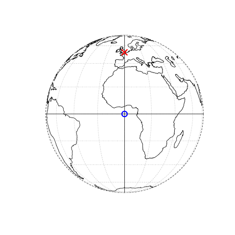

---

## Simple Features


---

## Raster Data Model


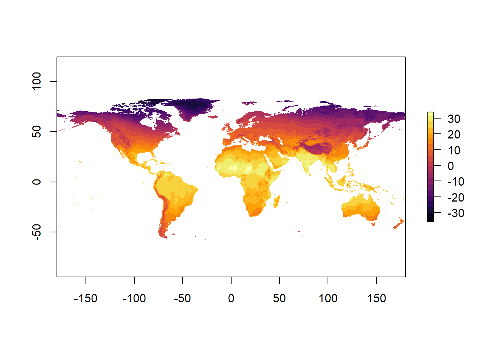

---

## Raster Data Model

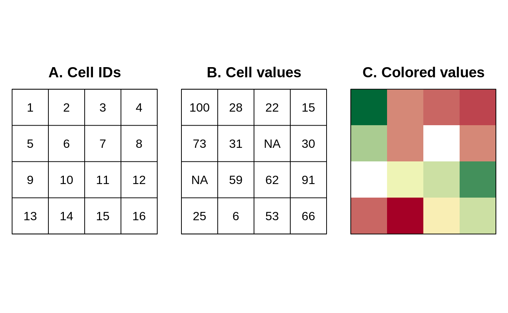

---

## Raster Data Model


---

## Raster Data Model

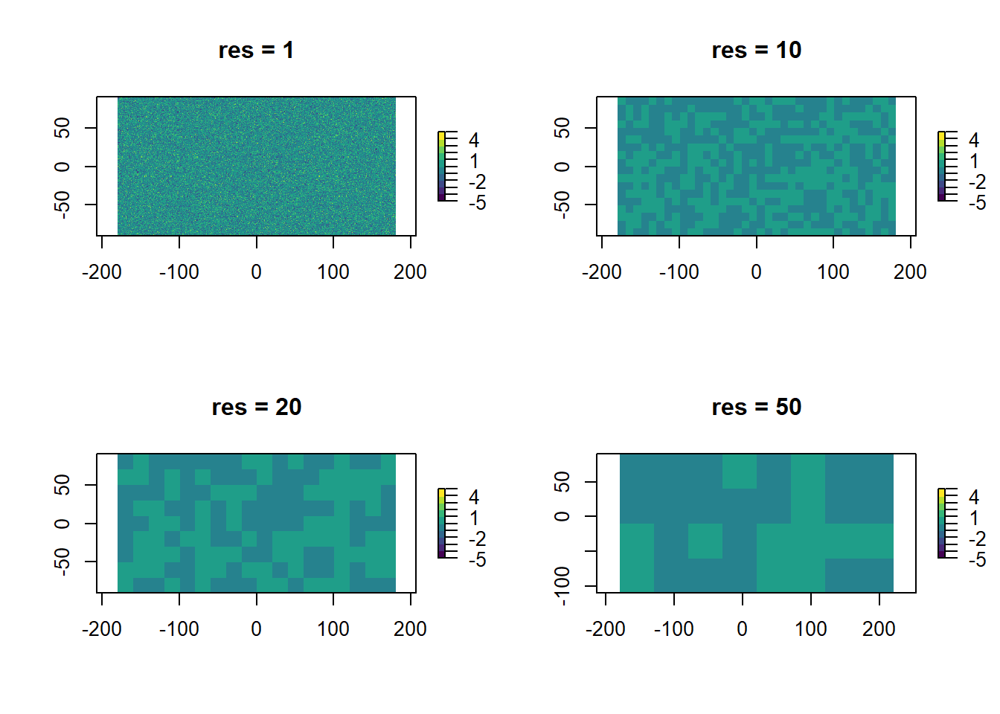


---

## Projections

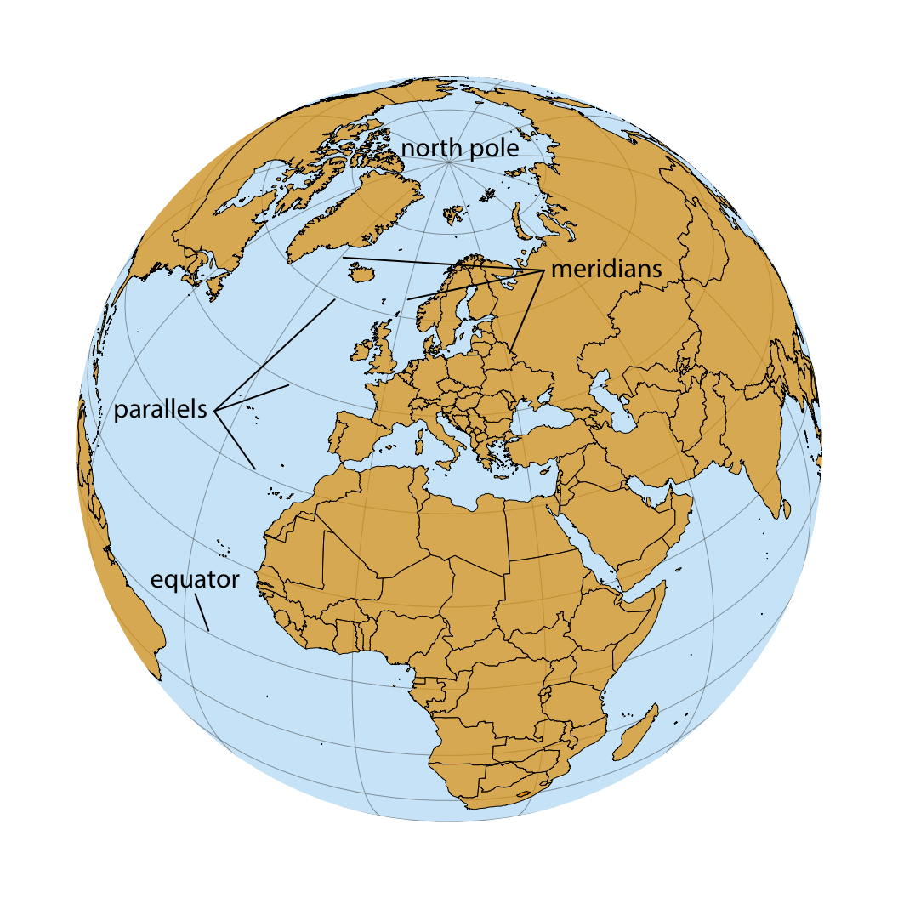

---

## Mercator Projection

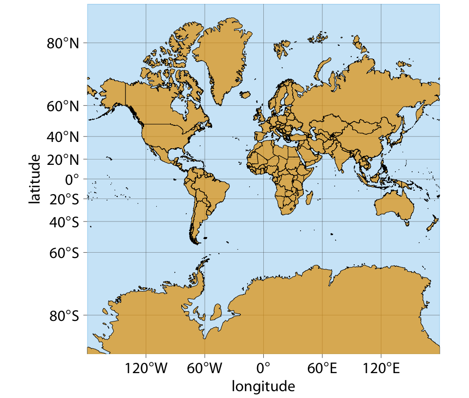

---

## Goode Homolosine Projection

![:space 10]
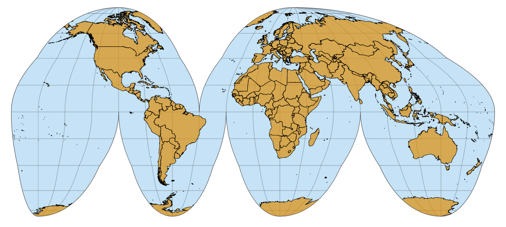

---

## WSG Projection

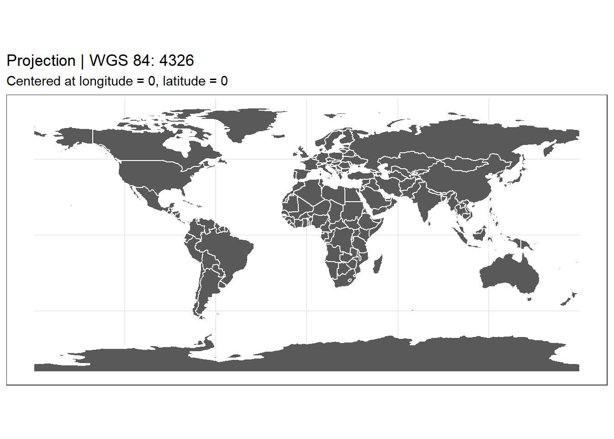

---

## Mollweide Projection

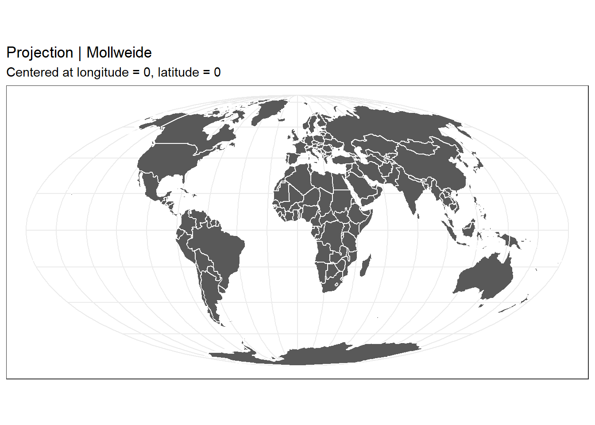

---

## Layers

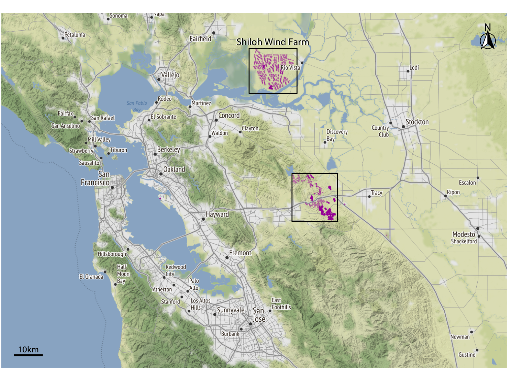


---

## Layers

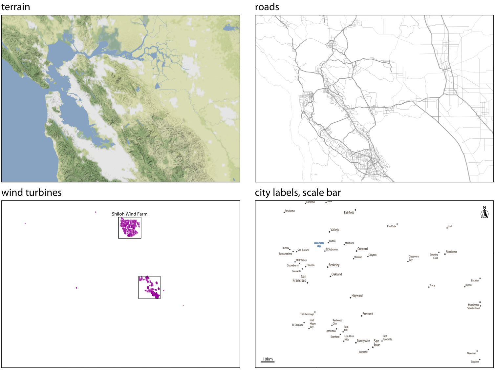
