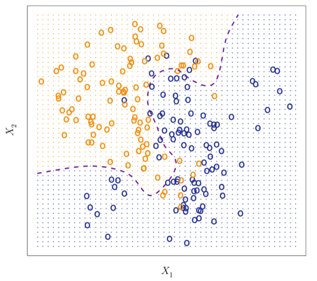
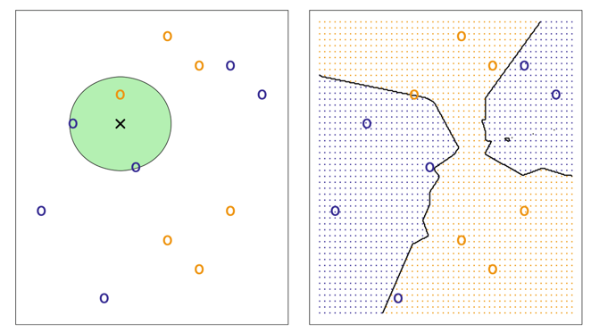
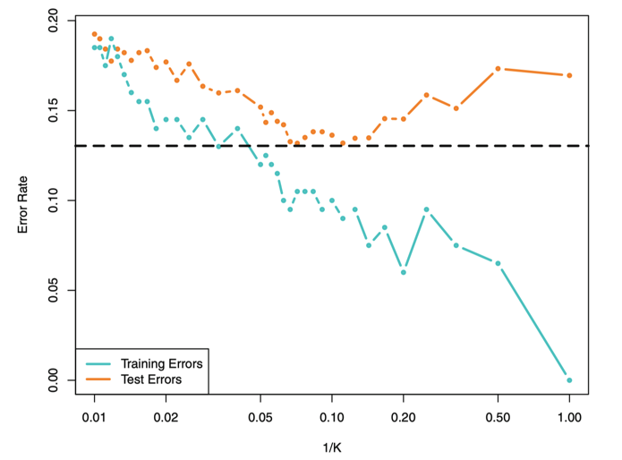
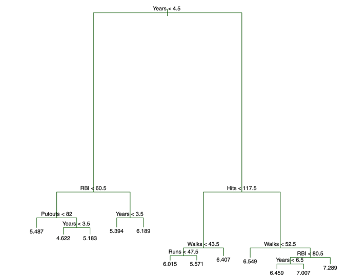
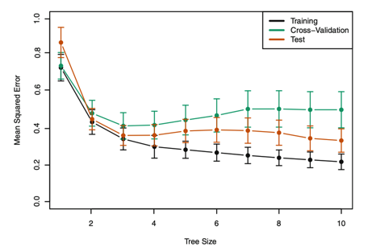
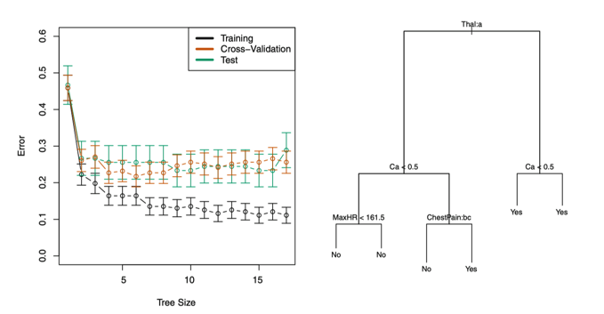

```{r setup, include=FALSE}
# Run for Interactive Slide Editing: 
# xaringan::inf_mr()
knitr::opts_chunk$set(echo = T,message=F,error=F,warning = F,cache=T)
require(tidyverse)
require(ggthemes)
```

layout: true

<div class="slide-footer"><span> 
PPOL670 | Introduction to Data Science for Public Policy

&emsp;&emsp;&emsp;&emsp;&emsp;&emsp;&emsp;&emsp;&emsp;

Week 8 <!-- Week of the Footer Here -->

&emsp;&emsp;&emsp;&emsp;&emsp;&emsp;&emsp;&emsp;&emsp;&emsp;&emsp;&emsp;

Supervised Learning <!-- Title of the lecture here -->

</span></div> 

---
class: outline

# Outline for Today 

<br>

- **Refresh on Classification Problems**

<br>

- **K Nearest Neighbors**

<br>

- **Classification and Regression Trees**

<br>

- **Bagging and Random Forests**


---

class: newsection

# Classification

---

<br>

.center[]

---

### Decision Boundary 

.center[]

---

### Conditional Probability 

Given $y \in 0,1$ (two classes)

$$pr(y_i = 1 | X = \vec{x_i})$$

--

<br>


$$\hat{f}(\vec{x_i}) \in [0,1]$$ 

where $\hat{f}(\cdot)$ is an approximation for the true data generating process $f(\cdot)$ and $\vec{x_i}$ is a vector of variables for observation $i$.

--

<br> 

$$\hat{y_i} =\begin{cases} 1~~\text{if}~~\hat{f}(\vec{x_i})  > .5 \\ 0~~\text{if}~~\hat{f}(\vec{x_i})  \le .5 \end{cases}$$

---

<br><br><br>

$$\hat{y_i} =\begin{cases} 1~~\text{if}~~\hat{f}(\vec{x_i})  > .5 \\ 0~~\text{if}~~\hat{f}(\vec{x_i})  \le .5 \end{cases}$$

<br>

.center[.5 is an arbitrary threshold ( $\tau$ ) that we can adjust. 

larger $\tau$ means more false negatives

smaller $\tau$ means more false positives
 ]


---

### Accuracy 


$$\hat{y}^{test}_i = \hat{f}(x^{test}_i)$$

.center[
| | $y^{test}_i$ |  $\hat{y}^{test}_i$ |  
|----|:------------:|:-------------------:|
| **True Positive** | 1 |  1 |  
| **False Positive** | 0 |  1 | 
| **False Negative** | 1 |  0 |  
| **True Negative** | 0 |  0 |  
]

--

<br>

$$ \text{average test error} = \frac{\sum^N_{i=1} I(y^{test}_i \ne \hat{y}^{test}_i)}{N}$$

---

### Accuracy

.center[
|                       |  $actual~(+)$ |  $actual~(-)$ |
|-----------------------|----------|----------|
| $Predicted~(+)$  |   True Positive (TP)       | False Positive (FP)          |
| $Predicted~(-)$  |   False Negative (FN)       |  True Negative (TN)         |

]

--

<br>

| Metric | Calculation |  Description |
|:---:|:-----:| -----|
| Accuracy | $\frac{TP + TN}{TP+FP+TN+FN}$ | In total, how accurate is the model |
| Precision | $\frac{TP}{TP+FP}$ | Of the true positives classified, how many are actually positive | 
| Specificity | $\frac{ TN }{ TN + FP }$ | Of the actual true negatives, how many were correctly classified | 
| Recall/Sensitivity | $\frac{TP}{ TP + FN}$ | Of the actual true positives, how many were correctly classified |

---

### ROC and AUC

.center[]

---

### Bias-Variance Tradeoff

<br><br>
.center[]


---

class: newsection

<br>

# $K$-Nearest Neighbors

---


```{r,echo=F,fig.align="center",fig.width=10,fig.height=8}
# Create Data
set.seed(1234)
N = 50
x1 = runif(N)
x2 = runif(N)
y = rbinom(N,1,.5)
D = tibble(x1,x2,y)
D$x1_star = .63
D$x2_star = .37
D <- 
  D %>% 
  mutate(distance_x1 = sqrt((x1 - x1_star)^2),
         distance_x2 = sqrt((x2 - x2_star)^2),
         distance = (distance_x1 + distance_x2)/2 )

new_size = 6

D %>% 
  ggplot(aes(x1,x2,color=factor(y))) +
  geom_point(size=3) +
  scale_color_manual(values=c("steelblue","darkred")) +
  theme_minimal() +
  theme(text = element_text(size=24),
        legend.position = "none",
        legend.text = element_text(size=20),
        title = element_text(hjust=.5)) 
```


---

```{r,echo=F,fig.align="center",fig.width=10,fig.height=8}
D %>% 
  ggplot(aes(x1,x2,color=factor(y))) +
  geom_point(size=3) +
  scale_color_manual(values=c("steelblue","darkred")) +
  geom_point(x=.63,y=.37,color="black",pch=18,size=new_size) +
  theme_minimal() +
  theme(text = element_text(size=24),
        legend.position = "none",
        legend.text = element_text(size=20),
        title = element_text(hjust=.5)) 
```

---

```{r,echo=F,fig.align="center",fig.width=10,fig.height=8}
D %>% 
  ggplot(aes(x1,x2,color=factor(y))) +
  geom_point(size=3) +
  scale_color_manual(values=c("steelblue","darkred")) +
  geom_point(x=.63,y=.37,color="black",pch=18,size=new_size) +
  geom_segment(aes(x=x1_star,xend=x1,y=x2_star,yend=x2),alpha=.2,size=1) +
  geom_point(x=.63,y=.37,color="black",pch=18,size=new_size) +
  theme_minimal() +
  theme(text = element_text(size=24),
        legend.position = "none",
        legend.text = element_text(size=20),
        title = element_text(hjust=.5)) 
```

---

```{r,echo=F,fig.align="center",fig.width=10,fig.height=8}
D %>% 
  ggplot(aes(x1,x2,color=factor(y))) +
  geom_point(size=3) +
  scale_color_manual(values=c("steelblue","darkred")) +
  geom_point(x=.63,y=.37,color="black",pch=18,size=new_size) +
  geom_segment(aes(x=x1_star,xend=x1,y=x2_star,yend=x2),alpha=.2,size=1) +
  geom_point(x=.63,y=.37,color="black",pch=18,size=new_size) +
  gghighlight::gghighlight(distance <.07  ) +
  theme_minimal() +
  theme(text = element_text(size=24),
        legend.position = "none",
        legend.text = element_text(size=20),
        title = element_text(hjust=.5)) 
```


---

```{r,echo=F,fig.align="center",fig.width=10,fig.height=8}
D %>% 
  ggplot(aes(x1,x2,color=factor(y))) +
  geom_point(size=3) +
  scale_color_manual(values=c("steelblue","darkred")) +
  geom_point(x=.63,y=.37,color="black",pch=18,size=new_size) +
  geom_segment(aes(x=x1_star,xend=x1,y=x2_star,yend=x2),alpha=.2,size=1) +
  geom_point(x=.63,y=.37,color="black",pch=18,size=new_size) +
  gghighlight::gghighlight(distance <.07  ) +
  geom_point(x=.63,y=.37,color="darkred",pch=18,size=new_size + .5) +
  theme_minimal() +
  theme(text = element_text(size=24),
        legend.position = "none",
        legend.text = element_text(size=20),
        title = element_text(hjust=.5)) 
```

---

### KNN

<br>

.center[ ]

---

### KNN

- Non-parametric method that treats inputs as coordinate sets

- Classifies by distance of the new entry (test data) to existing entries (training data). 

--

- Distance can be conceptualized in a number ways. Euclidean distance is common:

$$distance = \sqrt{(x_{ij} - x_{0j})^2}$$

--

- Classification occurs as a "_majority vote_"

$$Pr(y_{ik} = j~|~X = x_{ik}) = \frac{\sum^K_{k=1} I(y_{ik} =j )}{K}$$

--

- Poor performance well in high dimensions


---

### $k$ is a tuning parameter

<br>

.center[ ]


---

### $k$ is a tuning parameter

.center[ ]


---

class: newsection

# Classification and Regression Trees

---


.center[ ]

---

### Hitting Averages and Experience on Salary

<br>

.pull-left[
.center[ ]
]

.pull-right[
.center[ ]
]

---

<br>

The goal is to find boxes ( $R_1 ,\dots , R_j$ ) that minimize the RSS, given by

$$\sum^J_{j=1} \sum_{i \in R_j} (y_i - \hat{y}_{R_j})^2$$

where $\hat{y}_{R_j}$ is the mean response for the training observations within the $j$th box.

--

We take a top-down, greedy approach that is known as **_recursive binary splitting_**

- **Top-down**: start with one region and break from there.

- **Greedy**: best split is made at each step (best split given the other splits that have been made)

---

### The essence of recursive binary splitting

- (1) From the predictors $X$ select a predictor $X_j$

--

- (2) Find a cutpoint ( $s$ ) that splits $X_j$ into two regions that leads to the greatest possible reduction in RSS.

$$R_1(j,s) = \{X~|~X_j <s\}~\text{and}~ R_2 (j,s) = \{X~|~X_j \ge s\}$$ 

--

- (3) Looking for an $s$ and $j$ that minimizes

$$\sum_{i: ~x_i \in R_1(j,s)} (y_i - \hat{y}_{R_1})^2 + \sum_{i: ~x_i \in R_2(j,s)} (y_i - \hat{y}_{R_2})^2$$

where $\hat{y}_{R_1}$ and $\hat{y}_{R_2}$ are the mean responses for the training data in region 1 ( $R_1(j,s)$ ) and region 2  ( $R_2(j,s)$ )

--

- (4) Repeat the process until a stopping criterion is met

---

### Tree Pruning


.center[ ]


---

### Tree Pruning

- Shallow trees (a few splits) can result in underfitting. 

- Deep trees (many splits) can result in overfitting

--

<br>

Balance by penalizing depth using a "**_complexity criterion_**" ( $\alpha$ )

$$\sum^T_{m=1}\sum_{i:x_i \in R_m} (y_i - \hat{y}_{R_m}) ^2 + \alpha T$$

- $T$ indicates the number of terminal nodes, 
- $R_m$ is the rectangle (i.e. the subset of predictor space) corresponding to the $m$th terminal node
- $\hat{y}_{R_m}$ is the predicted response associated with $R_m$.


---

### Tree Pruning as a tuning parameter


.pull-left[The tuning parameter $\alpha$ controls a trade-off between the subtree’s complexity and its fit to the training data. 

<br>

- $\alpha \rightarrow 0$ means deeper tree

- $\alpha \rightarrow 1$ means a shallow tree

<br>

Need to use cross-validation to figure out the right value of $\alpha$.
]

.pull-right[

<br><br><br>
.center[ ]

]

---

### Classification Trees

<br>

- Categorical rather than continuous outcome

- Similar process

- Predict most commonly occurring class of training observations in the region to which it belongs.

- Use the **_Gini Index_** as a measurement of error

$$G = \sum^K_{k=1} \hat{p}_{mk} (1-\hat{p}_{mk})$$

- Gini index gets small if all $\hat{p}_{mk}$ are close to zero or one ("node purity")

---

<br><br><br><br>

.center[
 
]


---

### Regression vs. Trees

.center[
 
]

---

### Pros and Cons of Trees

Pros:

- Easy to explain/visualize

- Easy handle qualitative predictors

- Can deal well with data inconsistencies

Cons:

- Less predictive accuracy

- Suffer from high variance


---

class: newsection

## Bagging & Random Forest

---

### Bagging

**Bootstrap aggregation**, or **bagging**, is a general-purpose procedure for reducing the variance of a statistical learning method.

--

The idea:

- take many training sets from the data
- build separate tree one each training set 
- average the predictions

--

.center[
 
]

---

### What is bootstrapping?


.center[
 
]

---

Say we have two groups (people on a bus) and we want to know that their average age is statistically different. 

```{r}
bus1 <- tibble(age=c(55,34,21,14,57,43,26))
bus2 <- tibble(age=c(23,24,37,51,8,30,48))
```

--

We can just run a difference in means test.

```{r}
mean(bus1$age)-mean(bus2$age)
```

```{r}
t.test(bus1$age,bus2$age)
```


---

Say we have two groups (people on a bus) and we want to know that their average age is statistically different. 

```{r}
bus1 <- tibble(age=c(55,34,21,14,57,43,26))
bus2 <- tibble(age=c(23,24,37,51,8,30,48))
```

Or we could bootstrap. The key is sampling _with replacement_.

.pull-left[
```{r,seed=123}
bus1 %>% 
  sample_n(4,replace = 5)
```
]
.pull-right[
```{r,seed=123}
bus2 %>% 
  sample_n(4,replace = 5)
```
]

---

Do this many times...

```{r,fig.align="center",fig.width=8,fig.height=3.25,highlight=T}
boot_samples = rep(0,100)
for(i in 1:100){
  boot_samp1 = bus1 %>% sample_n(4,replace = 5)
  boot_samp2 = bus2 %>% sample_n(4,replace = 5)
  mu1 <- mean(boot_samp1$age)
  mu2 <- mean(boot_samp2$age)
  boot_samples[i] <- mu1 - mu2
}
tibble(means = boot_samples) %>% 
ggplot(aes(x=means)) + 
  geom_density(fill="grey30") + 
  geom_vline(xintercept = 4.14,color="red") # actual mean#<< 
```


---

### Same idea but with trees... 

Grow many of trees then average the predictions


$$\hat{f}_{avg}(x) = \frac{\sum^B_{b=1} \hat{f}_b(x) }{B}$$

<br>

--

.center[
 
]

---

### Random Forest 

- Issue with bagging is that the trees are **_highly correlated_**. 

--

- One way around this is to also take a **_random sample of predictors_** at each split (in addition to bagging). Algorithm is _not allowed_ to consider a majority of the available predictors.

--

- Number of predictors the algorithm is able to select  (`mtry`) is a **_tuning parameter_**

.center[
 
]

