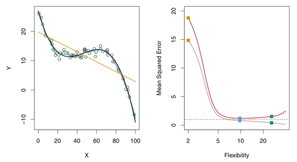
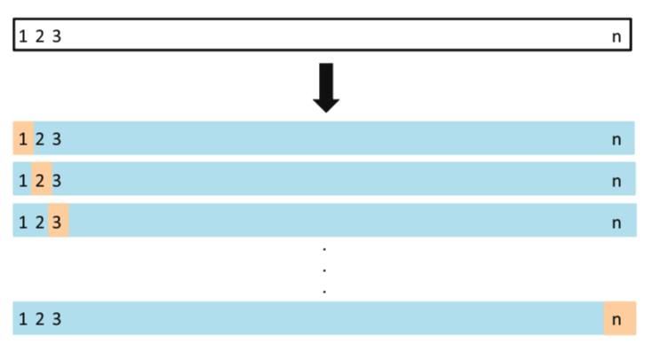
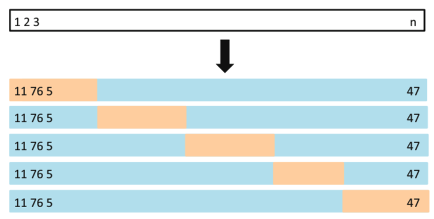
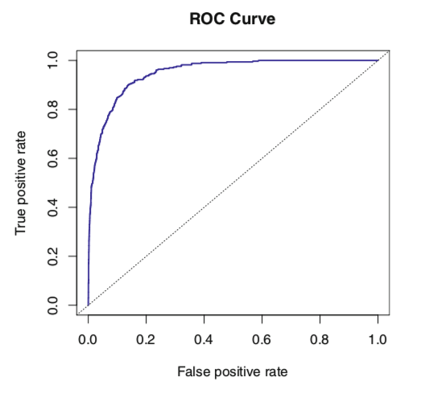
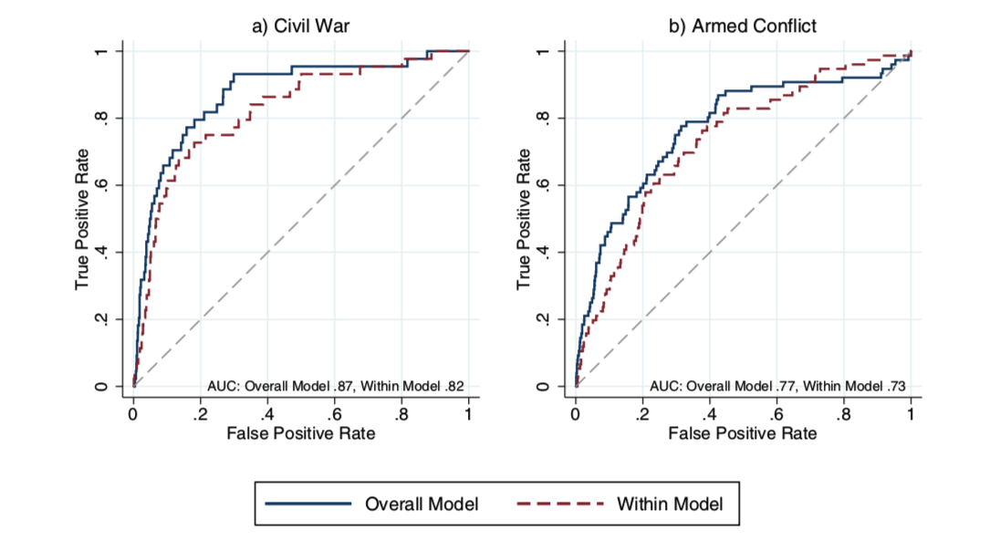

```{r setup, include=FALSE}
knitr::opts_chunk$set(echo = T,message=F,error=F,warning = F,cache=T)
require(tidyverse)
require(caret)
require(recipes)
```

layout: true

<div class="slide-footer"><span> 
PPOL670 | Introduction to Data Science for Public Policy

&emsp;&emsp;&emsp;&emsp;&emsp;&emsp;&emsp;&emsp;&emsp;

Week 8  <!-- Week of the Footer Here -->

&emsp;&emsp;&emsp;&emsp;&emsp;&emsp;&emsp;&emsp;&emsp;&emsp;&emsp;&emsp;

Introduction to Statistical Learning <!-- Title of the lecture here -->

</span></div> 

---
class: outline

# Outline for Today 

- **_What is Statistical Learning?_**

- Talk about **_Supervised Learning_** and issues of over/under fitting

- Delve into **_Cross-Validation_**

- Briefly discuss **_Performance Metrics_**

- Introduction to the **`caret`** package 

- Discussion **_preprocessing data_**

<br>

> This week covers the basics/theory, new week we'll apply what we learned.

---

class: newsection

# Statistical Learning

---

### What is statistical learning?

The aim is to model the  relationship between the outcome and some set of features features

$$y = f(X) + \epsilon$$

where 

- $y$ is the outcome/dependent/response variable 

- $X$ is a matrix of predictors/features/independent variables 

- $f$ is some fixed but unknown function mapping $X$ to $y$. The "signal" in the data.

- $\epsilon$ is some random error term. The "noise" in the data.

---

### What is statistical learning?

Statistical learning refers to a set of methods/approaches for estimating $f(.)$ 

$$\hat{y} = \hat{f}(X)$$

Where $\hat{f}(X)$ is an approximation of the "true" functional form, $f(X)$, and $\hat{y}$ is the predicted value.

The aim is to find a $\hat{f}(X)$ that minimizes the **_reducible_ error**.

--

$$E(y - \hat{y})^2$$
$$E[f(X) + \epsilon -  \hat{f}(X)]^2$$

$$\underbrace{E[f(X) -\hat{f}(X)]^2}_{\text{Reducible}} + \underbrace{var(\epsilon)}_{\text{Irreducible}}$$

---

### Reducible vs. Irreducible Error

$$\underbrace{E[f(X) -\hat{f}(X)]^2}_{\text{Reducible}} + \underbrace{var(\epsilon)}_{\text{Irreducible}}$$


The **"reducible" error** is the systematic **signal**. We can reduce this error by using different functional forms, better data, or a mixture of those two. 

The **"irreducible" error** is associated with the random **noise** around $y$. 

Statistical learning is concerned with minimizing the reducible error. However, our predictions  will never be perfect given the irreducible error. 

There is a lower bound on how accurate we can be.

---

### Inference vs. Prediction

Two reasons we want to estimate $f(\cdot)$: 

--

- **Inference**

  + Goal is **_interpretation_**
  
      - _Which predictors are associated with the response?_
      - _What is the relationship between the response and the predictors?_
      - _Is the relationship causal?_
      
  + **<font color = "darkred"> Key limitation</font>**: 
  
      - using functional forms that are easy to interpret (e.g. lines) might be far away from the true function form of $f(X)$.
  
---
  
### Inference vs. Prediction

Two reasons we want to estimate $f(\cdot)$: 
  
- **Prediction**

  + Goal is to **_predict_** future values of the outcome, $\hat{y}_{t+1}$
  
  + $\hat{f}(X)$ is treated as a **<font color=#282828>_black box_</font>**
      + model doesn't need to be interpretable as long as it provides an accurate prediction of $y$.
  
  + **<font color = "darkred"> Key limitation</font>**: 
  
      - <u>Interpretation</u>: it is difficult to know which variables are doing the heavy lifting and the exact influence of $x$ on $y$.
      

---

### Supervised vs. Unsupervised Learning

- <u>**Supervised Learning**</u> (our focus today)

  - for each observation of the predictor measurement $x_i$ there is an associated response measurement $y_i$. In essence, there is an _outcome_ we are aiming to accurately predict or understand.
  
  - use regression and classification methods
  
```{r,echo=F,fig.align="center",fig.width=7,fig.height=4}
set.seed(123)
x <- rnorm(150)
y = 1 + 2*x + rnorm(150)
tibble(x,y) %>% 
  ggplot(aes(x,y)) +
  geom_point(size=3,color="grey30") +
  geom_smooth(method="lm",se=F,size=2) +
  theme_minimal() +
  theme(legend.position = "none",
        axis.title = element_text(size=18))
```
  
 
---
  
### Supervised vs. Unsupervised Learning
  
- <u>**Unsupervised Learning**</u>  

  - we observe a vector of measurements $x_i$ but _no_ associated response $y_i$.
  
  - "unsupervised" because we lack a response variable that can supervise our analysis.
  
```{r,echo=F,fig.align="center",fig.width=7,fig.height=4}
set.seed(123)
n = 50
sigma = matrix(c(1,0,0,1),ncol=2,nrow=2)
x1 <- MASS::mvrnorm(n,c(0,0),Sigma = sigma) %>% as_tibble() %>% mutate(group=1)
x2 <- MASS::mvrnorm(n,c(-3,-3),Sigma = sigma) %>% as_tibble() %>% mutate(group=2)
x3 <- MASS::mvrnorm(n,c(-3,3),Sigma = sigma) %>% as_tibble() %>% mutate(group=3)
bind_rows(x1,x2,x3) %>% 
  ggplot(aes(V1,V2,color=factor(group),pch=factor(group))) +
  geom_point(size=3) +
  theme_minimal() +
  theme(legend.position = "none",
        axis.title = element_text(size=18))
```
  

---

class: newsection

# Supervised Learning

---

### Regression vs. Classification

_Outcomes_ come in many forms. How the outcome is distributed will determine the methods we use. 

--

- **Quantitative** outcome

  + a continuous/interval-based outcome: e.g. housing price, number of bills passed, stock market prices, etc.
  
  + Regression Methods: linear, penalization, generalized additive models (GAMs) 
  
  + Both parametric and non-parametric ways of approximating $f(\cdot)$


---

### Regression vs. Classification

_Outcomes_ come in many forms. How the outcome is distributed will determine the methods we use. 

- **Quantitative** outcome

- **Qualitative** outcome

  + a discrete outcome
  
      + _Binary_: War/No War; Sick/Not Sick
      
      + _Ordered_: Don't Support, Neutral, Support
      
      + _Categorical_: Cat, Dog, Bus, ... 
      
  + Classification Methods: logistic regression, naive Bayes, support vector machines, neural networks
  
---

### Regression vs. Classification

_Outcomes_ come in many forms. How the outcome is distributed will determine the methods we use. 

- **Quantitative** outcome

- **Qualitative** outcome
 
- Some methods can be used on either outcome type
  - K nearest neighbors
  - tree-based methods (random forest, gradient boosting)

- Every model has specific **tuning parameters** that we can use to optimize performance. 
  
---

### Interpretation vs. Flexibility

<br>
.center[_"There is no free lunch in statistics"_]

.pull-left[
- No one method dominates all others over all possible data sets. 

- It is an important task to decide for any given set of data which method produces the best results

- Balance between  model interpretation and model flexibility
]

.pull-right[
<br><br>

]

---

### Under-fitting (Bias)

```{r,echo=F,fig.align="center",fig.width=10,fig.heigh=6}
set.seed(123)
N = 100
x <- rnorm(N)
X <- splines::bs(x,degree=7)
B <- runif(7,-5,5) 
y <- X%*%B + rnorm(N,mean = 0,.2)
D = tibble(x,y = as.numeric(y))


modA = lm(y ~ x,data = D)
D$yhatA = predict(modA,D)

# Plot 
D %>% 
ggplot(aes(x,y)) +
  geom_point(alpha=.7,size=5,color="grey30") +
  theme_bw() +
  geom_line(aes(x,yhatA),color="blue",size=3,alpha=.6) +
  theme(legend.position = "none",
        axis.title = element_text(size=20),
        axis.text = element_text(size=18))
```

---

### Over-fitting (Variance)

```{r,echo=F,fig.align="center",fig.width=10,fig.heigh=6}
modD = lm(y ~ poly(x,21),data = D)
D$yhatD = predict(modD,D)

D %>% 
  ggplot(aes(x,y)) +
  geom_point(alpha=.7,size=5,color="grey30") +
  theme_bw() +
  geom_line(aes(x,yhatD),color="blue",size=3,alpha=.6) +
  theme(legend.position = "none",
        axis.title = element_text(size=20),
        axis.text = element_text(size=18))
```

---

### Model Accuracy

- We need to quantify the extent to which the predicted response value for a given observation is close to the true response value for that observation

--

- There are many metrics for model accuracy. Which metric you use depends on:

  + type of learning problem you are trying to solve 
  
  + what you aspect of the model you're aiming to optimize
  
--
  
- In the regression setting, the most common accuracy metric is _mean squared error_ (MSE).

$$MSE = \frac{\sum^N_{i=1} (y_i - \hat{f}(X_i))^2}{N}$$
---


### Model Accuracy

$$MSE = \frac{\sum^N_{i=1} (y_i - \hat{f}(X_i))^2}{N}$$


```{r,echo=F,fig.align="center",fig.width=10,fig.height=6}
D2 = D
D2$pred = predict(lm(y~x,data=D))
ggplot(D2,aes(x,y)) +
  geom_segment(aes(xend=x,x=x,yend=y,y=pred),
               color="steelblue",size=1,alpha=.5) +
  geom_point(size=4,alpha=.5) +
  geom_smooth(method="lm",se=F,color="darkred",size=2,alpha=.6) +
  theme_bw() +
  theme(legend.position = "none",
        axis.title = element_text(size=20),
        axis.text = element_text(size=18))
```


---

### Model Accuracy

```{r,echo=F,fig.align="center",fig.width=12,fig.height=8}
modB = lm(y ~ poly(x,2),data = D)
D$yhatB = predict(modB,D)
modC = lm(y ~ poly(x,5),data = D)
D$yhatC = predict(modC,D)
mse = function(y,yh) { mean((y-yh)^2) }

D %>% 
  gather(mod,yh,-y,-x) %>% 
  mutate(mod = str_remove(mod,"yhat")) %>% 
  group_by(mod) %>% 
  mutate(mse =mean((y-yh)^2),
         mse_txt = str_glue("Model {mod}\nMSE = {round(mse,3)}")) %>% 
  ggplot(aes(x,y)) +
  geom_point(alpha=.7,size=3,color="grey30") +
  geom_line(aes(x,yh),color="blue",size=2,alpha=.6) +
  theme_bw() +
  facet_wrap(~mse_txt) +
  theme(legend.position = "none",
        axis.title = element_text(size=18),
        axis.text = element_text(size=20),
        strip.text = element_text(size=24),
        text = element_text(family="serif"))
```


---

### Training and Test Data

- Utilize accuracy metrics to assess model performance, <u>_but we can always make our models flexible enough to minimize the MSE_</u>. 

--

- Need to see how accurate the model is on **_previously unseen data_**.

- Data is usually hard to come by so we partition the data we _do have_ into **training** and **test** sets. The idea is to hold the test data back and <u>never look at it</u>.

--

- Use the test data to calculate the **out of sample predictive accuracy**. 

- By holding off some data we can reduce the tendency to **overfit** the data.

---

### Model accuracy on New Data 

```{r,echo=F}
# New Data Draw
set.seed(321)
N = 100
x <- rnorm(N)
X <- splines::bs(x,degree=7)
# Use the same betas
y <- X%*%B + rnorm(N,mean = 0,.5)
D2 = tibble(x,y = as.numeric(y))

D2$yhatA = predict(modA,D2)
D2$yhatB = predict(modB,D2)
D2$yhatC = predict(modC,D2)
D2$yhatD = predict(modD,D2)

# Define Sets
D$set = "Training Set"
D2$set = "Test Set"

DD = bind_rows(D,D2)
```

```{r,echo=F,fig.align="center",fig.width=12,fig.height=8}
D2 %>% 
  gather(mod,yh,-y,-x,-set) %>% 
  mutate(mod = str_remove(mod,"yhat")) %>% 
  group_by(mod) %>% 
  mutate(mse =mean((y-yh)^2),
         mse_txt = str_glue("Model {mod}\nMSE = {round(mse,3)}")) %>% 
  ggplot(aes(x,y)) +
  geom_point(alpha=.7,size=3,color='forestgreen') +
  geom_line(aes(x,yh),color="blue",size=2,alpha=.6) +
  theme_bw() +
  facet_wrap(~mse_txt,scale="free") +
  # ylim(-5,5) +
  theme(legend.position = "none",
        axis.title = element_text(size=18),
        axis.text = element_text(size=20),
        strip.text = element_text(size=24),
        text = element_text(family="serif"))
```

---

### Bias-Variance Tradeoff

.center[]

- **high variance**: new data, new pattern.

- **high bias**: rigid pattern, doesn't reflect the data 


---

### Bias-Variance Tradeoff

.center[]

- Reality is a **tradeoff**

  - More variance, less bias
  
  - More bias, less variance

---

class: newsection

# Cross-Validation

---

### What is cross-validation?

<br>

- As we saw, the training error will always be less than the test error due to over-fitting. We need to see how our model performs on data it wasn't trained on (test error)

- "**Re-sampling**" involves repeatedly drawing samples from a training set and refitting a model of interest on each sample in order to obtain additional information about the fitted model. 

- We can use re-sampling techniques to **generate estimates for the test error**. 

- Let's look at **_three cross-validation approaches_**.


---

### Validation Set Approach

- Involves randomly dividing the data into two comparably sized samples, a training set and a validation/test/hold-out set.

- Model is fit to the training set then used to predict the response in the validation set. 

- The resulting error provides an estimate of the test error rate. 
<br>
.center[

]

---

### Validation Set Approach

**<font color = "darkred">Drawbacks</font>**

- Highly variable: test error rate is sensitive to the estimates that are in the training and test set. 

- Overestimates the test error: only trained on one sub-sample of the data. Models tend to perform worse when trained on less data. 
<br>
.center[

]

---

### "Leave-One-Out" Cross-Validation (LOOCV)

- Involves splitting the set of observations into two parts. Rather than creating two subsets of comparable size, a single observation is used for the validation set. 

- Estimate the model on $N-1$ observation, then test on the remaining observation.

- Do this $N$ times and average the test error. 

.center[

]


---

### "Leave-One-Out" Cross-Validation (LOOCV)

Far less biased than the validation approach. Does not overestimate the test error. No randomness in the training/test split

**<font color = "darkred">Drawbacks</font>**: 

- Computationally expensive: you have to re-estimate the same model N times!

.center[

]

---


### $K$-Fold Cross-Validation

- Involves randomly dividing the data into $k$ groups (or folds). Model is trained on $k-1$ folds, then test on the remaining fold. 

- Process is repeated $k$ times, each time using a new fold. Offers $k$ estimates of the test error, which we average. 

.center[

]

---

### $K$-Fold Cross-Validation

- Less computationally expensive (LOOCV is a special case of $K$-fold where $k = n$) 

- Gives more accurate estimates of the test error rate than LOOCV

.center[

]


---

class: newsection

# Performance Metrics 

---

### How did we do? 

- Our aim is to model the signal, not the noise. As we've seen, model over-fitting is a real problem, but re-sampling methods can offer us a way out. 

- Central to any machine learning task is how we choose to define "good" performance. 

--

- When dealing with quantitative outcomes (intervals), we can utilize metrics like MSE to assess performance.

$$MSE = \frac{\sum^N_{i=1} (y_i - \hat{f}(X_i))^2}{N}$$

---

### How did we do? 

- Our aim is to model the signal, not the noise. As we've seen, model over-fitting is a real problem, but re-sampling methods can offer us a way out. 

- Central to any machine learning task is how we choose to define "good" performance. 

- When dealing with quantitative outcomes (intervals), we can utilize metrics like MSE to assess performance.

- When dealing with qualitative outcome (categories), we need to rely on different metrics to assess performance.

<br>

$$\text{Accuracy} = \frac{\text{Correctly Classified}}{\text{Total Possible}}$$
$$\text{Error} = 1 - \text{Accuracy}$$


---

### The Weather Today 

Consider if we were testing the accuracy of two weather persons. Below are their forecasts for the weather in a given week alongside the observed weather pattern. (For now, let's just focus on binary outcomes: sunny day or rainy day)

.center[
|Weather Person | M | Tu | W | Th | F | St | Su |
|---------------|---|----|---|----|---|----|----|
| $WP_1$ Prediction | Rain | Sun  | Rain | Sun | Sun | Rain | Rain |
| $WP_2$ Prediction | Sun  | Sun  | Sun  | Sun | Sun | Sun  | Sun  |
| Actual            | Sun  | Sun  | Rain | Sun | Sun | Sun  | Sun |
]

--

.center[
|Weather Person | Correct | Total | Accuracy | Error |
|---------------|---------|-------|----------|-------|
| $WP_1$        |    4    |   7   |   57.1%  | 42.9% |
| $WP_2$        |    6    |   7   |   85.7%  | 14.3% |
]

If we calculate the accuracy for each, it looks as if Weather Person 2 is the most accurate. Does that make sense?

---

### The Weather Today 

Consider if we were testing the accuracy of two weather persons. Below are their forecasts for the weather in a given week alongside the observed weather pattern. (For now, let's just focus on binary outcomes: sunny day or rainy day)

.center[
|Weather Person | M | Tu | W | Th | F | St | Su |
|---------------|---|----|---|----|---|----|----|
| $WP_1$ Prediction | Rain | Sun  | Rain | Sun | Sun | Rain | Rain |
| $WP_2$ Prediction | Sun  | Sun  | Sun  | Sun | Sun | Sun  | Sun  |
| Actual            | Sun  | Sun  | Rain | Sun | Sun | Sun  | Sun |
]

.center[
|Weather Person | Correct | Total | Accuracy | Error |
|---------------|---------|-------|----------|-------|
| $WP_1$        |    4    |   7   |   57.1%  | 42.9% |
| $WP_2$        |    6    |   7   |   85.7%  | 14.3% |
]

Rain is **rare**. We can always have high accuracy if we just guess sun every day. This is generates a problem if what people care about is when to pack an umbrella!

---

### Confusion Matrix

<br> 

.center[
|                       |  $Positive_{~~\text{Actual}}$ |  $Negative_{~~\text{Actual}}$ |
|-----------------------|----------|----------|
| $Positive_{~~\text{Predicted}}$  |   True Positive (TP)       | False Positive (FP)          |
| $Negative_{~~\text{Predicted}}$  |   False Negative (FN)       |  True Negative (TN)         |

]

--

<br>

| Metric | Calculation |  Description |
|---|-----| -----|
| Accuracy | $\frac{TP + TN}{TP+FP+TN+FN}$ | In total, how accurate is the model |
| Precision | $\frac{TP}{TP+FP}$ | Of the true positives classified, how many are actually positive | 
| Specificity | $\frac{ TN }{ TN + FP }$ | Of the actual true negatives, how many were correctly classified | 
| Recall/Sensitivity | $\frac{TP}{ TP + FN}$ | Of the actual true positives, how many were correctly classified |


---

### Weather Person 1

<br>

.center[
|                       |  $Positive_{~~\text{Actual}}$ |  $Negative_{~~\text{Actual}}$ |
|-----------------------|----------|----------|
| $Positive_{~~\text{Predicted}}$  |   3      |  0   |
| $Negative_{~~\text{Predicted}}$  |   3      |  1   |

]

<br>

- Accuracy = 57.1%

- Precision = 1%

- Specificity = 100%

- Recall = 50%


---

### Weather Person 2

<br>

.center[
|                       |  $Positive_{~~\text{Actual}}$ |  $Negative_{~~\text{Actual}}$ |
|-----------------------|----------|----------|
| $Positive_{~~\text{Predicted}}$  |   6      |  1   |
| $Negative_{~~\text{Predicted}}$  |   0      |  0   |

]

<br>

- Accuracy = 85.7%

- Precision = 85.7%

- Specificity = 0%

- Recall = 100%

---

### ROC Curves

Consider the following: 

- We want to predict how many rainy days (1) there will be, sunny otherwise (0). 

- Our model outputs probabilities of a rainy day where 0 means no chance, 1 means it's absolutely going to rain. 
  
<br>  
  
```{r,echo=F}
est_probs <- c(.4,.7,.3,.5,.9,.1,.7)
true_values <-  c(1,1,0,0,1,0,1)
```

```{r}
# Our estimated probabilities 
est_probs 
```


---

### ROC Curves

Consider the following: 

- We need to convert these probabilities to predictions. We can do this by setting a **threshold**.
  
<br><br><br>  
```{r}
threshold = .5
our_preds = as.numeric(est_probs >= threshold)
our_preds
```


---

### ROC Curves


Consider the following: 

- We can now compare these predictions to the actual values. 

```{r}
table(our_preds,true_values)
```

- Thresholds reflect how sensitive we are to true or false positives. 
  
  + The higher the threshold, the less false positives.
  
  + The lower the threshold, the more false positives but more true positives. 
  
  + **It's another tradeoff!**
  
---

### ROC Curves

Receiver operating characteristic (ROC) curve offers a visual representation of model performance across different potential thresholds.  

.center[]


---

### Area Under the Curve (AUC)

We can calculate the area under the ROC curve to quickly and easily compare model performance.


.center[]


---

class: newsection

# `caret`

---

### Machine learning in `R`

<br><br>

- There are LARGE assortment of ML packages in `R`: essentially one for every possible learning method. 

- Each package has it's own unique ways of reading data in, outputting results, and post-processing. 

- This can make it difficult to implement different types of models quickly.

- The [`caret` package](http://topepo.github.io/caret/index.html) eases this process by creating a system of wrapper functions that make it very easy to implement models


---

### `caret` 

- The main `caret` function is `train()`, 

  + `method = ` argument allows us to select a specific machine learning algorithm. 
  
  + `trControl = ` argument allows us to feed it a `trainControl()` function which allows use to easily set cross-validation specifications. 
  
  + `metric =` argument allows us to specify what sorts of accuracy metrics the best performing model should be evaluated by. 
  
  + `tuneGrid =` argument allows us to easily try out different tuning parameters (more on this later).
  
---

```{r}
require(caret)
library(mlbench) # Holds the Sonar Data 
data(Sonar)
str(Sonar[, 1:10])
```

```{r}
# R == "Rock", M == "Mine"
table(Sonar$Class) 
```

---


```{r}
# Break into training and test datasets
set.seed(998)
inTraining <- createDataPartition(Sonar$Class, 
                                  p = .75, 
                                  list = FALSE)
training <- Sonar[ inTraining,]
testing  <- Sonar[-inTraining,]

dim(training)
dim(testing)
```


---

```{r}
## 10-fold CV 
fitControl <- trainControl(method = "cv",number = 10)

fit <- train(Class ~ ., 
             data = training, 
             method = "gbm", 
             trControl = fitControl,
             verbose = FALSE)
fit
```


---

```{r}
pred <-  predict(fit,newdata = testing)
table(pred,testing$Class)
```

---

```{r}
confusionMatrix(table(pred,testing$Class))
```

---

class:newsection

# Pre-Processing Data

---

### Feature Cleaning 

We've already talked about **data manipulation**.

- raw data to **tidy** data
- transform the **unit of analysis**
- **class** management (e.g. characters to dates)

--

<br>

However, often our variables exist on different scales, which can complicate machine learning and statistics tasks.

By complicate, I mean it can make **optimization problems intractable**. 

---

### Feature Cleaning 

Feature (or variable) cleaning is the process of curating a **design matrix** for a machine learning or modeling task. 

<br>

> In statistics, a **design matrix** (also known as regressor matrix or model matrix) is a matrix of values of explanatory variables of a set of objects, often denoted by X. Each row represents an individual object, with the successive columns corresponding to the variables and their specific values for that object. _We saw this earlier!_

<br>

This is known as data **pre-processing** the data.

---

### Feature Cleaning 

```{r,echo=F}
set.seed(123)
N = 1000
x <- rnorm(N,5,5)
y = 1+ 2*x + rnorm(N,0,5) 
y = scale(y)[,1] #y/(max(y)-min(y))
x = x * 100000
D = tibble(y,x) 
```

```{r,fig.align="center",fig.width=10,fig.height=6}
D %>% ggplot(aes(x,y)) + geom_point()
```


---

### Feature Cleaning 


```{r,fig.align="center",fig.width=10,fig.height=5}
D %>% 
  gather(var,val) %>% 
  ggplot(aes(val,fill=var)) + geom_density()
```

---

### Feature Cleaning 

Variables at different scales can impact estimation. The coefficient estimates are scaled down (i.e. a unit change in x has a really really small unit change in y). 

```{r}
lm(y~x,data=D) %>% 
  coef(.) %>% 
  round(.,6)
```


---

### Scaling

**scaling** is the process of transforming our data so that it all falls within the same numerical range. Below `x` is transformed to have a mean of `0` and a variance of `1`.

```{r,fig.align="center",fig.width=10,fig.height=3.5}
D %>% 
  mutate(x = scale(x)) %>% 
  gather(var,val) %>% 
  ggplot(aes(val,fill=var)) +geom_density(alpha=.5)
```

---

### Scaling

**scaling** is the process of transforming our data so that it all falls within the same numerical range. Below `x` is transformed to have a mean of `0` and a variance of `1`.

```{r,fig.align="center",fig.width=10,fig.height=3.5,highlight=T}
D %>% 
  mutate(x = (x-mean(x))/sd(x) ) %>% #<<
  gather(var,val) %>% 
  ggplot(aes(val,fill=var)) +geom_density(alpha=.5)
```

---

### Scaling

The scaled versions of our variables behave better. 

```{r}
D %>% 
  mutate(x = (x-mean(x))/sd(x) ) %>%
  lm(y~x,data=.) %>% 
  coef(.) %>% 
  round(.,3)
```

---

### Data preprocessing

<br><br>

Common pre-processing tasks:

- **Scaling** and transforming continuous values 

- Converting categorical variables to **dummy** variables.

- Detecting and **imputing** missing values


---

### `recipes()` package


.pull-left[
<br><br>
.center[]
]

.pull-right[
[`recipes`](https://tidymodels.github.io/recipes/) package is an alternative method for creating and preprocessing design matrices that can be used for modeling or visualization.


The idea of the `recipes` package is to define a recipe or blueprint that can be used to sequentially define the encodings and preprocessing of the data (i.e. “feature engineering”).
]


---

### `recipes()` package

.pull-left[
<br><br>
.center[]
]
.pull-right[
The basic setup of `recipes()`:

- Initialize a recipe object

- Specify the transformation steps

- Estimates the required quantities and statistics required by any operations.

- Apply the transformations 
]

---

### Data 

Data on whether a person will pay back a bank loan. The outcome variable is `status`. 13 other variables track features about the debtor and the loan. (See `?credit_data` for more details.)

```{r}
data("credit_data") # Load data (from recipes package)
glimpse(credit_data)
```

---

Variables of different types

```{r}
credit_data %>% 
  summarize_all(class) %>% 
  glimpse()
```

---

Variables on different scales... with some missing values!

```{r,highlight=T}
credit_data %>% 
  summarize_if(is.numeric, function(x) mean(x)) %>% #<<
  glimpse()
```

---

Variables on different scales... 

```{r}
credit_data %>% 
  summarize_if(is.numeric, function(x) mean(x,na.rm = T)) %>% 
  glimpse()
```

---

Categorical variables...

```{r}
credit_data %>% 
  select_if(is.factor) %>% 
  glimpse()
```

```{r}
credit_data %>% 
  select_if(is.factor) %>% 
  summarize_all(function(x) sum(is.na(x)))
```

---

### Building a recipe

The package operates by laying out a series of steps that are then itemized. Once we have all our steps in place we then `bake` the recipe (i.e. execute and transform the data all at once).

<br> 

`step_`s we need to perform:

1. imput any missing values.

2. scale the continuous variables

3. convert the categorical variables to dummy variables


---

### Building a recipe

First, let's initialize the recipe object. 

```{r}
our_recipe <- recipe(Status ~ ., data = credit_data)
our_recipe
```

---

### (1) Impute any missing values

`recipes` offers many different forms of imputation.

<br> 

.center[
```{r,echo=F,fig.align="center"}
grep("impute$", ls("package:recipes"), value = TRUE) %>% 
  tibble(`Imputation Methods` = .) %>% 
  kableExtra::kable(.,align="left") %>% 
  kableExtra::kable_styling(position = "center")
```
]

---

### (1) Impute any missing values

`recipes` offers many different forms of imputation.

```{r}
our_recipe <-
  our_recipe %>% 
  step_knnimpute(all_predictors())
our_recipe
```

---

### (2) Scale the continuous variables

```{r}
our_recipe <-
  our_recipe %>% 
  step_center(all_numeric()) %>% # Center mean around 0
  step_scale(all_numeric()) # Set variance to 1
our_recipe
```

---

### (3) Convert the categories to dummies

```{r}
our_recipe <- 
  our_recipe %>% 
  step_dummy(all_nominal())
our_recipe
```

---

### Prepare the recipe

<!-- Need to calculate all the necessary statistics and values for the transformations.  -->

```{r}
prepared_recipe <- our_recipe %>% prep()
prepared_recipe
```


---

### Bake!

<!-- Now that the recipe is prepared... we can apply it to our data. -->

_Before_
```{r}
glimpse(credit_data) 
```

---

### Bake!

_After_
```{r}
dat_processed <- bake(prepared_recipe,new_data = credit_data)
glimpse(dat_processed) 
```

---

<br>
.pull-left[
```{r,fig.align="center"}
credit_data %>% 
  ggplot(aes(Seniority)) +
  geom_density(fill="pink",
               alpha=.5)
```
]

.pull-right[
```{r,fig.align="center"}
dat_processed %>% 
  ggplot(aes(Seniority)) +
  geom_density(fill="pink",
               alpha=.5)
```
]


---

### `recipe()`

<br>
`recipe()` provides a way to systematically transform our data and apply it to any _new_ versions of the data.

<br>

This becomes really important when pre-processing **training data** that we then need to apply to **test data** in order to calculate our out of sample predictions.

<br> 

The `prep()` function allows us to use the same statistics (like the mean when centering) that we used to process the old and new data. 

Then `bake()` allows allows us to seamlessly and implement those steps. 


