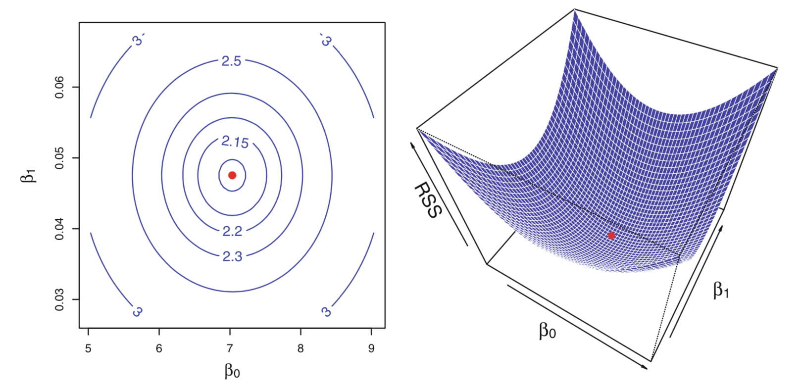
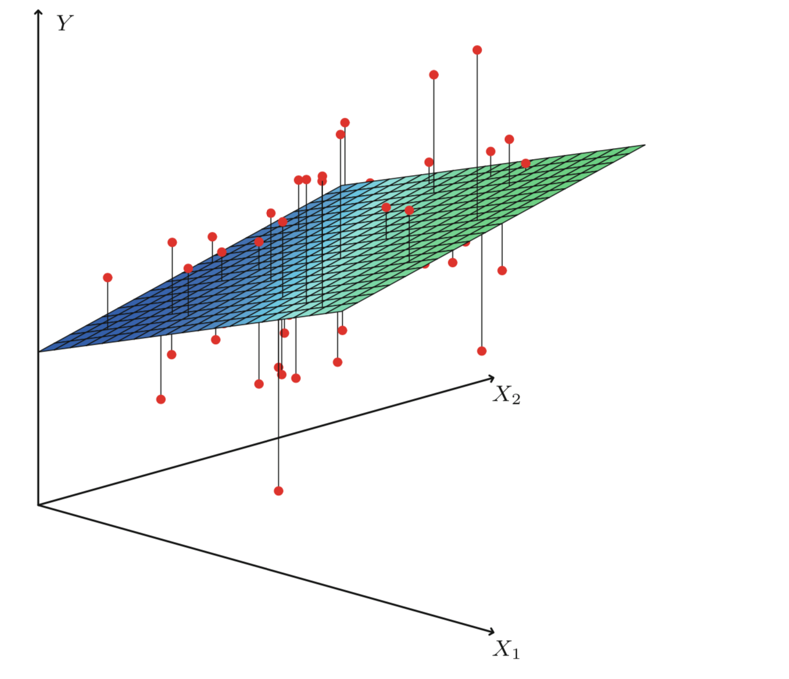
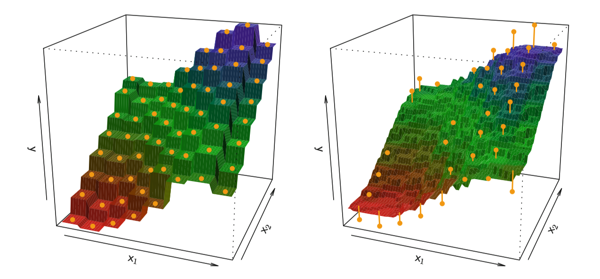
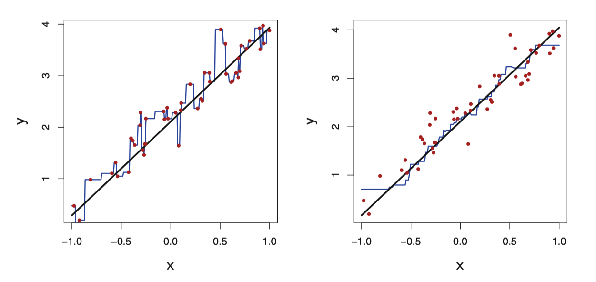
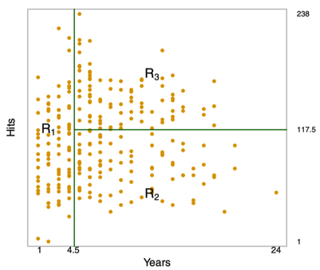
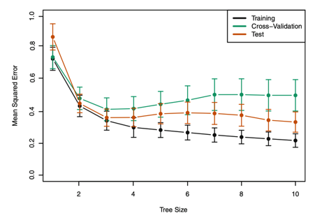
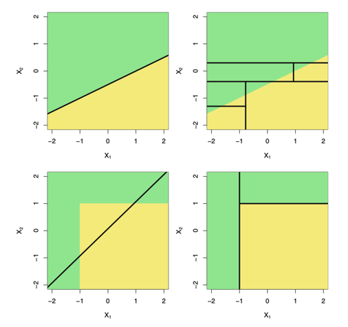
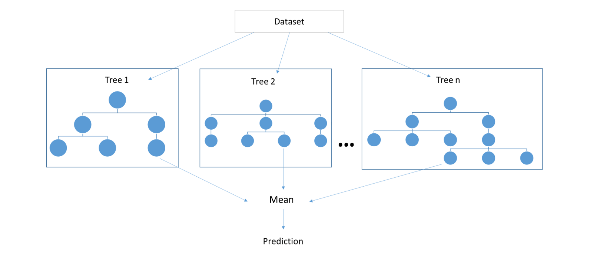
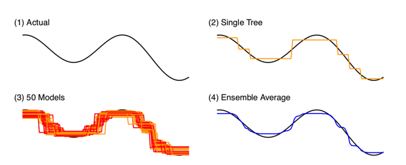
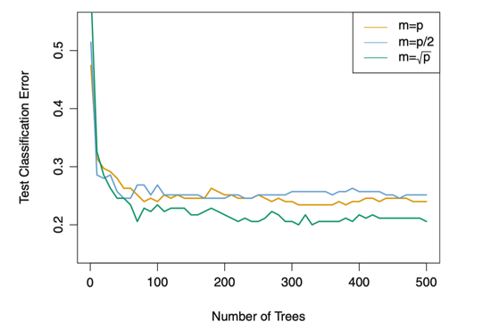

```{r setup, include=FALSE}
# Run for Interactive Slide Editing: 
# xaringan::inf_mr()
knitr::opts_chunk$set(echo = T,message=F,error=F,warning = F,cache=T)
require(tidyverse)
require(ggthemes)
```

layout: true

<div class="slide-footer"><span> 
PPOL670 | Introduction to Data Science for Public Policy

&emsp;&emsp;&emsp;&emsp;&emsp;&emsp;&emsp;&emsp;&emsp;

Week 9 <!-- Week of the Footer Here -->

&emsp;&emsp;&emsp;&emsp;&emsp;&emsp;&emsp;&emsp;&emsp;&emsp;&emsp;&emsp;

Regression <!-- Title of the lecture here -->

</span></div> 

---
class: outline

# Outline for Today 

<br>

- **Linear Models**

<br>

- **Classification and Regression Trees**

<br>

- **Bagging and Random Forests**


---

class: newsection

# Regression Methods

---


### Supervised Learning

The aim of supervised machine learning is to model the relationship between an outcome and some set of features. 

$$y = f(X) + \epsilon$$

where 

- $y$ is the outcome/dependent/response variable 

- $X$ is a matrix of predictors/features/independent variables 

- $f$ is some fixed but unknown function mapping $X$ to $y$. The "signal" in the data.

- $\epsilon$ is some random error term. The "noise" in the data.


---

### Regression vs. Classification


- **Quantitative** outcome (Today)

  + a continuous/interval-based outcome: e.g. housing price, number of bills passed, stock market prices, etc.
  + Regression: linear models, generalized linear models, penalization, generalized additive models (GAMs) 
  + Both parametric and non-parametric ways of approximating $f(\cdot)$
  
- **Qualitative** outcome (Next Week)

  + a discrete outcome: binary, ordered, categorical
  + Classification: logistic regression, naive Bayes, support vector machines, neural networks
  
- Some methods can be used on either outcome type

  
---


### Selecting Models $\hat{f}(X)$

In machine learning, we'll select different algorithms to approximate the "true" functional form $\hat{f}(X)$

<br>

$$f(X) \approx \hat{f}(X)$$

$$ \hat{y} =  \hat{f}(X)$$

<br>

We'll evaluate a model's predictive performance on out-of-sample data (using cross validation). Our aim is to find the most predictive model given the available features. 

$$e_i = y_i - \hat{y_i}$$


---

## Linear Models 

Linear approximation of continous outcome.

$$y_i = \beta_0 + \beta_1x_{1i} + \epsilon_i$$

--

$\beta_0$ and $\beta_1$ are **_unknown_** constants that represent the _intercept_ and _slope_, which we call the model's **_parameters_**. We learn the parameters from the data.

--

![:space 5]

We can predict future values once we've estimated the parameters of the models, but inputing new data. 


$$\hat{y}_i = \hat{\beta}_0 + \hat{\beta_1}x_{1i}^{new}$$

---

## Linear Models 
```{r,echo=F,fig.align="center",fig.width=10,fig.height=7}
# fake data
set.seed(123)
N = 500
P = 1
x <- rnorm(N)
X <- splines::bs(x,degree=P)
B <- runif(P,-5,5) 
y <- X%*%B + rnorm(N,mean = 0,1)
D = tibble(x,y = as.numeric(y))
D$pred = predict(lm(y~x,data=D))
D$resid = resid(lm(y~x,data=D))

ggplot(D,aes(x,y)) +
  # geom_segment(aes(xend=x,x=x,yend=y,y=pred),
  # color="steelblue",size=1,alpha=.5) +
  geom_point(size=1) +
  # geom_smooth(method="lm",se=F,color="darkred",size=2,alpha=.6) +
  theme_bw() +
  theme(legend.position = "none",
        axis.title = element_text(size=20),
        axis.text = element_text(size=18))
```

---

## Linear Models 
```{r,echo=F,fig.align="center",fig.width=10,fig.height=7}
ggplot(D,aes(x,y)) +
  # geom_segment(aes(xend=x,x=x,yend=y,y=pred),
  # color="steelblue",size=1,alpha=.5) +
  geom_point(size=1) +
  geom_smooth(method="lm",se=F,color="darkred",size=2,alpha=.6) +
  theme_bw() +
  theme(legend.position = "none",
        axis.title = element_text(size=20),
        axis.text = element_text(size=18))
```

---

## Linear Models 
```{r,echo=F,fig.align="center",fig.width=10,fig.height=7}
ggplot(D,aes(x,y)) +
  geom_segment(aes(xend=x,x=x,yend=y,y=pred),
  color="steelblue",size=1,alpha=.5) +
  geom_point(size=1) +
  geom_smooth(method="lm",se=F,color="darkred",size=2,alpha=.6) +
  theme_bw() +
  theme(legend.position = "none",
        axis.title = element_text(size=20),
        axis.text = element_text(size=18))
```


---

## Linear Models 
```{r,echo=F,fig.align="center",fig.width=10,fig.height=7}
ggplot(D,aes(x,resid)) +
  geom_point(size=1.5,color="steelblue") +
  theme_bw() +
  labs(y = "Residuals") +
  theme(legend.position = "none",
        axis.title = element_text(size=20),
        axis.text = element_text(size=18))
```

---

### Minimizing the Residual Sum of Squared Errors

![:space 10]
.center[ ]

---

### Assessing Fit

**Error**

$$RSS = e_1^2 + e_2^2 + \dots + e_n^2 =  \sum^N_{i=1} (y_i -\hat{\beta}_0 + \hat{\beta_1}x_{1i} )^2$$

<br>

$$MSE = \frac{\sum^N_{i=1} (y_i - \hat{y})^2}{N}$$

**Explained Variation**

$$R^2 = \frac{TSS - RSS}{TSS} =  1 - \frac{RSS}{TSS}$$

---

# Multiple Linear Regression

$$y_i = \beta_0 + \beta_1x_{1i} + \beta_2x_{2i} +  \dots + \beta_px_{pi} + \epsilon_i$$

.center[ ]

---

### High Bias, Low Variance

$$\hat{y} = \hat{\beta}_0 + \hat{\beta}_1 x $$

```{r,echo=F,fig.align="center",fig.width=10,fig.height=6}
# fake data
set.seed(1547)
N = 1000
P = 5
x <- rnorm(N)
z <- rbinom(N,1,.3) 
X <- splines::bs(x,degree=P)
B <- runif(P,-5,5) 
y <- X%*%B + -z + .8*z*X[,1] + rnorm(N,mean = 0,.2) 
D = tibble(x,z,y = as.numeric(y))
D$pred = predict(lm(y~x,data=D))
D$resid = resid(lm(y~x,data=D))

ggplot(D,aes(x,y)) +
  geom_point(size=1) +
  geom_smooth(method="lm",se=F,color="darkred",size=2,alpha=.6) +
  theme_bw() +
  theme(legend.position = "none",
        axis.title = element_text(size=20),
        axis.text = element_text(size=18))
```


---

### Polynomial Regression: building in _flexibility_

$$\hat{y} = \hat{\beta}_0 + \hat{\beta}_1 x +  \hat{\beta}_2 x^2$$ 

```{r,echo=F,fig.align="center",fig.width=10,fig.height=6}
D$pred = predict(lm(y~x+I(x^2),data=D))
ggplot(D,aes(x,y)) +
  geom_point(size=1) +
  geom_line(aes(x,pred),color="darkred",size=2) +
  theme_bw() +
  theme(legend.position = "none",
        axis.title = element_text(size=20),
        axis.text = element_text(size=18))
```

---

### Polynomial Regression: building in _flexibility_

$$\hat{y} = \hat{\beta}_0 + \hat{\beta}_1 x +  \hat{\beta}_2 x^2 + \hat{\beta}_2 x^3$$ 

```{r,echo=F,fig.align="center",fig.width=10,fig.height=6}
D$pred = predict(lm(y~x+I(x^2) + I(x^3),data=D))
ggplot(D,aes(x,y)) +
  geom_point(size=1) +
  geom_line(aes(x,pred),color="darkred",size=2) +
  theme_bw() +
  theme(legend.position = "none",
        axis.title = element_text(size=20),
        axis.text = element_text(size=18))
```

---

### Polynomial Regression: building in _flexibility_

$$\hat{y} = \hat{\beta}_0 + \hat{\beta}_1 x +  \hat{\beta}_2 x^2 + \hat{\beta}_2 x^3 + \hat{\beta}_4 z + \hat{\beta}_5 xz$$ 

```{r,echo=F,fig.align="center",fig.width=10,fig.height=6}
D$pred = predict(lm(y~x+I(x^2) + I(x^3) + z + x*z,data=D))
ggplot(D,aes(x,y)) +
  geom_point(size=1) +
  geom_line(aes(x,pred,group=factor(z)),color="darkred",size=2) +
  theme_bw() +
  theme(legend.position = "none",
        axis.title = element_text(size=20),
        axis.text = element_text(size=18))
```

---

### Low Bias, High Variance

$$\hat{y} = \hat{\beta}_0 + \hat{\beta}_1 x +  \hat{\beta}_2 z + \hat{\beta}_3 xz + \sum_{k=2}^7 \hat{\beta}_{k+2} x^k + \sum_{k=2}^7 \hat{\beta}_{k+9} x^kz$$ 

```{r,echo=F,fig.align="center",fig.width=10,fig.height=6}
D$pred = predict(lm(y~x+ z + x*z +  I(x^2)*z + I(x^3)*z + I(x^4)*z + I(x^5)*z + I(x^6)*z + I(x^7)*z,data=D))
ggplot(D,aes(x,y)) +
  geom_point(size=1) +
  geom_line(aes(x,pred,group=factor(z)),color="darkred",size=2) +
  theme_bw() +
  theme(legend.position = "none",
        axis.title = element_text(size=20),
        axis.text = element_text(size=18))
```

---

### Parametric vs. Non-parametric 

- Linear regression is an example of a **_parametric_** model, which is to say it assumes a _linear functional form_ for $f(X)$. 

- Parametric methods have their **_advantages_**:

  + Easy to fit
  + Easy to interpret
  + Can use statistical methods (to calculate uncertainty and test significance)
  
- Parametric methods have their **_disadvantages_** as well:
  
  + Strong assumptions about the form of $f(X)$
  + Biased &rarr; poor predictive performance

---

### Parametric vs. Non-parametric 

- **_Non-parametric_** methods to not explicitly assume a parametric form for $f(X)$.

- Provides a more flexible approach for performing regression. 

- **_Advantages_**
  
  - Makes no assumptions about the form of $f(X)$
  - Low bias &rarr; better predictive performance
  
- **_Disadvantages_**

  - Difficult to interpret
  - High variance &rarr; new data, new fit.
  
---

### K-Nearest Neighbors

One of the simplest non-parametric methods is **_K-nearest neighbors regression_**.

![:space 3]

Given a value of $K$ and prediction point $x_0$, KNN regression:

1. Identify K training observations that are closest to $x_0$
  - Denoted by set $N_0$
  
2. Estimates $f(x_0)$ using the _average of all the training responses_ in $N_0$.

$$\hat{f}(x_0) = \frac{1}{K} \sum_{x_i \in N_0} y_i$$
---

### K-Nearest Neighbors

![:space 10]

.center[ ]


---

### K-Nearest Neighbors

<br>

- $K$ the number of neighbors we select is a **tuning paramater**

  - Can't learn it from the data
  
  - Select it before we run anything
  
  - Will determine how flexible the model is (bias-variance tradeoff)
  
    - low $K$ &rarr; Low bias, High variance
    - high $K$ &rarr; High bias, low variance
    
- We can find a reasonable value for $K$ using **_cross validation_**

---

### K-Nearest Neighbors

```{r,echo=F,fig.align="center",fig.width=10,fig.height=7}
# fake data
set.seed(1547)
N = 1000
P = 3
x <- rnorm(N)
X <- splines::bs(x,degree=P)
B <- runif(P,-5,5) 
y <- X%*%B + rnorm(N,mean = 0,.5) 
D = tibble(x,y = as.numeric(y))

fit <- caret::knnreg(D[,c("x")], D$y, k = 1)
D$pred = predict(fit,newdata=D[,c("x")])
ggplot(D,aes(x,y)) +
  geom_point(size=1,alpha=.6,color="steelblue") +
  # geom_line(aes(x,pred),color="darkred",size=1) +
  theme_bw() +
  labs(title = " ") +
  theme(legend.position = "none",
        plot.title = element_text(size=25,hjust=.5),
        axis.title = element_text(size=18),
        axis.text = element_text(size=18))
```
---

### K-Nearest Neighbors

```{r,echo=F,fig.align="center",fig.width=10,fig.height=7}
fit <- caret::knnreg(D[,c("x")], D$y, k = 1)
D$pred = predict(fit,newdata=D[,c("x")])
ggplot(D,aes(x,y)) +
  geom_point(size=1,alpha=.6,color="steelblue") +
  geom_line(aes(x,pred),color="darkred",size=1) +
  theme_bw() +
  labs(title = "K = 1") +
  theme(legend.position = "none",
        plot.title = element_text(size=25,hjust=.5),
        axis.title = element_text(size=18),
        axis.text = element_text(size=18))
```

---

### K-Nearest Neighbors

```{r,echo=F,fig.align="center",fig.width=10,fig.height=7}
fit <- caret::knnreg(D[,c("x")], D$y, k = 3)
D$pred = predict(fit,newdata=D[,c("x")])
ggplot(D,aes(x,y)) +
  geom_point(size=1,alpha=.6,color="steelblue") +
  geom_line(aes(x,pred),color="darkred",size=1) +
  theme_bw() +
  labs(title = "K = 3") +
  theme(legend.position = "none",
        plot.title = element_text(size=25,hjust=.5),
        axis.title = element_text(size=18),
        axis.text = element_text(size=18))
```

---

### K-Nearest Neighbors

```{r,echo=F,fig.align="center",fig.width=10,fig.height=7}
fit <- caret::knnreg(D[,c("x")], D$y, k = 10)
D$pred = predict(fit,newdata=D[,c("x")])
ggplot(D,aes(x,y)) +
  geom_point(size=1,alpha=.6,color="steelblue") +
  geom_line(aes(x,pred),color="darkred",size=1) +
  theme_bw() +
  labs(title = "K = 10") +
  theme(legend.position = "none",
        plot.title = element_text(size=25,hjust=.5),
        axis.title = element_text(size=18),
        axis.text = element_text(size=18))
```

---

### K-Nearest Neighbors

```{r,echo=F,fig.align="center",fig.width=10,fig.height=7}
fit <- caret::knnreg(D[,c("x")], D$y, k = 50)
D$pred = predict(fit,newdata=D[,c("x")])
ggplot(D,aes(x,y)) +
  geom_point(size=1,alpha=.6,color="steelblue") +
  geom_line(aes(x,pred),color="darkred",size=1) +
  theme_bw() +
  labs(title = "K = 50") +
  theme(legend.position = "none",
        plot.title = element_text(size=25,hjust=.5),
        axis.title = element_text(size=18),
        axis.text = element_text(size=18))
```

---

### To parametric or not to parametric, that is the question...


> The parametric approach (like linear regression) will outperform the nonparametric approach (like KNN regression) if the parametric form that has been selected is close to the "true form" of $f(X)$.


.center[ ]

---

class: newsection

# Regression Trees

---


.center[ ]

---

### Hitting Averages and Experience on Salary

<br>

.pull-left[
.center[ ]
]

.pull-right[
.center[ ]
]

---

<br>

The goal is to find boxes ( $R_1 ,\dots , R_j$ ) that minimize the RSS, given by

$$\sum^J_{j=1} \sum_{i \in R_j} (y_i - \hat{y}_{R_j})^2$$

where $\hat{y}_{R_j}$ is the mean response for the training observations within the $j$th box.

--

We take a top-down, greedy approach that is known as **_recursive binary splitting_**

- **Top-down**: start with one region and break from there.

- **Greedy**: best split is made at each step (best split given the other splits that have been made)

---

### The essence of recursive binary splitting

- (1) From the predictors $X$ select a predictor $X_j$

--

- (2) Find a cutpoint ( $s$ ) that splits $X_j$ into two regions that leads to the greatest possible reduction in RSS.

$$R_1(j,s) = \{X~|~X_j <s\}~\text{and}~ R_2 (j,s) = \{X~|~X_j \ge s\}$$ 

--

- (3) Looking for an $s$ and $j$ that minimizes

$$\sum_{i: ~x_i \in R_1(j,s)} (y_i - \hat{y}_{R_1})^2 + \sum_{i: ~x_i \in R_2(j,s)} (y_i - \hat{y}_{R_2})^2$$

where $\hat{y}_{R_1}$ and $\hat{y}_{R_2}$ are the mean responses for the training data in region 1 ( $R_1(j,s)$ ) and region 2  ( $R_2(j,s)$ )

--

- (4) Repeat the process until a stopping criterion is met

---

### Tree Pruning


.center[ ]


---

### Tree Pruning

- Shallow trees (a few splits) can result in underfitting. 

- Deep trees (many splits) can result in overfitting

--

<br>

Balance by penalizing depth using a "**_complexity criterion_**" ( $\alpha$ )

$$\sum^T_{m=1}\sum_{i:x_i \in R_m} (y_i - \hat{y}_{R_m}) ^2 + \alpha T$$

- $T$ indicates the number of terminal nodes, 
- $R_m$ is the rectangle (i.e. the subset of predictor space) corresponding to the $m$th terminal node
- $\hat{y}_{R_m}$ is the predicted response associated with $R_m$.


---

### Tree Pruning as a tuning parameter


.pull-left[The tuning parameter $\alpha$ controls a trade-off between the subtree’s complexity and its fit to the training data. 

<br>

- $\alpha \rightarrow 0$ means deeper tree

- $\alpha \rightarrow 1$ means a shallow tree

<br>

Need to use cross-validation to figure out the right value of $\alpha$.
]

.pull-right[

<br><br><br>
.center[ ]

]

---

### Regression vs. Trees

.center[
 
]

---

### Pros and Cons of Trees

Pros:

- Easy to explain/visualize

- Easy handle qualitative predictors

- Can deal well with data inconsistencies

Cons:

- Less predictive accuracy

- Suffer from high variance


---

class: newsection

## Bagging & Random Forest

---

### Bagging

**Bootstrap aggregation**, or **bagging**, is a general-purpose procedure for reducing the variance of a statistical learning method.

--

The idea:

- take many training sets from the data
- build separate tree one each training set 
- average the predictions

--

.center[
 
]

---

### What is bootstrapping?


.center[
 
]

---

Say we have two groups (people on a bus) and we want to know that their average age is statistically different. 

```{r}
bus1 <- tibble(age=c(55,34,21,14,57,43,26))
bus2 <- tibble(age=c(23,24,37,51,8,30,48))
```

--

We can just run a difference in means test.

```{r}
mean(bus1$age)-mean(bus2$age)
```

```{r}
t.test(bus1$age,bus2$age)
```


---

Say we have two groups (people on a bus) and we want to know that their average age is statistically different. 

```{r}
bus1 <- tibble(age=c(55,34,21,14,57,43,26))
bus2 <- tibble(age=c(23,24,37,51,8,30,48))
```

Or we could bootstrap. The key is sampling _with replacement_.

.pull-left[
```{r,seed=123}
bus1 %>% 
  sample_n(4,replace = 5)
```
]
.pull-right[
```{r,seed=123}
bus2 %>% 
  sample_n(4,replace = 5)
```
]

---

Do this many times...

```{r,fig.align="center",fig.width=8,fig.height=3,highlight=T}
boot_samples = rep(0,100)
for(i in 1:100){
  boot_samp1 = bus1 %>% sample_n(4,replace = 5)
  boot_samp2 = bus2 %>% sample_n(4,replace = 5)
  mu1 <- mean(boot_samp1$age)
  mu2 <- mean(boot_samp2$age)
  boot_samples[i] <- mu1 - mu2
}
tibble(means = boot_samples) %>% 
ggplot(aes(x=means)) + 
  geom_density(fill="steelblue",color="white",alpha=.5) + 
  geom_vline(xintercept = 4.14,color="red",size=1) # actual mean#<< 
```


---

### Same idea but with trees... 

Grow many of trees then average the predictions


$$\hat{f}_{avg}(x) = \frac{\sum^B_{b=1} \hat{f}_b(x) }{B}$$

<br>

--

.center[
 
]

---

### Random Forest 

- Issue with bagging is that the trees are **_highly correlated_**. 

--

- One way around this is to also take a **_random sample of predictors_** at each split (in addition to bagging). Algorithm is _not allowed_ to consider a majority of the available predictors.

--

- Number of predictors the algorithm is able to select  (`mtry`) is a **_tuning parameter_**

.center[
 
]

