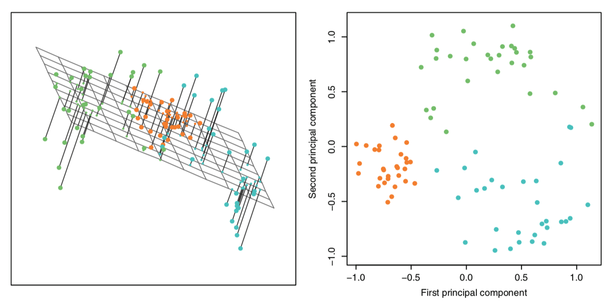
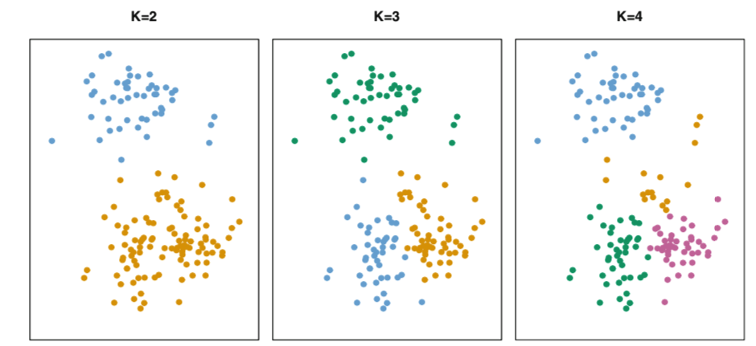
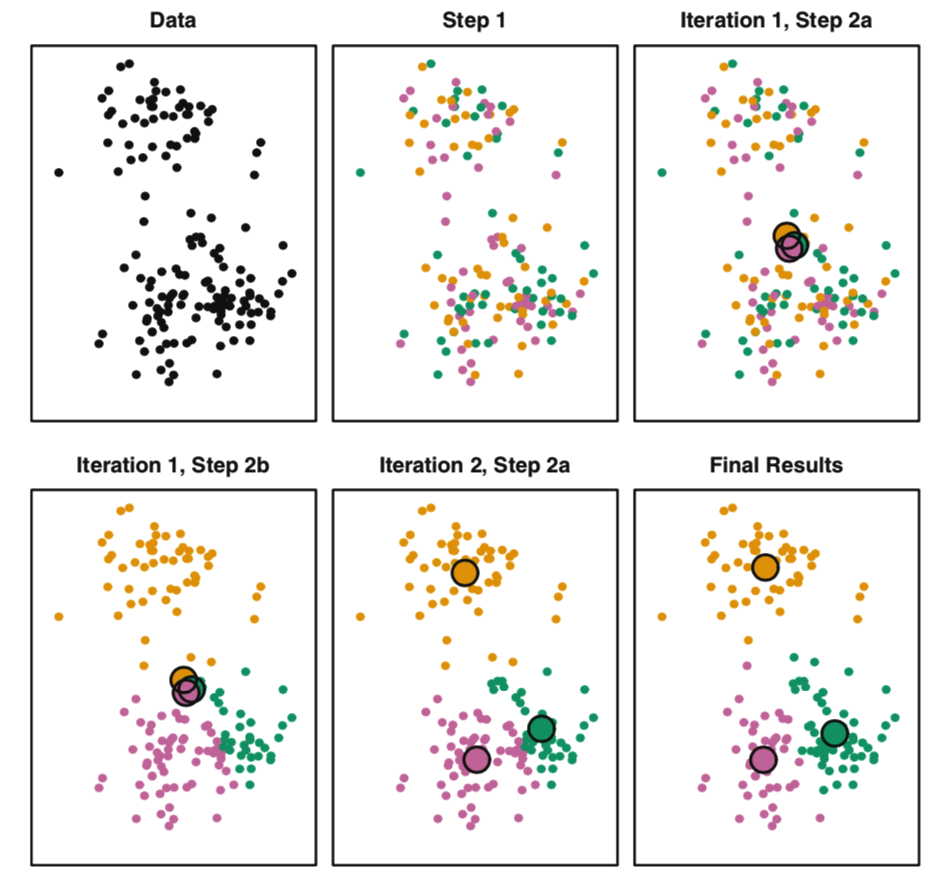
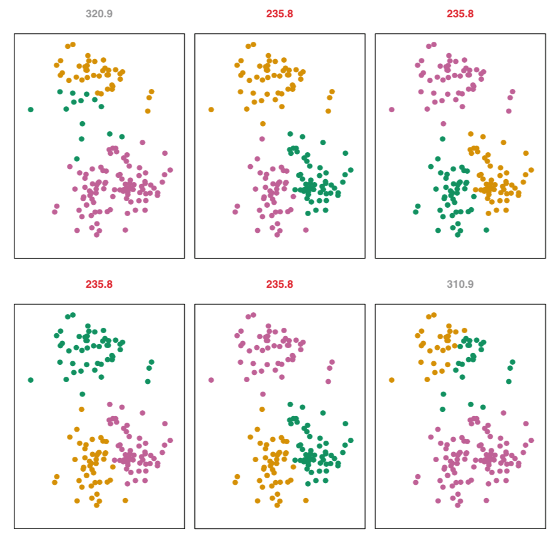
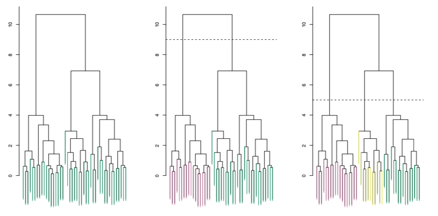
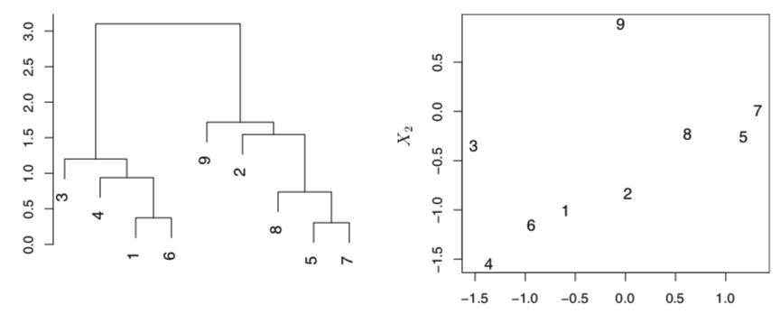
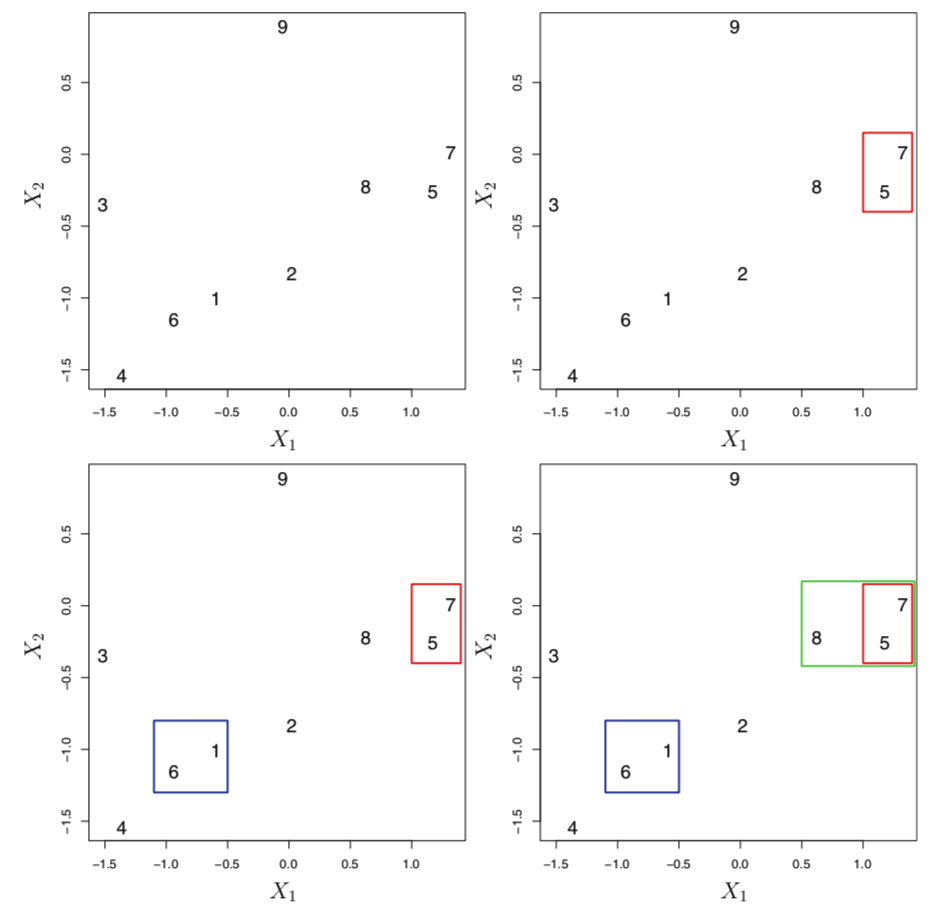
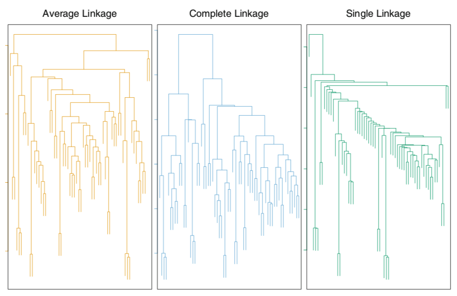

```{r setup, include=FALSE}
knitr::opts_chunk$set(echo = T,message=F,error=F,warning = F,cache=T)
require(tidyverse)
require(FactoMineR)
require(factoextra)
```

layout: true

<div class="slide-footer"><span> 
PPOL670 | Introduction to Data Science for Public Policy

&emsp;&emsp;&emsp;&emsp;&emsp;&emsp;&emsp;&emsp;&emsp;

Week 9 <!-- Week of the Footer Here -->

&emsp;&emsp;&emsp;&emsp;&emsp;&emsp;&emsp;&emsp;&emsp;&emsp;&emsp;&emsp;

Unsupervised Learning <!-- Title of the lecture here -->

</span></div> 

---
class: outline

# Outline for Today 

<br>

- **Refresh on the supervised and unsupervised distinction**

<br>

- **Principal Components**

<br>

- **K-means Clustering**

<br>

- **Hierarchical Clustering**

---

class: newsection

# Supervised <br> vs. <br> Unsupervised

---

### Supervised Learning


- For each observation of the predictor measurement $x_i$ there is an associated response measurement $y_i$. In essence, there is an _outcome_ we are aiming to accurately predict or understand.
  
- Use regression and classification methods
  
```{r,echo=F,fig.align="center",fig.width=7,fig.height=4}
set.seed(123)
x <- rnorm(150)
y = 1 + 2*x + x^2 + x^3 + x^4 + x^5 + rnorm(150,0,10)
tibble(x,y) %>% 
  ggplot(aes(x,y)) +
  geom_point(size=3,color="grey30") +
  geom_smooth(method="loess",se=F,size=2) +
  theme_minimal() +
  theme(legend.position = "none",
        axis.title = element_text(size=18))
```
  
 
---
  
### Unsupervised Learning
  

- We observe a vector of measurements $x_i$ but _no_ associated response $y_i$.
  
- "unsupervised" because we lack a response variable that can supervise our analysis.

- Aim is to (a) data reduction and/or (b) data exploration (find "hidden" structures in the data).
  
```{r,echo=F,fig.align="center",fig.width=7,fig.height=4}
set.seed(123)
n = 50
sigma = matrix(c(1,0,0,1),ncol=2,nrow=2)
x1 <- MASS::mvrnorm(n,c(0,0),Sigma = sigma) %>% as_tibble() %>% mutate(group=1)
x2 <- MASS::mvrnorm(n,c(-3,-3),Sigma = sigma) %>% as_tibble() %>% mutate(group=2)
x3 <- MASS::mvrnorm(n,c(-3,3),Sigma = sigma) %>% as_tibble() %>% mutate(group=3)
bind_rows(x1,x2,x3) %>% 
  ggplot(aes(V1,V2,color=factor(group),pch=factor(group))) +
  geom_point(size=3) +
  theme_minimal() +
  theme(legend.position = "none",
        axis.title = element_text(size=18))
```
  
---

### Challenges of Unsupervised Learning


<br> 

- Tends to be more **subjective**: there is no simple goal here

<br> 

- **Difficult to assess** the results

<br> 

- No way to "check our work": no universally accepted mechanism for performing cross-validation or validating results.

<br> 

- Requires **exploration**

---

class: newsection

<br> 

# Principal Components 

---

### Principal component analysis (PCA)

<br>

When faced with a large set of _correlated_ variables, **principal components** allow us to summarize this set with a smaller number of representative variables that collectively explain most of the variability in the original set. 

-  Directions in feature space along which the original data are **_highly variable_**.

- These directions also define lines and subspaces that are as **_close as possible_**.

- PCA is a form of **data reduction**

---

### Principal component analysis (PCA)

- Say we have a data set ( $D$ ) containing $p$ features.

--

- We want to explore this data visually, but if $p$ is large, that would require many plots!
  
  - e.g. $p = 10$ means $45 plots$ ( $\frac{p(p-1)}{2}$ )
  
  - Not every feature is adding information
  
--

- Need to reduce the number of features.

- PCA offers a way of finding a **_low-dimensional representation_** of the data that captures as much of the information (variation) as possible. 


---

### Lower Dimensional Representation


```{r generate fake data,echo = F}
# Fake data for this process
set.seed(1234)
N = 100
x1 <- rnorm(N,0,5) 
x2 <- rnorm(N,0,.1)
D = data.frame(x1,x2) %>% 
  mutate(x2_alt = 0)
```


```{r,echo=F,fig.align="center",fig.width=9,fig.height=7}
D %>% 
  ggplot(aes(x1,x2)) +
  # geom_hline(yintercept = 0,color="grey60",size=2) +
  # geom_segment(aes(x=x1,xend=x1,y=x2,yend=0),color="darkred",alpha=.4,size=1) +
  # geom_point(aes(x1,x2_alt),color="darkred",size=2.5,pch=15) +
  geom_point(size=2.5,color="grey20") +
  theme_minimal() +
  ylim(-.4,.4) +
  labs(y="",x="")
```


---

### Lower Dimensional Representation

```{r,echo=F,fig.align="center",fig.width=9,fig.height=7}
D %>% 
  ggplot(aes(x1,x2)) +
  geom_hline(yintercept = 0,color="grey60",size=2) +
  # geom_segment(aes(x=x1,xend=x1,y=x2,yend=0),color="darkred",alpha=.4,size=1) +
  # geom_point(aes(x1,x2_alt),color="darkred",size=2.5,pch=15) +
  geom_point(size=2.5,color="grey20") +
  theme_minimal() +
  ylim(-.4,.4) +
  labs(y="",x="")
```

---

### Lower Dimensional Representation

```{r,echo=F,fig.align="center",fig.width=9,fig.height=7}
D %>% 
  ggplot(aes(x1,x2)) +
  geom_hline(yintercept = 0,color="grey60",size=2) +
  geom_segment(aes(x=x1,xend=x1,y=x2,yend=0),color="darkred",alpha=.4,size=1) +
  geom_point(aes(x1,x2_alt),color="darkred",size=5,pch=4) +
  geom_point(size=2.5,color="grey20") +
  theme_minimal() +
  ylim(-.4,.4) +
  labs(y="",x="")
```

---

### Lower Dimensional Representation

```{r,echo=F,fig.align="center",fig.width=9,fig.height=7}
D %>% 
  ggplot(aes(x1,x2)) +
  # geom_hline(yintercept = 0,color="grey60",size=2) +
  # geom_segment(aes(x=x1,xend=x1,y=x2,yend=0),color="darkred",alpha=.4,size=1) +
  geom_point(aes(x1,x2_alt),color="darkred",size=5,pch=4,alpha=.4) +
  geom_point(aes(x1,x2_alt),color="darkred",size=2,pch=16) +
  # geom_point(size=2.5,color="grey20") +
  theme_minimal() +
  ylim(-.4,.4) +
  labs(y="",x="")
```

---

### Principal component analysis (PCA)

The Principal components define a direction in feature space along which the **_data vary most_**. 

--

<br>

Assuming $X$ has $p$ features, the first principal component is a linear combination of the factor loadings (eigenvectors)

<br>

$$PC_{i1} = \phi_{11} x_{i1} + \phi_{21} x_{i2} + \dots + \phi_{p1}x_{ip}$$


where we place the constraint

$$\sum^p_{j=1} \phi^2_{ji} = 1$$

---

### Principal component analysis (PCA)

<br><br>

We refer to $PC_{11}, PC_{21}, \dots , PC_{n1}$ as the _scores_ of the first principal component. 

--

We can easily find the **_linear combination that maximize the sample variance_** by taking a eigendecomposition of the variance-covariance matrix (but that is a beyond the scope of this course).

--

The subsequent principal components we find are by definition _uncorrelated_ with the first component (we do this by making the second component _orthogonal_ to the first.)

---

```{r,echo=F,fig.align="center",fig.width=9,fig.height=8}
D %>% 
  ggplot(aes(x1,x2)) +
  # geom_vline(xintercept = 0,color="grey60",size=2) +
  geom_hline(yintercept = 0,color="grey60",size=2,alpha=.5) +
  # geom_segment(aes(x=x1,xend=0,y=x2,yend=x2),color="steelblue",alpha=.4,size=1) +
  # geom_point(aes(y=x2),x=0,color="steelblue",size=5,pch=4) +
  
  geom_point(aes(x1,x2_alt),color="darkred",size=5,pch=4,alpha=.4) +
  geom_point(aes(x1,x2_alt),color="darkred",size=2,pch=16) +
  geom_point(size=2.5,color="grey20") +
  theme_minimal() +
  ylim(-.4,.4) +
  labs(y="",x="")
```

---

```{r,echo=F,fig.align="center",fig.width=9,fig.height=8}
D %>% 
  ggplot(aes(x1,x2)) +
  geom_vline(xintercept = 0,color="grey60",size=2) +
  geom_hline(yintercept = 0,color="grey60",size=2,alpha=.5) +
  # geom_segment(aes(x=x1,xend=0,y=x2,yend=x2),color="steelblue",alpha=.4,size=1) +
  # geom_point(aes(y=x2),x=0,color="steelblue",size=5,pch=4) +
  
  geom_point(aes(x1,x2_alt),color="darkred",size=5,pch=4,alpha=.4) +
  geom_point(aes(x1,x2_alt),color="darkred",size=2,pch=16) +
  geom_point(size=2.5,color="grey20") +
  theme_minimal() +
  ylim(-.4,.4) +
  labs(y="",x="")
```

---

```{r,echo=F,fig.align="center",fig.width=9,fig.height=8}
D %>% 
  ggplot(aes(x1,x2)) +
  geom_vline(xintercept = 0,color="grey60",size=2) +
  geom_hline(yintercept = 0,color="grey60",size=2,alpha=.5) +
  geom_segment(aes(x=x1,xend=0,y=x2,yend=x2),color="steelblue",alpha=.4,size=1) +
  geom_point(aes(y=x2),x=0,color="steelblue",size=5,pch=4) +
  geom_point(aes(x1,x2_alt),color="darkred",size=5,pch=4,alpha=.4) +
  geom_point(aes(x1,x2_alt),color="darkred",size=2,pch=16) +
  geom_point(size=2.5,color="grey20") +
  theme_minimal() +
  ylim(-.4,.4) +
  labs(y="",x="")
```

---

```{r,echo=F,fig.align="center",fig.width=9,fig.height=8}
D %>% 
  ggplot(aes(x1,x2)) +
  geom_point(aes(y=x2),x=0,color="steelblue",size=5,pch=4,alpha=.4) +
  geom_point(aes(y=x2),x=0,color="steelblue",size=2,pch=16) +
  
  geom_point(aes(x1,x2_alt),color="darkred",size=5,pch=4,alpha=.4) +
  geom_point(aes(x1,x2_alt),color="darkred",size=2,pch=16) +
  theme_minimal() +
  ylim(-.4,.4) +
  labs(y="",x="")
```


---

### Principal component analysis (PCA)


Once we have computed the principal components, we can plot them against each other in order to produce low-dimensional views of the data.

Geometrically, this amounts to projecting the original data down onto the subspace spanned by our eigenvectors.

.center[]

---

### Example: Crime in America

<br>

```{r}
dat <- USArrests 
skimr::skim_to_wide(dat) %>% 
  select(type:missing,n:sd,hist)
```

---

### Example: Crime in America

First, be sure to scale the variables.

```{r}
dat <- scale(dat) %>% as.data.frame()
skimr::skim_to_wide(dat) %>% 
  select(type:missing,n:sd,hist)
```

```{r}
row.names(dat) <- row.names(USArrests)
```


---

### Example: Crime in America

<br><br><br>
There are many packages that perform PCA; some are even hard coded into base R. (e.g. `princomp()` and `prcomp()`). 

We'll use two recent packages for PCA rather than the base `R` versions as these packages provide cleaner summaries and plotting functions.  

```{r}
require(FactoMineR)
require(factoextra)
```

---

### Example: Crime in America

```{r}
dat_pca <- PCA(dat,graph=F)
dat_pca
```

---

### Example: Crime in America

```{r,fig.align="center",fig.width=9,fig.height=6}
fviz_pca_biplot(dat_pca,col.var = "darkred")
```

---

### Proportion of Variance Explained 

<br>

How much of the information in a given data set is lost by projecting the observations onto the first few principal components? 

How many principal components should we keep around?

--

<br>

To answer these questions: we need to know the **_proportion of variance explained_** (PVE) by each principal component. 


- Aim is to keep the **smallest number of components** that explain the **_most_ variation**. 

---

### Scree plot

```{r, fig.align="center",fig.width=9,fig.height=6}
fviz_eig(dat_pca, addlabels = TRUE)
```

---

<br><br><br><br>
```{r, fig.align="center",fig.width=9,fig.height=7}
get_eigenvalue(dat_pca)
```

---

### Exploring Principal Components

<br><br>
- Look at the first few principal components in order to find _interesting patterns in the data_. 

- If no interesting patterns are found in the first few principal components, then further principal components are unlikely to be of interest. 

- Conversely, if the first few principal components are interesting, then continue to look at subsequent principal components until no further interesting patterns are found. 

---

### Exploring Principal Components

```{r,fig.align="center",fig.width=9,fig.height=6}
fviz_pca_biplot(dat_pca,axes = 1:2,col.ind = "grey60")
```

---

### Exploring Principal Components

```{r,fig.align="center",fig.width=9,fig.height=6}
fviz_pca_biplot(dat_pca,axes = 2:3,col.ind = "grey60")
```

---

### Exploring Principal Components

```{r,fig.align="center",fig.width=9,fig.height=6}
fviz_pca_biplot(dat_pca,axes = 3:4,col.ind = "grey60")
```

---

### How Many Principal Components to Use?


- Choose the smallest number of principal components that are required in order to explain a sizable amount of the variation in the data.

  - Look for the "elbow" in the scree plot.

<br>

- The aim is for **data reduction**. 

<br>

- Can treat the number of principal components selected as a **tuning parameter** (if using the components in a supervised machine learning task).


---

class: newsection

### K-Means Clustering

---

### Clustering Methods

- **Clustering** refers to techniques for finding _subgroups_ in a data set. 

- When we cluster the observations of a data set, we seek to partition them into distinct groups so that 
  
  - the observations **_within_** each group are **_similar_** to each other.
  
  - while observations in different groups are **_different_** from each other.

--

- **PCA vs. Clustering**

  - PCA looks to find a low-dimensional representation of the observations that explain a good fraction of the variance;
  
  - Clustering looks to find homogeneous subgroups among the observations.


---

### K-means clustering

<br><br>
- **Aim**: partition a data set into $k$ distinct, _non-overlapping_ clusters.

<br>

- An observation can only be member to one cluster.

<br> 

- "Good" clustering is when the **_within-cluster variation is as small as possible_**

---

### K is arbitrary

<br><br>
.center[

]


---

### Minimize the total within-cluster variation

<br><br>

$$\underset{C_1,\dots,C_k}{Min} \begin{Bmatrix}\sum^K_{k=1} W(C_k) \end{Bmatrix}$$
<br><br>

Where 

- $k$ indexes the number of clusters
- $C_k$ denotes a cluster 
- $W(C_k)$ denotes the within-cluster variation

---

### Within-cluster variation?

First, what does it mean to be "close"?

--

Could use _squared Euclidean distance_ 

$$(x_{ij} - x_{i'j})^2$$

But "distance" can be conceptualized in many ways. 

--

Second, define within-cluster variance

$$W(C_k) = \frac{1}{|C_k|} \sum_{i,i' \in C_k}\sum^P_{j=1} (x_{ij} - x_{i'j})^2$$

where $|C_k|$ denotes the number of observations in the $k$ cluster.

--

> Very difficult problem to solve because there are $K^n$ ways to partition the data. 

---

### K-means clustering algorithm

<br><br>
**Step 1**: Randomly assign a number, from 1 to $K$, to each of the observations.
These serve as initial cluster assignments for the observations. 

**Step 2**: Iterate until the cluster assignments stop changing:

- **(a)** For each of the $K$ clusters, compute the cluster centroid. The $k$th cluster centroid is the vector of the $p$ feature means for the observations in the $k$th cluster.

- **(b)** Assign each observation to the cluster whose centroid is closest (where closest is defined using Euclidean distance).

---

.center[

]

---

Because the K-means algorithm finds a **_local_** rather than a **_global optimum_**, the results obtained will depend on the initial (random) cluster assignment of each observation in Step 1.

.center[

]

---

class: newsection

### Hierarchical Clustering

---

### Hierarchical Clustering

<br><br>
- One downside of $K$-means is that it requires us to **_pre-specify_** the number of clusters $K$

- **Hierarchical clustering** is a _bottom-up_ clustering method that doesn't require use to define the number of clusters _ex anti_.

- H. clustering builds a tree (dendrogram) which treats every observation as unique and then combines clusters up to the trunk.

- We can determine the number of clusters by choosing a cutpoint (i.e. by "pruning the tree")

---

### Hierarchical Clustering

<br>
.center[

]

---

### Hierarchical Clustering

<br>

We can draw conclusions regarding the similarity of observations by proximity on the verticle axis, _not_ the horizontal axis.


<br>
.center[

]

---

### Hierarchical Clustering Algorithm

**Step 1**: Begin with n observations and a measure (such as Euclidean distance) of all the $\frac{n(n − 1)}{2}$ pairwise dissimilarities. Treat each observation as its own cluster.

**Step 2**: For $i=n,n−1,...,2$:

- **(a)** Examine all pairwise inter-cluster dissimilarities among the $i$ clusters and identify the pair of clusters that are least dissimilar (that is, most similar). Fuse these two clusters. The dissimilarity between these two clusters indicates the height in the dendro- gram at which the fusion should be placed.

- **(b)** Compute the new pairwise **inter-cluster dissimilarities** among the $i − 1$ remaining clusters.

---

.center[

]

---

### Defining "Inter-Cluster" Dissimilarity

The concept of dissimilarity between a pair of observations needs to be extended to a pair of **_groups of observations_**. 

--

This is known as **"Linkage"**

|Linkage| Description|
|-------|----------|
| *Complete* | Maximal intercluster dissimilarity. Compute all pairwise dissimilarities between the observations in cluster A and the observations in cluster B, and record the _largest_ of these dissimilarities. |
| *Single* | Minimal intercluster dissimilarity. Compute all pairwise dissimilarities between the observations in cluster A and the observations in cluster B, and record the _smallest_ of these dissimilarities. Single linkage can result in extended, trailing clusters in which single observations are fused one-at-a-time. |
| *Average* | Mean intercluster dissimilarity. Compute all pairwise dis- similarities between the observations in cluster A and the observations in cluster B, and record the average of these dissimilarities. |
| *Centroid* | Dissimilarity between the centroid for cluster A (a mean vector of length p) and the centroid for cluster B. Centroid linkage can result in undesirable _inversions_. |

---

### Linkage matters

.center[

]

---

### Small Decisions, Big Consequences

In order to perform clustering, some decisions must be made:

--

- **_Should the observations or features first be standardized in some way?_**

--

- In the case of **hierarchical clustering**:
  
  - _What dissimilarity measure should be used?_
  
  - _What type of linkage should be used?_
  
  - _Where should we cut the dendrogram in order to obtain clusters?_

--

- In the case of **K-means clustering**: 

  - _how many clusters should we look for in the data?_


