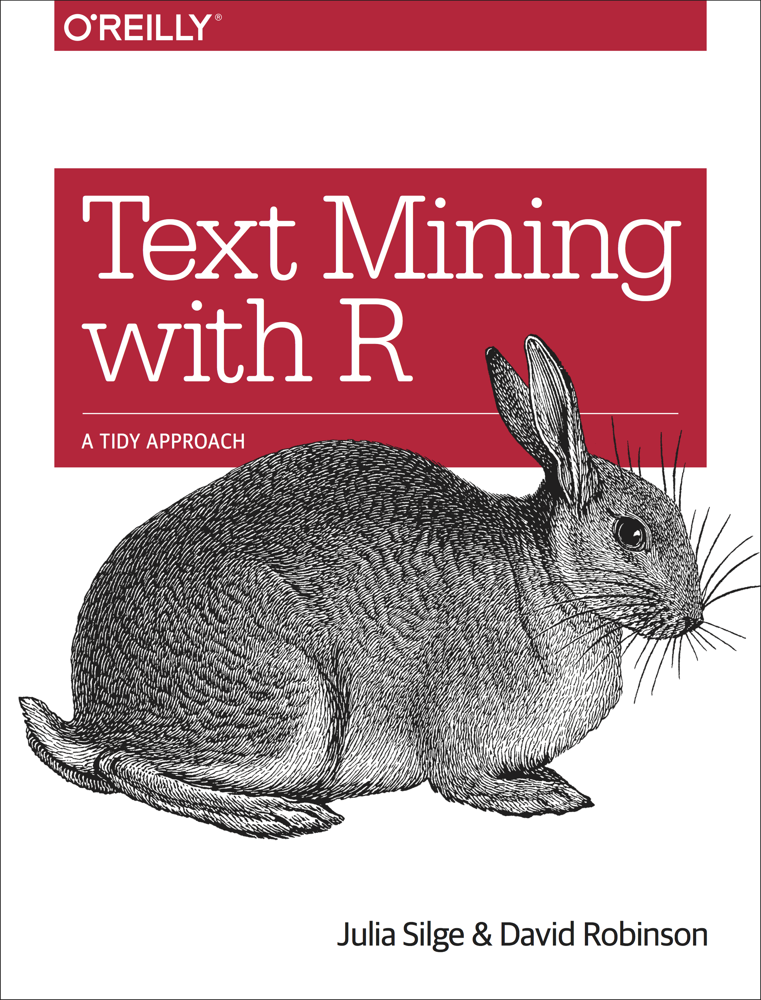

```{r setup, include=FALSE}
knitr::opts_chunk$set(echo = T,message=F,error=F,warning = F)
require(tidyverse)
require(tidytext)
```

layout: true

<div class="slide-footer"><span> 
PPOL670 | Introduction to Data Science for Public Policy

&emsp;&emsp;&emsp;&emsp;&emsp;&emsp;&emsp;&emsp;&emsp;

Week 10 <!-- Week of the Footer Here -->

&emsp;&emsp;&emsp;&emsp;&emsp;&emsp;&emsp;&emsp;&emsp;&emsp;&emsp;&emsp;

Text-as-Data <!-- Title of the lecture here -->

</span></div> 

---
class: outline

# Outline for Today 

![:space 10]

- **String Manipulation**

- **Text as "tidy" data**

- **Sentiment Analysis**

- **Topic Models**

---

class: newsection

# Strings

---

### String Manipulation in `R`


.pull-left[

]

.pull-right[

```{r}
require(stringr)

# or

require(tidyverse)
```
]

--

![:space 30]

.center[
`str_<prefix>()`

```{r}
str_c("a","b")
```

```{r}
str_detect("There is a cat in the street",pattern = "cat")
```

]


---

![:space 20]

```{r}
text = "There were 5 cats!"
text
```

--

![:space 10]

```{r}
str_view(text,"cats")
```


---

### Regular Expressions (regex)

.center[


|Regex | Description |
|:----:|------------------------------|
| `+`  | match 1 or more of the previous character |
| `*`  | match 0 or more of the previous character
| `?` |the preceding item is optional (i.e., match 0 or 1 of the previous character).
| `[ ]` | match 1 of the set of things inside the bracket
| `\\w` | match a "word" character (i.e., letters and numbers).
| `\\d` | match digits
| `\\s` | match a space character
| `\\t` | match a "tab" character
| `\\n` | match a "newline" character
| `^`   | the "beginning edge" of a string
| `$` | the "ending edge" of a string
| {n} | the preceding character is matched n times
]


---

![:space 30]

```{r}
str_view(string = text, pattern = "\\d")
```

---

![:space 30]

```{r,results="asis"}
str_view_all(string = text, pattern = "\\s")
```

---

![:space 30]

```{r,results="asis"}
str_view_all(string = text, pattern = "\\d+\\s+\\w+")
```

---

### String Editing

![:space 5]

```{r}
str_replace(string = text, pattern = "cats", replacement = "dogs")
```

--

![:space 5]

```{r}
str_remove(string = text, pattern = "[:punct:]")
```


--

![:space 5]

```{r}
str_extract(text,pattern = "\\d")
```

---

### Locating text 

```{r}
texts <- c("The man drank 5 beers.",
           "Obama was president.",
           "I think we should walk 2 blocks.")
```

![:space 5]

```{r}
str_detect(texts,pattern = "\\d")
```


![:space 5]

```{r}
str_which(texts,pattern = "\\d")
```


---

### Insert data in a string

![:space 5]

```{r}
x <- 10
str_c("The value is ",x,"%")
```

--

![:space 3]

```{r}
x <- 10
str_glue("The value is {x}%")
```

--

![:space 3]

```{r}
x <- 10
str_glue("The value is {x + 5}%")
```

---

### Capitalization

```{r}
text2 <- "TeXt MininG iN r"
```

```{r}
str_to_lower(text2)
```

```{r}
str_to_upper(text2)
```

```{r}
str_to_title(text2)
```

```{r}
str_to_sentence(text2)
```

---

class: newsection

# Tidy Text

---

![:space 20]

.pull-left[

]

.pull-right[

<br><br><br>

```{r}
require(tidytext)
```

]


---

![:space 5]

.pull-left[

]

.pull-right[
- 

- 

- : that require that the data be organized differently 

]

--

![:space 65]


---

### Tokenization 

```{r,echo=F}
text <- 
"US opposition politicians and aid agencies have questioned a decision by President Donald Trump to cut off aid to three Central American states."
```

![:space 5]

```{r,results="asis"}
text
```


```{r}
text_dat <- tibble(doc = 1, text = text)
text_dat
```

---

### Tokenization 

```{r}
text_dat %>% 
  unnest_tokens(word,text)
```

---

### Tokenization 

```{r}
text_dat %>% 
  unnest_tokens(word,text) %>% 
  count(word, sort = TRUE) 
```


---

### Example 

```{r,results="asis",cache=T}
require(rvest)
url <- "https://www.bbc.com/news/world-us-canada-47764237"
raw <- read_html(url)
story <- raw %>% 
  html_nodes(xpath='//*[@id="page"]/div[1]/div[2]/div/div[1]/div[1]/div[2]/p') %>% 
  html_text() %>% 
  str_c(collapse=" ")
story
```


---

### Example 

```{r}
text_data <- 
  tibble(id=1,story) %>% 
  unnest_tokens(word,story)
text_data
```

---

### Example

```{r}
text_data %>% 
  count(word,sort=T)
```

---

### Stopwords

```{r}
stop_words
```

---

### Example

```{r}
text_data <-
  text_data %>% 
  anti_join(stop_words) %>% 
  count(word,sort = T)
text_data 
```

---

### Example


![:space 10]

.pull-left[
```{r example_plot, eval=FALSE, split=TRUE,size=.05}
text_data %>% 
  filter(n > 2) %>%
  mutate(word = reorder(word, n)) %>%
  ggplot(aes(word, n)) +
  geom_col() +
  xlab(NULL) +
  coord_flip() +
  theme(text=element_text(size=30))
```
]

.pull-right[
```{r, ref.label="example_plot", echo=FALSE}
```
]


---


class: newsection

# Sentiment 

---

![:space 25]


---

### Sentiment Dictionaries

```{r}
sentiments %>% 
  group_by(lexicon) %>% 
  count(sort=T)
```
--
.center[
|Dictionary Name | Source 
|:----------------:|--------|
| `nrc` | http://saifmohammad.com/WebPages/lexicons.html
| `AFINN` | http://www2.imm.dtu.dk/pubdb/views/publication_details.php?id=6010
| `bing` | https://www.cs.uic.edu/~liub/FBS/sentiment-analysis.html
| `loughran` | https://sraf.nd.edu/
]

---

### Sentiment Dictionaries

.pull-left[
```{r}
get_sentiments("afinn")
```
]

.pull-right[
```{r}
get_sentiments("bing")
```
]

---

### Sentiment to text

```{r}
sent_dict <- get_sentiments("afinn")
sent_text <- text_data %>% inner_join(sent_dict) 
sent_text
```

---

```{r,fig.align="center",fig.width=9,fig.height=6}
sent_text %>% 
ggplot(aes(word, score)) +
  geom_col(show.legend = FALSE,fill="steelblue") +
  coord_flip() + theme(text=element_text(size=20))
```

---

```{r,fig.align="center",fig.width=9,fig.height=6}
text_data %>% 
  inner_join(get_sentiments("bing")) %>% 
  ggplot(aes(word, sentiment,color=sentiment)) +
  geom_point(size=5,show.legend = FALSE) +
  coord_flip() + theme(text=element_text(size=20))
```


---

### Example: Inaugural Speeches

```{r}
inaug_dat <- read_csv("Data/inaug_speeches.csv")
inaug_dat
```

---

### Example: Inaugural Speeches

```{r}
obama <- 
  inaug_dat %>% 
  filter(Name == "Barack Obama") %>% 
  select(address = `Inaugural Address`,text)
obama
```

---

### Example: Inaugural Speeches

```{r}
obama_txt <- 
  obama %>% 
  unnest_tokens(word,text) %>% 
  anti_join(stop_words) %>% 
  inner_join(get_sentiments("afinn")) %>% 
  group_by(address) %>% 
  mutate(index = row_number()) %>% 
  ungroup()
obama_txt
```

---

### Example: Inaugural Speeches

```{r,fig.align="center",fig.width=9,fig.height=5,cache=T}
obama_txt %>% 
  ggplot(aes(index,score,fill=address)) +
  geom_col(show.legend = FALSE) +
  facet_wrap(~address,ncol = 1, scales = "free_y") +
  theme_minimal() +theme(text = element_text(size=20))
```

---

### Example: Inaugural Speeches

```{r,fig.align="center",fig.width=9,fig.height=3.5,cache=T,highlight=T}
obama_txt %>% 
  group_by(word,address) %>% 
  summarize(n = n(),score=max(score)) %>% 
  filter(n>1) %>% 
  ggplot(aes(label=word,size=n,color=score)) +
  ggwordcloud::geom_text_wordcloud_area() + #<<
  scale_color_gradient(low="darkred",high="steelblue") +
  scale_size_area(max_size = 15) +
  facet_wrap(~address,scales="free") +
  theme(text = element_text(size=20))
```


---

class: newsection

# Topic Models 

---

![:space 10]


---

### Latent Dirichlet Allocation (LDA)

- **Every document is a mixture of topics**
  
  - We could imagine a two-topic model of American news, with one topic for “politics” and one for “entertainment.” 
  
  - We could say “Document 1 is 90% about "politics" and 10% about "entertainment", while Document 2 is 30% about "politics" and 70% about "entertainment."

- **Every topic is a mixture of words**
  
  - The most common words in the "politics" topic might be “President”, “Congress”, and “government”, while the entertainment topic may be made up of words such as “movies”, “television”, and “actor”. 
  
  - Words can be shared between topics; a word like “budget” might appear in both equally.


---

### Latent Dirichlet Allocation (LDA)

![:space 10]


---

```{r}
library(topicmodels)

data("AssociatedPress")
AssociatedPress
```

--

Can convert easily from a document term matrix (see reading) back to a tidy text format with `tidy()`

```{r}
AssociatedPress %>% tidy()
```

---

### LDA

```{r,cache=T}
ap_lda <- LDA(AssociatedPress, k = 2, control = list(seed = 1234))
ap_lda
```

![:space 15]

- Like the other clustering methods that we encountered, `k` is arbitrary. Here we shot for $k = 2$ 

- Running an LDA is _easy_ (though they are computationally expensive)

- The challenge lies in **interpreting** the topic output.

---

- Extract information regarding topic assignment using the `tidy()` function from the `tidytext` package
  
- Parameters of interest

  - "beta" &rarr; Term to Topic
  
  - "gamma" &rarr; Document to Topic

```{r}
ap_topics <- tidy(ap_lda, matrix = "beta")
ap_topics
```

---

```{r}
ap_top_terms <- 
  ap_topics %>%
  group_by(topic) %>% # Group by the topics
  
  # Grab the top 10 words most 
  # associated with the topic
  top_n(10, beta) %>% 
  
  ungroup() %>% # Ungroup
  arrange(topic, -beta) # Arrange 
ap_top_terms
```

---

### Deciphering the Topics

```{r,fig.align="center",fig.width=8,fig.height=4.5,cache=T}
ap_top_terms %>%
  mutate(term = reorder(term, beta)) %>%
  ggplot(aes(term, beta, fill = factor(topic))) +
  geom_col(show.legend = FALSE) +
  facet_wrap(~ topic, scales = "free") +
  coord_flip() +
  theme(text=element_text(size=16))
```

---

### Documents to Topics

```{r}
ap_documents <- tidy(ap_lda, matrix = "gamma") %>% 
  arrange(document,gamma)
ap_documents 
```

---

### Documents to Topics

Document #6 is highly associated with the "politics" topic 

```{r}
ap_documents %>% filter(document==6)
```


```{r}
tidy(AssociatedPress) %>% filter(document == 6) %>% arrange(desc(count))
```

