```{r setup, include=FALSE}
# Run for Interactive Slide Editing: 
# xaringan::inf_mr()
knitr::opts_chunk$set(echo = T,message=F,error=F,warning = F,cache=T)
require(tidyverse)
require(ggthemes)
```

layout: true

<div class="slide-footer"><span> 
PPOL670 | Introduction to Data Science for Public Policy

&emsp;&emsp;&emsp;&emsp;&emsp;&emsp;&emsp;&emsp;&emsp;

Week 11 <!-- Week of the Footer Here -->

&emsp;&emsp;&emsp;&emsp;&emsp;&emsp;&emsp;&emsp;&emsp;&emsp;&emsp;&emsp;

Classification <!-- Title of the lecture here -->

</span></div> 

---
class: outline

# Outline for Today 

<br>

- **Classification Problems**

- **Discuss Classification Performance Metrics**

- **Logistic Regression**

- **K Nearest Neighbors**

- **Classification Trees**

- **Support Vector Machines**


---

class: newsection

# Classification

---

<br>

.center[]

---

### Decision Boundary 

.center[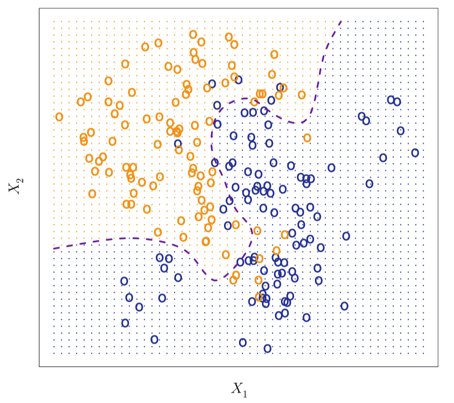]

---

class: newsection

# Classification Performance Metrics 

---

### How did we do? 

- Our aim is to model the signal, not the noise. As we've seen, model over-fitting is a real problem, but re-sampling methods can offer us a way out. 

- Central to any machine learning task is how we choose to define "good" performance. 

--

- When dealing with quantitative outcomes (intervals), we can utilize metrics like MSE to assess performance.

$$MSE = \frac{\sum^N_{i=1} (y_i - \hat{f}(X_i))^2}{N}$$

---

### How did we do? 

- Our aim is to model the signal, not the noise. As we've seen, model over-fitting is a real problem, but re-sampling methods can offer us a way out. 

- Central to any machine learning task is how we choose to define "good" performance. 

- When dealing with quantitative outcomes (intervals), we can utilize metrics like MSE to assess performance.

- When dealing with qualitative outcome (categories), we need to rely on different metrics to assess performance.

<br>

$$\text{Accuracy} = \frac{\text{Correctly Classified}}{\text{Total Possible}}$$
$$\text{Error} = 1 - \text{Accuracy}$$


---

### The Weather Today 

Consider if we were testing the accuracy of two weather persons. Below are their forecasts for the weather in a given week alongside the observed weather pattern. (For now, let's just focus on binary outcomes: sunny day or rainy day)

.center[
|Weather Person | M | Tu | W | Th | F | St | Su |
|---------------|---|----|---|----|---|----|----|
| $WP_1$ Prediction | Rain | Sun  | Rain | Sun | Sun | Rain | Rain |
| $WP_2$ Prediction | Sun  | Sun  | Sun  | Sun | Sun | Sun  | Sun  |
| Actual            | Sun  | Sun  | Rain | Sun | Sun | Sun  | Sun |
]

--

.center[
|Weather Person | Correct | Total | Accuracy | Error |
|---------------|---------|-------|----------|-------|
| $WP_1$        |    4    |   7   |   57.1%  | 42.9% |
| $WP_2$        |    6    |   7   |   85.7%  | 14.3% |
]

If we calculate the accuracy for each, it looks as if Weather Person 2 is the most accurate. Does that make sense?

---

### The Weather Today 

Consider if we were testing the accuracy of two weather persons. Below are their forecasts for the weather in a given week alongside the observed weather pattern. (For now, let's just focus on binary outcomes: sunny day or rainy day)

.center[
|Weather Person | M | Tu | W | Th | F | St | Su |
|---------------|---|----|---|----|---|----|----|
| $WP_1$ Prediction | Rain | Sun  | Rain | Sun | Sun | Rain | Rain |
| $WP_2$ Prediction | Sun  | Sun  | Sun  | Sun | Sun | Sun  | Sun  |
| Actual            | Sun  | Sun  | Rain | Sun | Sun | Sun  | Sun |
]

.center[
|Weather Person | Correct | Total | Accuracy | Error |
|---------------|---------|-------|----------|-------|
| $WP_1$        |    4    |   7   |   57.1%  | 42.9% |
| $WP_2$        |    6    |   7   |   85.7%  | 14.3% |
]

Rain is **rare**. We can always have high accuracy if we just guess sun every day. This is generates a problem if what people care about is when to pack an umbrella!

---

### Confusion Matrix

<br> 

.center[
|                       |  $Positive_{~~\text{Actual}}$ |  $Negative_{~~\text{Actual}}$ |
|-----------------------|----------|----------|
| $Positive_{~~\text{Predicted}}$  |   True Positive (TP)       | False Positive (FP)          |
| $Negative_{~~\text{Predicted}}$  |   False Negative (FN)       |  True Negative (TN)         |

]

--

<br>

| Metric | Calculation |  Description |
|---|-----| -----|
| Accuracy | $\frac{TP + TN}{TP+FP+TN+FN}$ | In total, how accurate is the model |
| Precision | $\frac{TP}{TP+FP}$ | Of the true positives classified, how many are actually positive | 
| Specificity | $\frac{ TN }{ TN + FP }$ | Of the actual true negatives, how many were correctly classified | 
| Recall/Sensitivity | $\frac{TP}{ TP + FN}$ | Of the actual true positives, how many were correctly classified |


---

### Weather Person 1

<br>

.center[
|                       |  $Positive_{~~\text{Actual}}$ |  $Negative_{~~\text{Actual}}$ |
|-----------------------|----------|----------|
| $Positive_{~~\text{Predicted}}$  |   3      |  0   |
| $Negative_{~~\text{Predicted}}$  |   3      |  1   |

]

<br>

- Accuracy = 57.1%

- Precision = 1%

- Specificity = 100%

- Recall = 50%


---

### Weather Person 2

<br>

.center[
|                       |  $Positive_{~~\text{Actual}}$ |  $Negative_{~~\text{Actual}}$ |
|-----------------------|----------|----------|
| $Positive_{~~\text{Predicted}}$  |   6      |  1   |
| $Negative_{~~\text{Predicted}}$  |   0      |  0   |

]

<br>

- Accuracy = 85.7%

- Precision = 85.7%

- Specificity = 0%

- Recall = 100%

---

### ROC Curves

Consider the following: 

- We want to predict how many rainy days (1) there will be, sunny otherwise (0). 

- Our model outputs probabilities of a rainy day where 0 means no chance, 1 means it's absolutely going to rain. 
  
<br>  
  
```{r,echo=F}
est_probs <- c(.4,.7,.3,.5,.9,.1,.7)
true_values <-  c(1,1,0,0,1,0,1)
```

```{r}
# Our estimated probabilities 
est_probs 
```


---

### ROC Curves

Consider the following: 

- We need to convert these probabilities to predictions. We can do this by setting a **threshold**.
  
<br><br><br>  
```{r}
threshold = .5
our_preds = as.numeric(est_probs >= threshold)
our_preds
```


---

### ROC Curves


Consider the following: 

- We can now compare these predictions to the actual values. 

```{r}
table(our_preds,true_values)
```

- Thresholds reflect how sensitive we are to true or false positives. 
  
  + The higher the threshold, the less false positives.
  
  + The lower the threshold, the more false positives but more true positives. 
  
  + **It's another tradeoff!**
  
---

### ROC Curves

Receiver operating characteristic (ROC) curve offers a visual representation of model performance across different potential thresholds.  

.center[]

---

class: newsection

<br>

# Logistic Regression

---

## The problem with linear regression 


```{r,echo=F,fig.align='center',fig.width=9,fig.height=6,dpi=300}
set.seed(123)
N = 250
x <- rnorm(N)
z =  pnorm(1 + 2*x)
y = rbinom(N,1,z)
D = tibble(y,x)

tt = element_text(family='serif',face='bold',size = 20)
ggplot(D,aes(x,y)) +
  geom_point(size=3,alpha=.5) +
  geom_smooth(method="lm",se=F,color="darkred",size=1.5) +
  theme_bw() +
  theme(axis.title = tt,
        axis.text = tt ) 
```

---

## Logistic Regression


```{r,echo=F,fig.align='center',fig.width=9,fig.height=6,dpi=300}
D$pr = predict(glm(y~x,data = D,family=binomial("probit")),type="response")

ggplot(D,aes(x,y)) +
  geom_point(size=3,alpha=.5) +
  geom_line(aes(x,pr),color="steelblue",size=2,alpha=.75) +
  theme_bw() +
  theme(axis.title = tt,
        axis.text = tt ) 

```


---

We need a function $F(\cdot)$ (which is known as a **_link function_**) that maps our linear combination of independent variables ( $X\beta$ ) onto a probability space (ranging from 0 to 1).

$$ F(X\beta) \mapsto [0,1]$$

.center[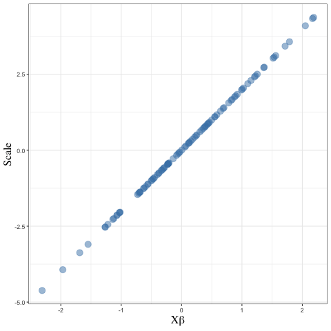]

---

```{r,echo=F,fig.align="center",fig.width=10,fig.height=8}
bind_rows(
  tibble(x=seq(-5,5,.1),
         `CDF\nPr(y = 1)`=pnorm(seq(-5,5,.1)),
         `PDF\nDensity`=dnorm(seq(-5,5,.1)),type="Normal"),
  tibble(x=seq(-5,5,.1),
         `CDF\nPr(y = 1)`=plogis(seq(-5,5,.1),location = 0,scale=1),
         `PDF\nDensity` = dlogis(seq(-5,5,.1),location = 0,scale=1),
         type="Logistic")
) %>% 
  gather(key,val,-x,-type) %>% 
ggplot(aes(x,val,color=type)) +
  geom_line(size=2,alpha=.75) +
  labs(y='',color="",pch="",x= latex2exp::TeX("$\\beta_0 + \\beta_1 x_i$")) +
  scale_color_manual(values=c("#410B9E", "#FF791F"))+
  theme_bw() +
  theme(axis.title = tt,
        axis.text = tt,
        legend.text = tt,
        legend.position = "top",
        strip.text = tt,strip.background = element_blank()) +
  facet_wrap(~key,scales="free",strip.position = "right",ncol=1)
```

---

```{r,echo=F,cache=F}
set.seed(123)
N = 600
x1 <- rnorm(N)           
x2 <- rnorm(N)           
y_star <- .5*x1 + .6*x2

# convert to a probability space
pr <- exp(y_star)/(1+exp(y_star))

# Drop the probability into a bernoulli dist. (0 or 1)
y <- rbinom(N, size=1, prob = pr) 

# Gather as dataset
dat <- tibble(y,x1,x2)
training_data = dat[1:500,]
test_data = dat[500:600,]
```

```{r}
head(training_data,3)
```


```{r,fig.align="center",fig.width=10,fig.height=3.75,cache=F}
pairs(training_data,col="steelblue")
```

---

### Estimate

```{r,cache=F}
#We can easily estimate these models in base R
mod = glm(y ~ x1 + x2, data=training_data,
          family=binomial(link = "logit"))
```

![:space 5]

### Predict

```{r,cache=F}
preds = predict(mod, test_data,type = "response")
head(preds)
```

---

### Estimate

```{r,cache=F}
#We can easily estimate these models in base R
mod = glm(y ~ x1 + x2, data=training_data,
          family=binomial(link = "logit"))
```

![:space 5]

### Predict
```{r,cache=F}
preds = predict(mod, test_data,type = "response")
table(preds > .5, test_data$y)
```

---

class: newsection

<br>

# $K$-Nearest Neighbors

---


```{r,echo=F,fig.align="center",fig.width=10,fig.height=8}
# Create Data
set.seed(1234)
N = 50
x1 = runif(N)
x2 = runif(N)
y = rbinom(N,1,.5)
D = tibble(x1,x2,y)
D$x1_star = .63
D$x2_star = .37
D <- 
  D %>% 
  mutate(distance_x1 = sqrt((x1 - x1_star)^2),
         distance_x2 = sqrt((x2 - x2_star)^2),
         distance = (distance_x1 + distance_x2)/2 )

new_size = 6

D %>% 
  ggplot(aes(x1,x2,color=factor(y))) +
  geom_point(size=3) +
  scale_color_manual(values=c("steelblue","darkred")) +
  theme_minimal() +
  theme(text = element_text(size=24),
        legend.position = "none",
        legend.text = element_text(size=20),
        title = element_text(hjust=.5)) 
```


---

```{r,echo=F,fig.align="center",fig.width=10,fig.height=8}
D %>% 
  ggplot(aes(x1,x2,color=factor(y))) +
  geom_point(size=3) +
  scale_color_manual(values=c("steelblue","darkred")) +
  geom_point(x=.63,y=.37,color="black",pch=18,size=new_size) +
  theme_minimal() +
  theme(text = element_text(size=24),
        legend.position = "none",
        legend.text = element_text(size=20),
        title = element_text(hjust=.5)) 
```

---

```{r,echo=F,fig.align="center",fig.width=10,fig.height=8}
D %>% 
  ggplot(aes(x1,x2,color=factor(y))) +
  geom_point(size=3) +
  scale_color_manual(values=c("steelblue","darkred")) +
  geom_point(x=.63,y=.37,color="black",pch=18,size=new_size) +
  geom_segment(aes(x=x1_star,xend=x1,y=x2_star,yend=x2),alpha=.2,size=1) +
  geom_point(x=.63,y=.37,color="black",pch=18,size=new_size) +
  theme_minimal() +
  theme(text = element_text(size=24),
        legend.position = "none",
        legend.text = element_text(size=20),
        title = element_text(hjust=.5)) 
```

---

```{r,echo=F,fig.align="center",fig.width=10,fig.height=8}
D %>% 
  ggplot(aes(x1,x2,color=factor(y))) +
  geom_point(size=3) +
  scale_color_manual(values=c("steelblue","darkred")) +
  geom_point(x=.63,y=.37,color="black",pch=18,size=new_size) +
  geom_segment(aes(x=x1_star,xend=x1,y=x2_star,yend=x2),alpha=.2,size=1) +
  geom_point(x=.63,y=.37,color="black",pch=18,size=new_size) +
  gghighlight::gghighlight(distance <.07  ) +
  theme_minimal() +
  theme(text = element_text(size=24),
        legend.position = "none",
        legend.text = element_text(size=20),
        title = element_text(hjust=.5)) 
```


---

```{r,echo=F,fig.align="center",fig.width=10,fig.height=8}
D %>% 
  ggplot(aes(x1,x2,color=factor(y))) +
  geom_point(size=3) +
  scale_color_manual(values=c("steelblue","darkred")) +
  geom_point(x=.63,y=.37,color="black",pch=18,size=new_size) +
  geom_segment(aes(x=x1_star,xend=x1,y=x2_star,yend=x2),alpha=.2,size=1) +
  geom_point(x=.63,y=.37,color="black",pch=18,size=new_size) +
  gghighlight::gghighlight(distance <.07  ) +
  geom_point(x=.63,y=.37,color="darkred",pch=18,size=new_size + .5) +
  theme_minimal() +
  theme(text = element_text(size=24),
        legend.position = "none",
        legend.text = element_text(size=20),
        title = element_text(hjust=.5)) 
```

---

### KNN

<br>

.center[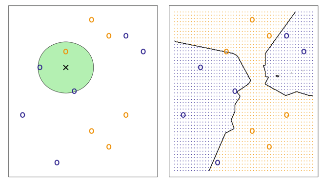 ]

---

### KNN

- Non-parametric method that treats inputs as coordinate sets

- Classifies by distance of the new entry (test data) to existing entries (training data). 

--

- Distance can be conceptualized in a number ways. Euclidean distance is common:

$$distance = \sqrt{(x_{ij} - x_{0j})^2}$$

--

- Classification occurs as a "_majority vote_"

$$Pr(y_{ik} = j~|~X = x_{ik}) = \frac{\sum^K_{k=1} I(y_{ik} =j )}{K}$$

--

- Poor performance in high dimensions


---

### $k$ is a tuning parameter

<br>

.center[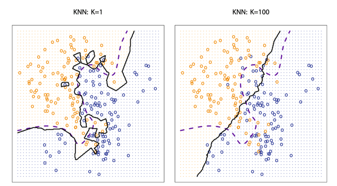 ]


---

### $k$ is a tuning parameter

.center[ ]


---

class: newsection

# Classification Trees


---

## Refresh on Regression Trees 

- The goal is to find boxes that minimize the predictive error in our training data. 

- **_Recursive Binary Splitting_**

  - **Top-down**: start with one region and break from there.

  - **Greedy**: best split is made at each step (best split given the other splits that have been made)

- **_Tree Depth_**
  
  - Shallow trees (a few splits) can result in underfitting. 

  - Deep trees (many splits) can result in overfitting

---

### Classification Trees

<br>

- Categorical rather than continuous outcome

- Similar process to a regression tree.

- Predict most commonly occurring class of training observations in the region to which it belongs.

- Use the **_Gini Index_** as a measurement of error

$$G = \sum^K_{k=1} \hat{p}_{mk} (1-\hat{p}_{mk})$$

- Gini index gets small if all $\hat{p}_{mk}$ are close to zero or one ("node purity")

---

<br><br><br><br>

.center[
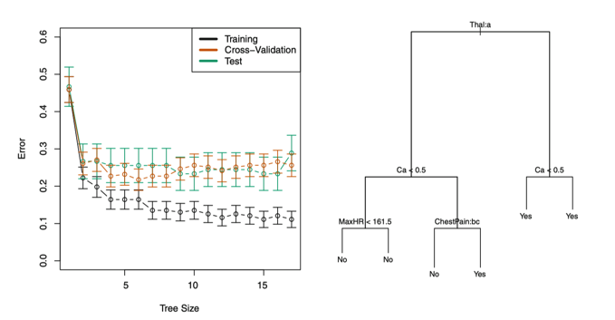 
]


---

### Reminder: Regression vs. Trees

.center[
 
]

---

class: newsection

# Support Vector Machines

---

### Let's Build a Wall

```{r,echo=F,fig.align="center",fig.height=7,fig.width=10}
set.seed(123)
n = 1e4
x1 = runif(n)
x2 = runif(n)
y = 0+1*x1 >= x2
D = tibble(y,x1,x2)
D %>% 
  ggplot(aes(x1,x2,color=as.factor(y))) +
  geom_point(show.legend = F,alpha=.3,size=3) +
  geom_abline(intercept = 0,slope=1,size=3,color="grey20") +
  ggthemes::theme_fivethirtyeight() +  
  ggthemes::scale_color_gdocs()  
```


---

### Separating Hyperplane

$$y_i(\beta_0 + x_{1i}\beta_1 + \dots + x_{pi}\beta_p) > 0, \text{ if }y_i = 1$$
$$y_i(\beta_0 + x_{1i}\beta_1 + \dots + x_{pi}\beta_p) < 0, \text{ if }y_i = -1$$

.center[
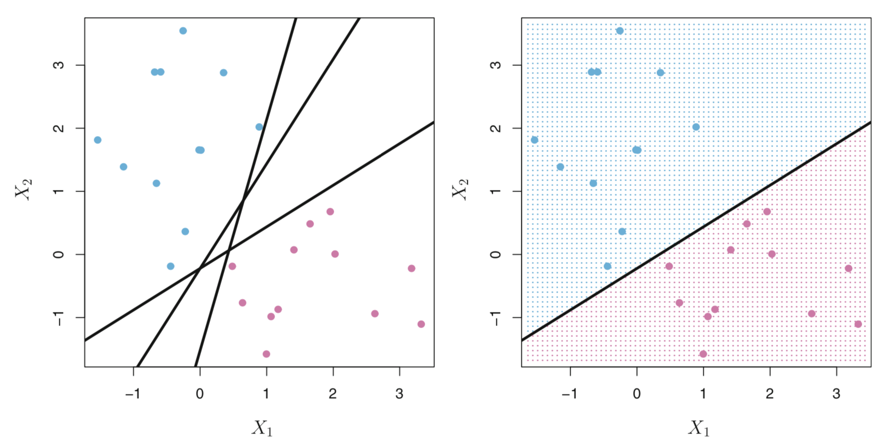 
]

---

### Maximal Margin Hyperplane

.center[
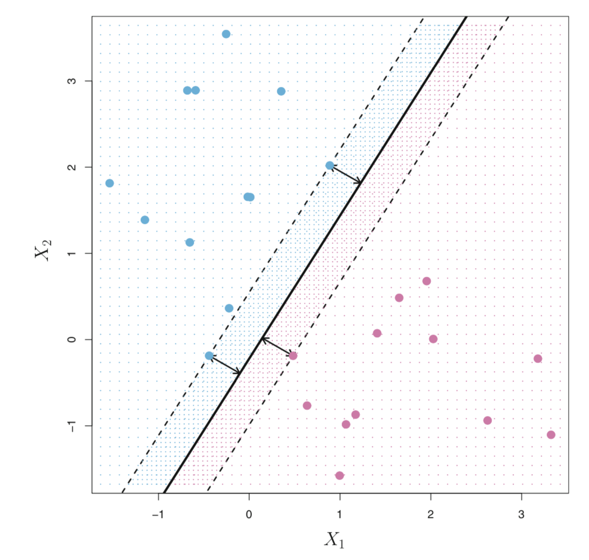 
]

---

### Non-separable

.center[
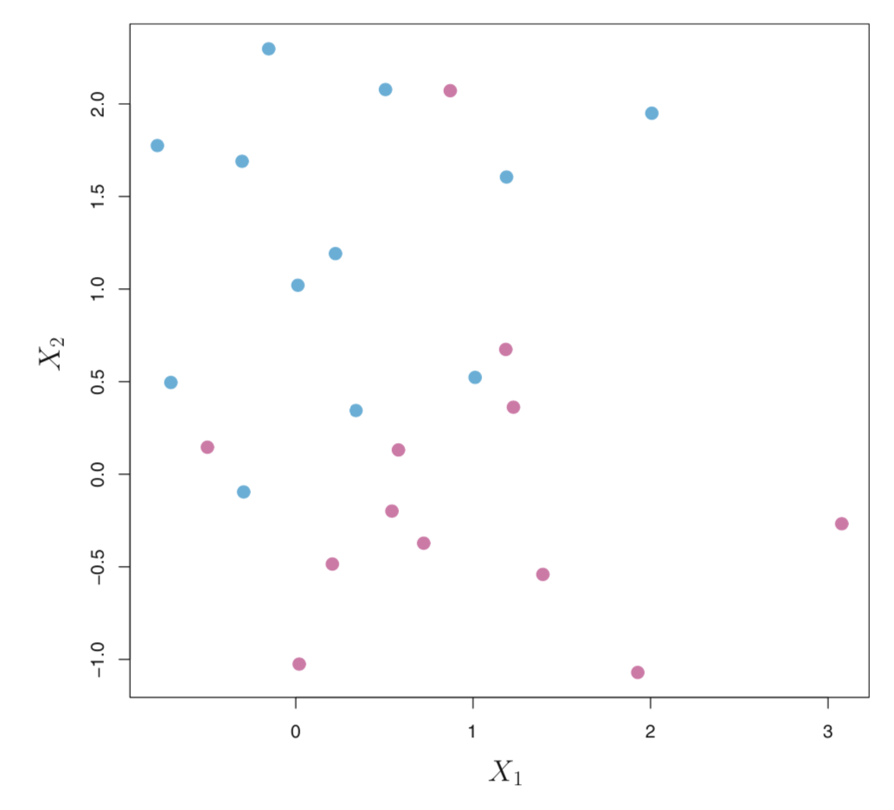 
]

---

### Support Vector Classifier 

![:space 10]
.center[
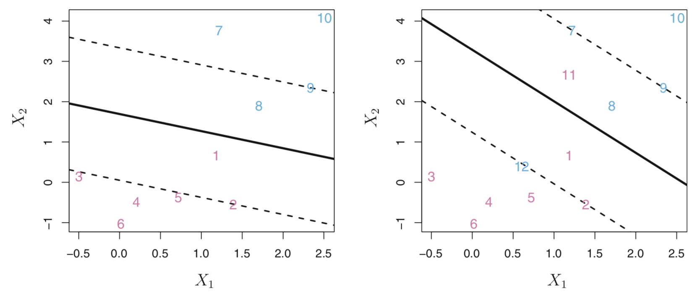 
]

---

### Support Vector Classifier 

**_Aim_**: maximize the margin that separates most of the training observations but misclassifies only a few observations. 

$$max_{\beta, \epsilon}~M~\text{ subject to } \sum_{j=1}^p \beta_j^2 = 1$$

$$y_i(\beta_0 + x_{1i}\beta_1 + \dots + x_{pi}\beta_p) \ge M (1-\epsilon_i)$$

$$\epsilon \ge 0, \sum_{i=1}^n \epsilon_i \le C$$
Where $C$ is a nonnegative tuning parameter. 

- $C$ dictates how many individuals observations can be on the wrong side of the margin. 

- $C$ &rarr; 0 high bias; $C$ &rarr; 1 high variability

---

### Tuning $C$

.center[
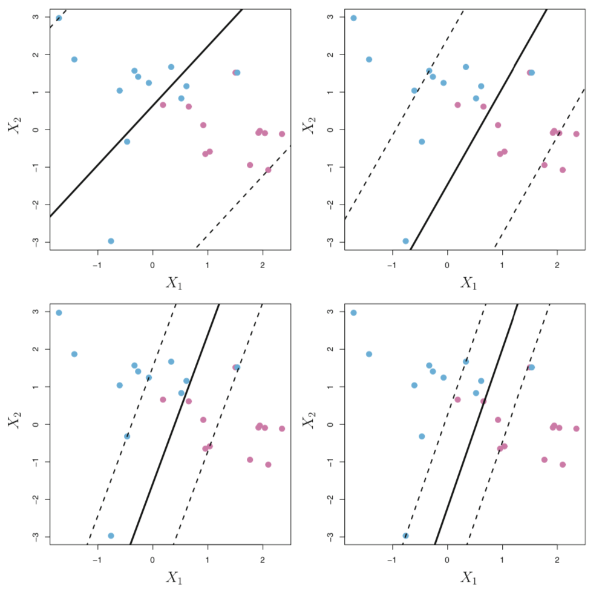 
]

---

### Dealing with Non-Linear Boundaries 

![:space 5]

.center[
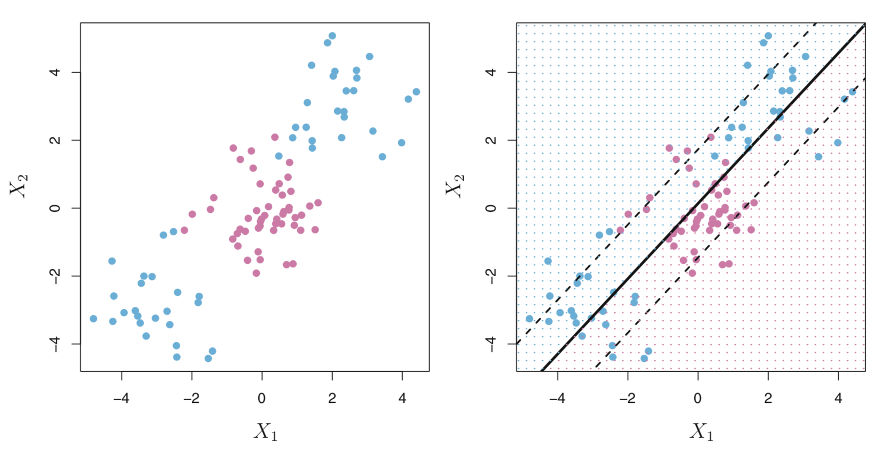 
]

---

### Support Vector Machine

Use a (polynomial, radial) _kernel_ to generate a decision boundary.

<br>

.center[
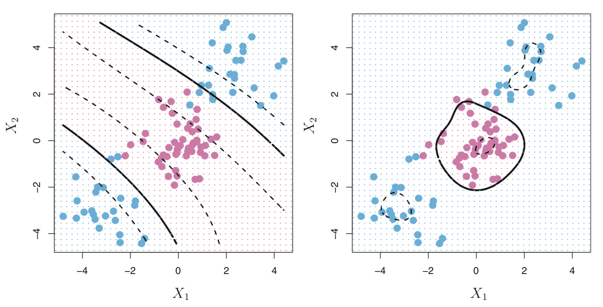 
]
