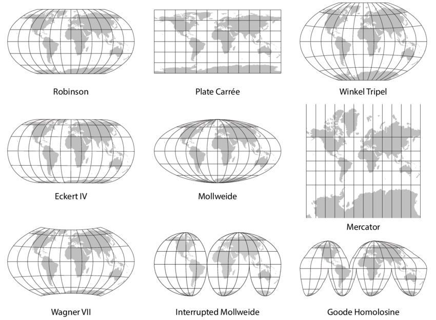
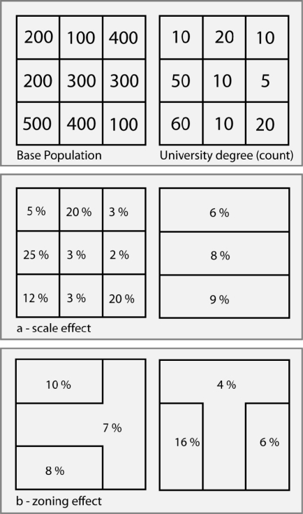
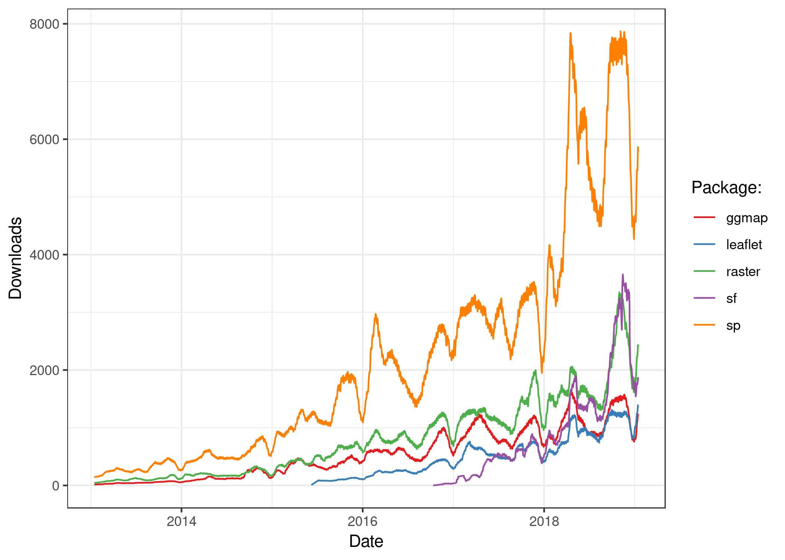
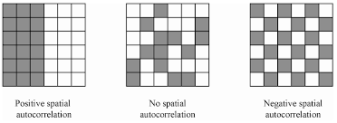
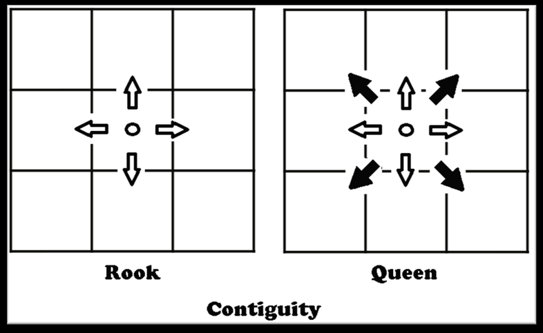

```{r setup, include=FALSE}
knitr::opts_chunk$set(echo = T,message=F,error=F,warning = F)
```

layout: true

<div class="slide-footer"><span> 
PPOL670 | Introduction to GIS and Spatial Analysis in R

&emsp;&emsp;&emsp;&emsp;&emsp;&emsp;&emsp;&emsp;&emsp;

Week 11 <!-- Week of the Footer Here -->

&emsp;&emsp;&emsp;&emsp;&emsp;&emsp;&emsp;&emsp;&emsp;&emsp;&emsp;&emsp;

GIS and Spatial Analysis Basics in R  <!-- Title of the lecture here -->

</span></div> 

---
class: outline

# Outline for Today 

- **GIS Basics**

- **GIS in R**

- **Spatial Analysis**

---

class: newsection

# GIS Basics


---

class: center, middle

## GIS vs Spatial Analysis


---

# Types of Data


---

# Projections



---

# Map types

- Choropleth
- Point
- Flow
- Density

---

# Issues

- Modifiable areal unit problem (MAUP)


---

# MAUP



---

# Issues

- Modifiable areal unit problem (MAUP)
- Ecological Fallacy
- Unstable Rates

---

class: newsection

# GIS in R


---

class: center
## The R Spatial Ecosystem




---

## The R Spatial Ecosystem

### Legacy Geography
```{r eval=F}
library(sp)
library(rgdal)
library(ggmap)
```

### Tidy Geography
```{r eval=F}
library(sf)
library(tmap)
library(leaflet)
library(raster)
```

---

## The R Spatial Ecosystem

### Spatial Analysis
```{r eval=F}
library(spdep)
```

### Tools and Data
```{r eval=F}
library(maptools)
library(spData)
library(spDataLarge) # needs to be installed using devtools
library(urbnmapr) # needs to be installed using devtools
```

---

# Basic Maps
```{r, eval=F}
library(tidyverse)
library(sf)
library(spData)
```

```{r, include=F}
library(tidyverse)
library(sf)
library(spData)
```

```{r}
us_states %>% 
  plot()

```

---

# Basic Maps
```{r}
us_states %>% 
  select(total_pop_15) %>% 
  plot()

```

---

# Basic Maps
```{r, eval=F}
library(tmap)
```

```{r, include=F}
library(tmap)
```

```{r}
tm_shape(us_states, projection = "+proj=aea +lon_0=-90 +lat_1=33 +lat_2=45") +
  tm_polygons("total_pop_10")

```

---

# More tmap Code

```{r, eval=F}
library(tidyverse)
library(tmap)
library(spData)
library(spDataLarge)

# Add fill layer to nz shape
tm_shape(nz) +
  tm_fill() 
# Add border layer to nz shape
tm_shape(nz) +
  tm_borders() 
# Add fill and border layers to nz shape
tm_shape(nz) +
  tm_fill() +
  tm_borders() 

```


---

# More tmap Code

```{r, eval=F}
# layers and grids
map_nz = tm_shape(nz) + tm_polygons()

map_nz1 = map_nz +
  tm_shape(nz_elev) + 
  tm_raster(alpha = 0.7)

nz_water = st_union(nz) %>% 
  st_buffer(22200) %>% 
  st_cast(to = "LINESTRING")

map_nz2 = map_nz1 +
  tm_shape(nz_water) + tm_lines()

map_nz3 = map_nz2 +
  tm_shape(nz_height) + tm_dots()

tmap_arrange(map_nz1, map_nz2, map_nz3)


# what about adding a projection?
tm_shape(nz) + 
  tm_fill(col = "Median_income", title="Medium Income") +
  tm_borders()
```

---

# Finding and Reading Shapefiles

- https://www.nhgis.org/

```{r}
library(sf)
fname <- system.file("shape/nc.shp", package="sf")
fname
## [1] "/tmp/Rtmpb7R1w9/Rinst7fecc45b12d/sf/shape/nc.shp"
nc <- st_read(fname)
```


---

class: newsection

# Basic Spatial Analysis

---

## Spatial Autocorrelation

- What is temporal autocorrelation?

--- 

## Spatial Autocorrelation



---

## Moran's I

- Scale: -1 to 1
- Weights Matrix
  - Queen vs Rook





---

## Moran's I in R

```{r}
load(url("http://github.com/mgimond/Spatial/raw/master/Data/moransI.RData"))

library(tidyverse)

glimpse(s1@data)

library(tmap)
```

``` {r, eval = F}
tm_shape(s1) + 
  tm_polygons(style="quantile", col = "Income") +
  tm_legend(outside = TRUE, text.size = .8) 
```


---

## Moran's I in R

``` {r}
tm_shape(s1) + 
  tm_polygons(style="quantile", col = "Income") +
  tm_legend(outside = TRUE, text.size = .8) 
```


---

## Moran's I in R

```{r}
library(spdep)

nb <- poly2nb(s1, queen=TRUE) # create contiguity matrix


library(sf)
s2 <- st_as_sf(s1)
class(s1)
class(s2)
```


---

## Moran's I in R

```{r}
lw <- nb2listw(nb, style="W", zero.policy=TRUE) # create spatial weights matrix

# calculate Moran's I
MC<- moran.mc(s1$Income, lw, nsim=599)
MC

# scale Income and create spatial lag variable
s1@data <- s1@data %>% mutate(sIncome = scale(Income),
                   lag_sIncome = lag.listw(lw, sIncome))


```

---

## Moran's I in R

```{r}

# get correlation between income and neighbors' income
reg <- lm(sIncome ~ lag_sIncome, data=s1)
reg
```

```{r, eval=F}
ggplot(data = s1@data, aes(x = sIncome, y = lag_sIncome)) +
  geom_point(color = "steelblue") +
  geom_abline(linetype = "dashed", color = "red", slope = .905, intercept = 0.05017) +
  geom_hline(yintercept = 0) +
  geom_vline(xintercept = 0) +
  ggthemes::theme_calc() +
  ggtitle("Moran Scatterplot Income",
          subtitle = "(scaled)") +
  annotate(geom = "text", label = as.character(round(MC$statistic,3)), x = .25, y = .065)
```

---

class: center

### Relationship between Income and Lagged Income

```{r, echo=F}
ggplot(data = s1@data, aes(x = sIncome, y = lag_sIncome)) +
  geom_point(color = "steelblue") +
  geom_abline(linetype = "dashed", color = "red", slope = .905, intercept = 0.05017) +
  geom_hline(yintercept = 0) +
  geom_vline(xintercept = 0) +
  ggthemes::theme_calc() +
  ggtitle("Moran Scatterplot Income",
          subtitle = "(scaled)") +
  annotate(geom = "text", label = as.character(round(MC$statistic,3)), x = .25, y = .065)
```