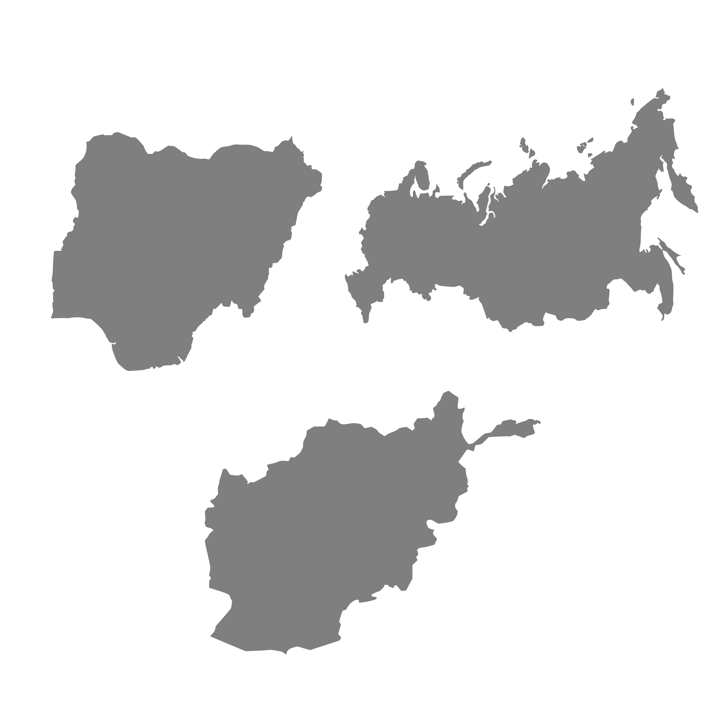
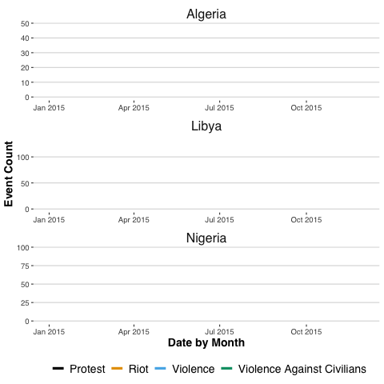
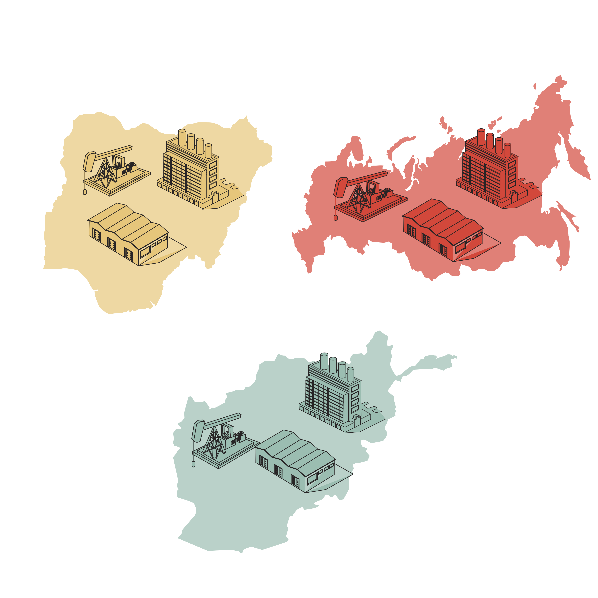
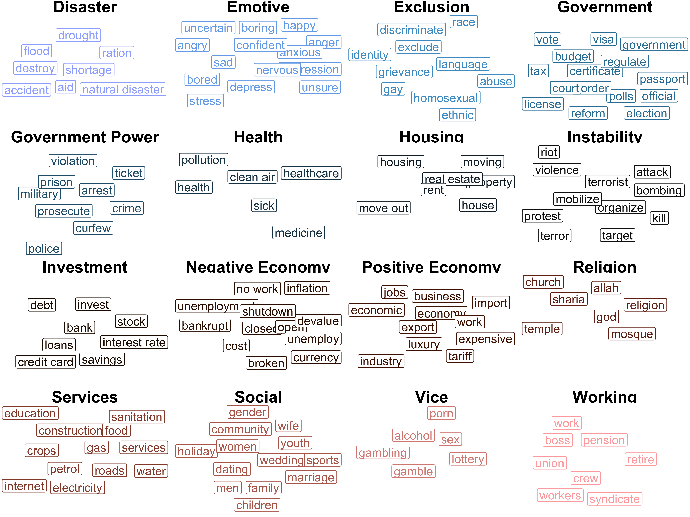

```{r setup, include=FALSE}
knitr::opts_chunk$set(echo = T,message=F,error=F,warning = F,cache=T)
require(tidyverse)
require(recipes)
require(rsample)
require(caret)
doMC::registerDoMC()
```

layout: true

<div class="slide-footer"><span> 
PPOL670 | Introduction to Data Science for Public Policy

&emsp;&emsp;&emsp;&emsp;&emsp;&emsp;&emsp;&emsp;&emsp;

Week 12 <!-- Week of the Footer Here -->

&emsp;&emsp;&emsp;&emsp;&emsp;&emsp;&emsp;&emsp;&emsp;&emsp;&emsp;&emsp;

Exploratory Data Analysis <!-- Title of the lecture here -->

</span></div> 

---
class: outline

# Outline for Today 

![:space 10]

- **_Exploring data when you have limited priors_**

- Outline the **_"layers"_** of data exploration.

- Walk through an **_applied example_** looking at the relationship between protest and internet search activity. 
  
---

class: newsection

# Exploratory Data Analysis

---

### Exploratory Data Analysis (EDA)

EDA is an **_iterative cycle_**:

![:space 5]

1. **_Generate_** questions about your data.

2. Search for answers by **_visualizing_**, **_transforming_**, and **_modelling_** your data.

3. Use what you learn to **_refine_** your questions and/or generate new questions.

![:space 5]

EDA is not a formal process with a strict set of rules. Feel free to investigate every idea that occurs to you. Some will work and offer valuable insights, others won't.

---

### Weak priors on the DGP

Often we are need to elicit answers from data where we know little about the **_data generating process_** (DGP)

  - Little to no academic work to guide our expectations.
  
  - New data type that does not conform cleanly to past operationalizations of well-defined theoretical concepts.
  
  - Data is entirely foreign to you 
      
      + Data outside your domain of _expertise_ --- e.g., you study conflict but you need to examine healthcare data.
      
      + Data outside your domain of _expectation_ --- e.g., a company's internal data logs that you need to draw insight on.

---

###  "Layers" of Exploration 

Given new data, how best should one draw novel insights?

--

- **__**: **_Train/Test Split_**
  
  - Always the first step. 
  - Split the data and never look at, learn from, or examine the test data.
  - We can probe, model, and theorize about the training data _as long as we've held off test data_ to validate our conclusions. 

---

###  "Layers" of Exploration 

Given new data, how best should one draw novel insights?

- **__**: **_Train/Test Split_**
- **__**: **_Understanding what data you have_**
  
  - <u>_Data Properties_</u>
      - What is the unit of analysis?
      - What are the data types?
          - integers, floats, categorical, ordered scales?
      - What sources of variation are there?
      - How is that data distributed?
      - Are there oddities in the data? 
          - e.g. housing price data with a lot of 0s. 
      - Is the data incomplete? If so, why?
      - Should the data be transformed?
      - Are there ways to back out new variables from the variables you have? ("feature engineering")
    
---

###  "Layers" of Exploration 

Given new data, how best should one draw novel insights?

- **__**: **_Train/Test Split_**
- **__**: **_Understanding what data you have_**
  
  - <u>_Data Properties_</u>
  - <u>_Data Generation_</u> (questions to ask yourself)
      - How was the data generated?
          - Hand coded vs. machine coded?
          - Self-reported?
          - Convenience sample?
          - Complete? Incomplete? Why?
      - How fit is the data to answer your (or any) inquiry?
      - In what ways could the data be distorted or biased?
      - Are the concepts measured in the data clearly defined? 
          - If so, why do you believe that? 
          - If not, where does the issue lie?
    
---

###  "Layers" of Exploration 

Given new data, how best should one draw novel insights?

- **__**: **_Train/Test Split_**
- **__**: **_Understanding what data you have_**
- **__**: **_Analyzing the relationships_**

  - What variables are highly correlated?
  - What is the relationship between the variables?
  - What can bi-variate models tell us about the relationship between two (or more) variables?
  - Does a decomposition reveal anything interesting about the variation in the data?
  - Does the data cluster in interesting ways? 
  - Can we plot the data spatially or temporally? Do any interesting patterns emerge? 
  
---

###  "Layers" of Exploration 

Given new data, how best should one draw novel insights?

- **__**: **_Train/Test Split_**
- **__**: **_Understanding what data you have_**
- **__**: **_Analyzing the relationships_**
- **__**: **_Unpacking the outcome_**

  - What outcome variable do you care about (or seems important) in the data? 
  - Build a model that best predicts this outcome.
  - Explore the most predictive model
      - What features/variables mattered most in the prediction task?
      - What are the marginal effects of these most predictive features?
      - Is there any heterogeneity in the predicted value of the model across certain observations?

---

###  "Layers" of Exploration 

Given new data, how best should one draw novel insights?

- **__**: **_Train/Test Split_**
- **__**: **_Understanding what data you have_**
- **__**: **_Analyzing the relationships_**
- **__**: **_Unpacking the outcome_**
- **__**: **_Theorize_**

  - What are some hypotheses that we might be able to generate from the data?
  - What confounders might be lurking generating spurious correlations?
	- What are some plausible interventions that we might be able to employ to test a causal relationship?
		- Are those interventions ethical?
		- Are those interventions practical?
		
---

###  "Layers" of Exploration 

Given new data, how best should one draw novel insights?

- **__**: **_Train/Test Split_**
- **__**: **_Understanding what data you have_**
- **__**: **_Analyzing the relationships_**
- **__**: **_Unpacking the outcome_**
- **__**: **_Theorize_**


- **__**: **_Repeat 1 - 4_**

---

class: newsection

# Applied Example

---

## Protest & Internet Searches



---

![:space 10]


---



---


---

![:space 5]



---

### Layer 0: Split the Data

```{r}
dat = read_csv("Data/search_protest_data.csv")
range(dat$date)
```


```{r}
train_dat = dat %>% filter(date < as.Date("2017-06-01"))
test_dat = dat %>% filter(date >= as.Date("2017-06-01"))

# Proporation in the training data 
round(nrow(train_dat)/nrow(dat),3)
  
# Proporation in the test data
round(nrow(test_dat)/nrow(dat),3)
```

---

### Layer 1: Understanding the Data

**Unit of Analysis**

```{r}
train_dat %>% glimpse()
```

---

### Layer 1: Understanding the Data

**Unit of Analysis**: Country-Month

```{r}
train_dat %>% summarize(n_countries = n_distinct(country))
```


```{r}
# Number of observations
train_dat %>% nrow()
```

---

### Layer 1: Understanding the Data

**Coverage**: Data appears complete across the available months, except for South Sudan.

```{r,fig.align="center",fig.width=10,fig.height=4.5,dpi=600}
train_dat %>% 
  ggplot(aes(date,country)) +
  geom_point(show.legend = F) 
```


---

### Layer 1: Understanding the _Outcome_

```{r,fig.align="center",fig.width=7,fig.height=5,fig.height=3,dpi=600}
train_dat %>% 
  ggplot(aes(protest_event) ) +
  geom_bar()
```


---

### Layer 1: Understanding the _Outcome_

![:space 3]

- Outcome data drawn from the [Armed Conflict Location & Event Data Project (ACLED)](https://www.acleddata.com/) data project.

- Protests are captured through a mixture of media, NGO, and first hand accounts. 

- Event level data that has been aggregated to the country-month (the unit of analysis)

- `protest_event` takes on the value of "yes" if there was a protest in the respective country-month, "no" otherwise. In other words, we're classifying country-months as "protests", "not protests".

- Any issues you can think of with this data? Any sources of potential bias? 

---

### Layer 1: Understanding the _Features_

![:space 5]

- [Google Trends](https://trends.google.com/trends/?geo=US) data downloaded using the Google API.

- Search history is returned as a _normalized score_ ranging from 0 (not searched at all) to 100 (period the term was searched for the most within the available time period).

- Each search term was extracted independently of other search term (scores aren't relative) for each country (search term captures the "within country" usage).

- All keywords have been _lagged_ by one period (to prevent anachronistic associations).

- Any issues you can think of with this data? Any sources of potential bias?

---

### Layer 1: Understanding the _Features_

Number of features to learn on: 154... i.e. a lot.
```{r}
train_dat %>% select(abuse:stress) %>% ncol
```

Missing information?
```{r}
train_dat %>% select(abuse:stress) %>% 
  summarize_all(function(x) sum(is.na(x))) %>% 
  gather(kw,missing) %>% filter(missing>0)
```

---

### Layer 1: Understanding the _Features_

Variation?
```{r,fig.align="center",fig.width=7,fig.height=3,dpi=600}
train_dat %>% select(abuse:stress) %>% 
  summarize_all(sd) %>% gather(var,sd) %>% 
  ggplot(aes(sd)) + geom_histogram() +
  geom_vline(xintercept = 0,color="red")
```

---

### Layer 1: Understanding the _Features_

Variation by country?

```{r,fig.align="center",fig.width=7,fig.height=3,dpi=600}
train_dat %>% select(country,abuse:stress) %>% 
  group_by(country) %>% summarize_all(sd) %>% gather(kw,sd,-country) %>% 
  ggplot(aes(sd,group=country)) + geom_density(show.legend = F) +
  geom_vline(xintercept = 0,color="red")
```

---

### Layer 1: Understanding the _Features_

Number of keywords that don't vary by country (i.e. never searched for)?
```{r,fig.align="center",fig.width=10,fig.height=4,dpi=600}
train_dat %>% select(country,abuse:stress) %>% 
  group_by(country) %>% summarize_all(sd) %>% gather(kw,sd,-country) %>%
  filter(sd==0) %>% group_by(country) %>% count() %>% 
  ggplot(aes(country,n,fill=n)) + geom_col(show.legend = F) + 
  coord_flip() +labs(y="Number of keywords with no variation") 
```

---

### Layer 1: Understanding the _Features_

Which keywords have the highest coverage?

```{r}
train_dat %>% select(country,abuse:stress) %>% 
 group_by(country) %>% summarize_all(sd) %>% gather(kw,sd,-country) %>%
  filter(sd>0) %>% group_by(kw) %>% count() %>% 
  arrange(desc(n)) %>% head(.,10)
```

---

### Layer 2: Analyzing the relationships

![:space 5]

- Many features means p(p-1)/2 (11,781) possible plots. We likely don't want to spend the next couple of months plotting relationships.

- For the outcome, let's look at the prevalence of protest over time and space.

- For the features, let's look at the:

  - correlations between the indicators,
  
  - whether the data clusters in interesting ways,
  
  - decompose the data to see if there are any interesting substructures. 

---

### Layer 2: _outcome over time/space_

```{r,fig.align="center",fig.width=10,fig.height=4.5,dpi=600}
train_dat %>% 
  mutate(year=lubridate::year(date)) %>% group_by(country,year) %>%
  summarize(prop_protest_months = sum(protest_event=="yes")/n()) %>% 
  ggplot(aes(year,country,fill=prop_protest_months)) + geom_tile() +
  scale_fill_gradient(low="white",high="darkred") 
```

---

### Layer 2: _relationship between features_

Correlation between the features.
```{r,fig.align="center",fig.width=10,fig.height=5,dpi=600}
sigma = train_dat %>% select(abuse:stress) %>% cor()
ggcorrplot::ggcorrplot(sigma,hc.order = TRUE,outline.col = "white",tl.cex = 5)
```


---

### Layer 2: _relationship between features_

How do the features cluster?
```{r,fig.align="center",fig.width=10,fig.height=5,dpi=600}
D = train_dat %>% select(abuse:stress) 
clusters = hclust(dist(D),method="complete")
plot(clusters)
```

---

### Layer 2: _relationship between features_

How do the features cluster?
```{r,fig.align="center",fig.width=10,fig.height=4.5,dpi=600}
train_dat$cluster = cutree(clusters, h = 500) 
train_dat %>% arrange(cluster) %>% mutate(country=fct_inorder(country)) %>% 
  ggplot(aes(date,country,color=factor(cluster))) +
  geom_point() 
```

---

### Layer 2: _relationship between features_

Hidden structures in the features?
```{r,fig.align="center",fig.width=10,fig.height=4.5,dpi=600}
pca_D <- FactoMineR::PCA(D,graph=F,scale.unit = T)
factoextra::fviz_eig(pca_D,addlabels = T,) 
```

---

### Layer 2: _relationship between features_

Hidden structures in the features?
```{r,fig.align="center",fig.width=10,fig.height=4.5,dpi=600}
factoextra::fviz_pca_var(pca_D,axes = 1:2)
```


---

### Layer 2: _relationship between features_

Hidden structures in the features?
```{r,fig.align="center",fig.width=10,fig.height=4.5,dpi=600}
factoextra::fviz_pca_var(pca_D,axes = 2:3)
```


---

### Layer 2: _relationship between features_

Hidden structures in the features?
```{r,fig.align="center",fig.width=10,fig.height=4.5,dpi=600}
scores = as_tibble(factoextra::get_pca_ind(pca_D)$coord)
ggplot(scores,aes(Dim.1,Dim.2)) + geom_point()
```

---

### Layer 2: _relationship between features_

Hidden structures in the features?
```{r,fig.align="center",fig.width=10,fig.height=4.5,dpi=600}
ggplot(scores,aes(Dim.1,Dim.3)) + geom_point()
```

---

### Layer 2: _relationship between features_

Hidden structures in the features?
```{r,fig.align="center",fig.width=10,fig.height=4.5,dpi=600}
ggplot(scores,aes(Dim.2,Dim.3)) + geom_point()
```

---

### Layer 3: _Unpacking the outcome_

Build a predictive model: as always, we need to **_pre-process the data_**.
```{r}
# Drop clusters variable
train_dat2 = train_dat %>% select(-cluster,-date,-country) 

# Cleaning function
rcp = recipe(protest_event ~ . , data = train_dat2) %>% 
  step_range(all_predictors()) %>% 
  prep()

# Apply the changes 
train_dat2 = bake(rcp,train_dat2)
test_dat2 = bake(rcp,test_dat %>% select(-date,-country) )
```

---

### Layer 3: _Unpacking the outcome_

Build a predictive model: set up our **_cross-validation_**. 
```{r}
# Note: caret package is loaded
set.seed(1988) # set a seed for replication purposes 

folds <- createFolds(train_dat2$protest_event, k = 5) # Partition the data into 10 equal folds

sapply(folds,length)
```

```{r}
control_conditions <- 
  trainControl(method='cv', # K-fold cross validation
               summaryFunction = twoClassSummary, # Need this b/c it's a classification problem
               classProbs = TRUE, # Need this b/c it's a classification problem
               index = folds # The indices for our folds (so they are always the same)
  )
```

---

### Layer 3: _Unpacking the outcome_

Build a _few_ predictive models. 
```{r}
# Logit
mod_logit <-
  train(protest_event ~ ., 
        data=train_dat2, 
        method = "glm",
        metric = "ROC", 
        trControl = control_conditions
  )
```


---

### Layer 3: _Unpacking the outcome_

Build a _few_ predictive models. 
```{r}
# K Nearest Neighbors
mod_knn <-
  train(protest_event ~ ., 
        data=train_dat2, 
        method = "knn", 
        metric = "ROC", 
        trControl = control_conditions
  )
```

---

### Layer 3: _Unpacking the outcome_

Build a _few_ predictive models. 
```{r}
# Random Forest
mod_rf <-
  train(protest_event ~ ., 
        data=train_dat2, 
        method = "ranger", 
        metric = "ROC",
        importance = 'impurity',
        trControl = control_conditions
  )
```

---

### Layer 3: _Unpacking the outcome_

Choose the most predictive model... Random Forest for the win!

```{r,fig.align="center",fig.width=7,fig.height=3,dpi=600}
mod_list <- list(logit = mod_logit,knn = mod_knn,rf = mod_rf)

# Generate Plot to compare output. 
dotplot(resamples(mod_list),metric = 'ROC')
```

---

### Layer 3: _Unpacking the outcome_: <br> Variable Importance

- Now that we've located a predictive model, our aim is to isolate the variables/features that mattered most in the prediction task. 

- One straight-forward way of measuring variable importance for a random forest is to employ a **_"permutation" approach_**.

- Another way (if dealing with a linear model) is to look at the size of the t or z statistic.

- Finally, if using a random forest, we can use metrics like the Gini Coefficient to calculate which features most increase or decrease node impurity. 

- Here we'll randomly permute the values of each feature and record the drop in training performance.

---

### Layer 3: _Unpacking the outcome_: <br> Variable Importance

Variable Importance (using permutations)

```{r,fig.align="center",fig.width=10,fig.height=4.5,dpi=600}
# install.packages("vip") # Install the package
pred_wrapper <- function(object, newdata) {
  # wrapper function so vip knows how to calculate a prediction
  predict(object, data=newdata,type="response")$predictions[,"yes"]
}

# Generate a variable importance plot
permute_imp_plot <- 
  vip::vip(mod_rf$finalModel,
           data = train_dat2,
           target=train_dat2$protest_event,
           train = train_dat2 %>% select(-protest_event),
           reference_class = "yes",
           method="permute",
           pred_wrapper = pred_wrapper)
```

---

### Layer 3: _Unpacking the outcome_:  <br> Variable Importance

Variable Importance (using permutations)

```{r,fig.align="center",fig.width=10,fig.height=5,dpi=600}
permute_imp_plot 
```

---

### Layer 3: _Unpacking the outcome_:  <br> Variable Importance

Variable Importance (using impurity -- which comes with `Caret`)

```{r,fig.align="center",fig.width=10,fig.height=5,dpi=600}
plot(varImp(mod_rf,scale=T),top = 10)
```

---

### Layer 3: _Unpacking the outcome_:  <br> Partial Dependency


Examine the marginal effect of a given feature: "wife"

```{r}
# install.packages('pdp') Download the partial dependency plot
pdp_dat = pdp::partial(mod_rf, 
                        pred.var = c("wife"), 
                        ice = F, 
                        center = F, 
                        prob = T,
                        type= "classification",
                        train = train_dat2) 
pdp_dat
```


---

### Layer 3: _Unpacking the outcome_:  <br> Partial Dependency

Examine the marginal effect of a given feature: "wife"
```{r,fig.align="center",fig.width=10,fig.height=4,dpi=600}
pdp_dat %>% 
  ggplot(aes(wife,yhat)) + geom_line() +
  labs(y="Pr(Protest == 1)")
```

---

### Layer 3: _Unpacking the outcome_:  <br> Partial Dependency

Examine the marginal effect of a given feature: "gay"

```{r,fig.align="center",fig.width=10,fig.height=4,dpi=600}
pdp_dat2 = pdp::partial(mod_rf, pred.var = c("gay"), 
                        ice = F, center = F, 
                        prob = T,type= "classification", 
                        train = train_dat2) 
pdp_dat2
```
---

### Layer 3: _Unpacking the outcome_:  <br> Partial Dependency

Examine the marginal effect of a given feature: "gay"

```{r,fig.align="center",fig.width=10,fig.height=4,dpi=600}
pdp_dat2 %>% 
  ggplot(aes(gay,yhat)) + 
  geom_line() +labs(y="Pr(Protest == 1)")
```


---

### Layer 3: _Unpacking the outcome_:  <br> Individual Conditional Expectation (ICE) 

Examine if there is any heterogeneity in the prediction.

```{r}
ice_dat = pdp::partial(mod_rf, pred.var = c("wife"), 
                        ice = T, center = F, 
                        prob = T,type= "classification", 
                        train = train_dat2) 
ice_dat
```

---

### Layer 3: _Unpacking the outcome_:  <br> Individual Conditional Expectation (ICE) 

Examine if there is any heterogeneity in the prediction.

```{r,fig.align="center",fig.width=10,fig.height=4}
 ggplot(data=ice_dat) + 
  geom_line(aes(wife,yhat,group=yhat.id),alpha=.05) +
  geom_line(data=pdp_dat,aes(wife,yhat),color="orange",size=1.5) + 
  labs(y="Pr(Protest == 1)")
```

---

### Layer 3: _Unpacking the outcome_:  <br> Individual Conditional Expectation (ICE) 

Examine if there is any heterogeneity in the prediction (centering the predictions around the partial dependency)

```{r}
ice_dat2 = pdp::partial(mod_rf, pred.var = c("wife"), 
                        ice = T, center = T, 
                        prob = T,type= "classification", 
                        train = train_dat2) 
ice_dat2
```


---

### Layer 3: _Unpacking the outcome_:  <br> Individual Conditional Expectation (ICE)

```{r,fig.align="center",fig.width=10,fig.height=5}
 ggplot(data=ice_dat2) + 
  geom_line(aes(wife,yhat,group=yhat.id),alpha=.05) +
  labs(y="Pr(Protest == 1)")
```

---

### Layer 4: Theorize

- What features appear most associated with the protest outcome?

- What is the relationship between those features and the probability of observing the outcome?

  - What does this tell us about search activity around those keywords and perceptions on the ground?

- What might be a potential confounder(s)? 

- What are some hypotheses we might generate from these data?

- How might we test those hypotheses? Are there any interventions we could design?

---

### Repeat

This is just the starting point:

- Back to **__**:

  - Can we engineer new features from the existing data? 
  - Are there ways to incorporate additional information? (e.g. country and month dummies?)
  
---

### Repeat

This is just the starting point:

- Back to **__**:

- Back to **__**: 

  - Can we systematically reduced dimensions in the data (along theoretical categories) to reduce the dimensionality?
  - Can we use clustering along with dimension reduction to better understand how the data is partitioning into two classes?
  
---

### Repeat

This is just the starting point:

- Back to **__**:

- Back to **__**: 
  
- Back to **__**:

  - Are there other models we could run? 
  - Are there other features we should explore the marginal effects of?
  
---

### Repeat

This is just the starting point:

- Back to **__**:

- Back to **__**: 
  
- Back to **__**:

- Back to **__**:

  - How do these changes alter our beliefs/original hypotheses?
  - Do these changes result in new questions/hypotheses? 
  - Are we able to solidify a theory regarding what is going on?


