```{r setup, include=FALSE}
knitr::opts_chunk$set(echo = T,message=F,error=F,warning = F)
require(tidyverse)
```

layout: true

<div class="slide-footer"><span> 
PPOL670 | Introduction to Data Science for Public Policy

&emsp;&emsp;&emsp;&emsp;&emsp;&emsp;&emsp;&emsp;&emsp;

Week 12 <!-- Week of the Footer Here -->

&emsp;&emsp;&emsp;&emsp;&emsp;&emsp;&emsp;&emsp;&emsp;&emsp;&emsp;&emsp;

Ethics <!-- Title of the lecture here -->

</span></div> 

---
class: outline

# Outline for Today 

![:space 2]

- Expectations regarding group **projects**

  - Presentations Next Time
  
  - Final reports Due

- A brief jaunt into building **Shiny Applications** and **Dashboards**

- **Ethics in Data Science**

- Ethical issues in practice &rarr;  **case study**

---

class: newsection

# Final Projects 

---

### Project Report

- **_6 - 10 pages_** (double spaced; 12pt Font)

- **_Submit_** as `.pdf` (via CANVAS); hardcopy in person. 

--

- Note that given the page constraints,  

  - `knitr::opts_chunk$set(echo=FALSE)`
  - Or by chunk, `echo=FALSE`

--

- All figures **_"publishable quality"_**

  - Clear, well thought through: colors, labels, titles/comments, choice of geometric representation, etc.
  
  - Centered, appropriately sized figures
  
---

### Project Report _Components_

- **_Problem Statement and Background_**  Concise statement of problem; background/literature; why should we care. 
  
--

![:space 1]
  
- **_Research Design/Approach_**  how are you exploring the problem; what are the main goals of the analysis (define "success").

--

![:space 1]

- **_Methods & Tools_**  methods/tools your team explored; justify their use; what worked, what didn't.

--

![:space 1]

- **_Results & Discussion_**  detailed (but concise) summary of the results of your work; did you "succeed" given the aims of the project; what are the next steps/avenues for future work.

--

.center[

]

---

### Project Report _Code_

- **Appendix** allowed. 

  - Reference to work product and efforts that didn't make it into the main project report (due to space constraints or being a "dead end"). 
  
  - No page limit to appendix, but be practical. `R` output should be concise (don't print pages upon pages of output).
  
- **_All code and work on team Github repository_**. 

  - Be careful to push data if _large_ ( > 1GB)
  
  - Thoughtful, informative commit messages. 
  
  - Even distribution of the workload across team members ("divide and conquer")
  
---

### Project Presentation

- Prepare a [slide presentation using R Markdown](https://rmarkdown.rstudio.com/lesson-11.html)

- **_12 minutes_** total (I will stop you); not all have to present, but all must be in front of class during presentation.

- **_6-15 slides_** in total, not including the title slide.

- Layout of the presentation should **_mirror the report_**

 - (1-3 slides) Problem statement and Background
 - (1-3 slides) Approach/Design
 - (1-3 slides) Methods/Tools
 - (2-4 slides) Results
 - (1-2 slides) Lessons learned/Next steps

- **_Submit_** rendered version of the slides to CANVAS. (All code for generating the slides on Github).

---

class: newsection

# Shiny

---

.pull-left[

<br><br>


] 

.pull-right[

<br><br>

- Build interactive web apps straight from R. 

- Use on website or within an R Markdown Page

- Advanced customization: CSS themes, html widgets, Java Script

- Useful for 

  - data exploration

  - Iterative presentation of results

]

---

### Building a Basic Application

![:space 5]

Install Package. Self-Contained but many supplementary packages are available that expand on the shiny functionality. 

```{r,eval=FALSE}
install.packages("shiny")
```


![:space 5]

Can quickly call and run an example. 
```{r,eval=FALSE}
library(shiny)
runExample("01_hello")
```


---

![:space 10]

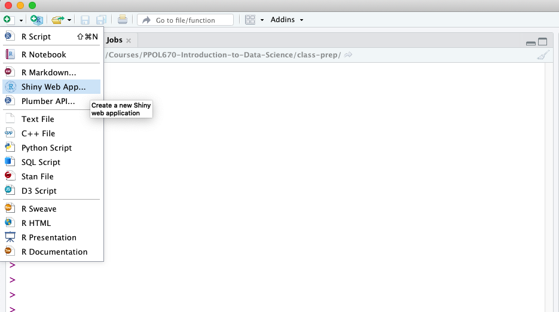

---

![:space 25]

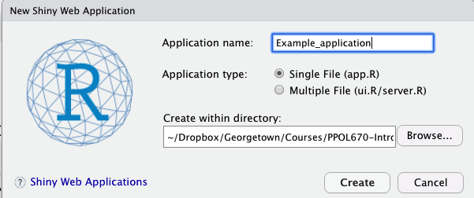

---

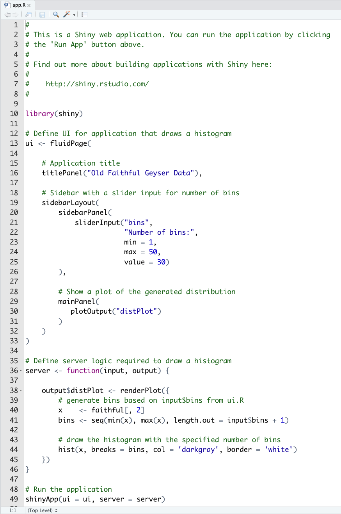

---

![:space 40]

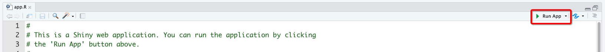

---

![:space 25]

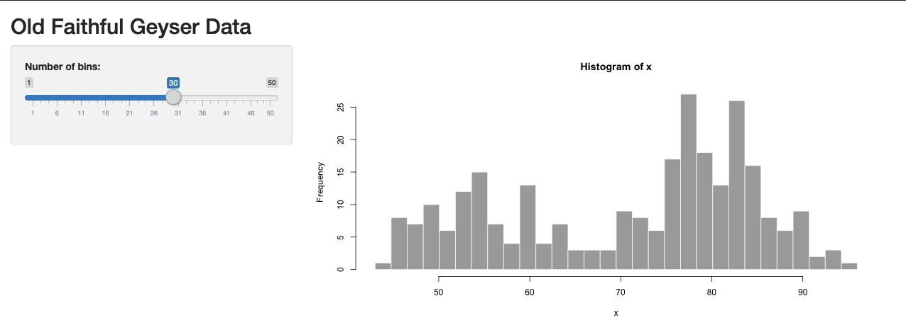

---

![:space 10]

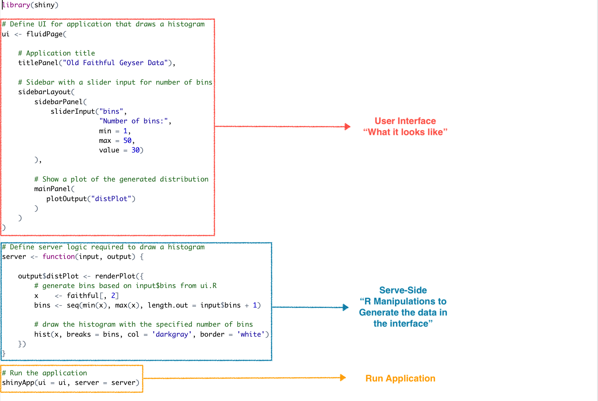

---

### User Interface

```{r,eval=FALSE}
ui <- fluidPage(

    # Application title
    titlePanel("Old Faithful Geyser Data"),

    # Sidebar with a slider input for number of bins
    sidebarLayout(
        sidebarPanel(
            sliderInput("bins",
                        "Number of bins:",
                        min = 1,
                        max = 50,
                        value = 30)
        ),

        # Show a plot of the generated distribution
        mainPanel(
           plotOutput("distPlot")
        )
    )
)
```


---

### Server

![:space 10]

```{r,eval=FALSE}
# Define server logic required to draw a histogram
server <- function(input, output) {

    output$distPlot <- renderPlot({
        # generate bins based on input$bins from ui.R
        x    <- faithful[, 2]
        bins <- seq(min(x), max(x), length.out = input$bins + 1)

        # draw the histogram with the specified number of bins
        hist(x, breaks = bins, col = 'darkgray', border = 'white')
    })
}

```

---

### Run Application

![:space 25]

```{r,eval=F}
shinyApp(ui = ui, server = server)
```


---

### Reactivity:  

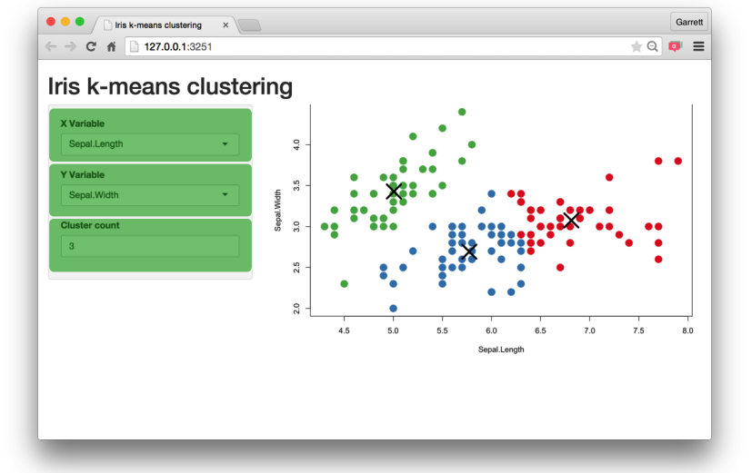

---

### Reactivity:  Types

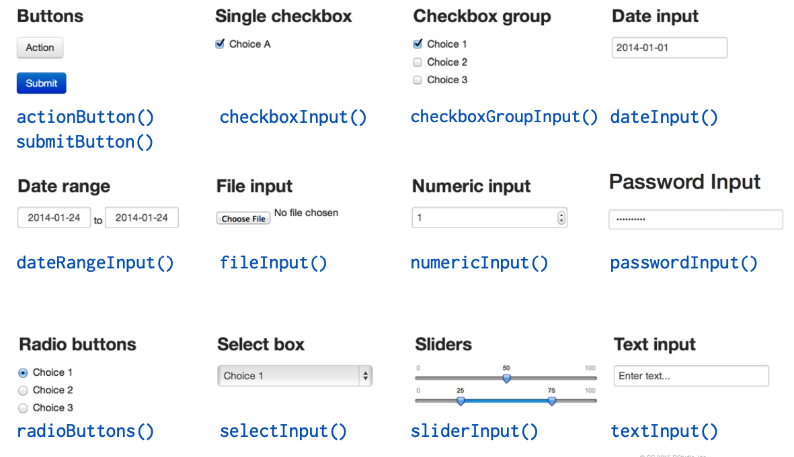

---

### Reactivity:  Syntax

![:space 10]

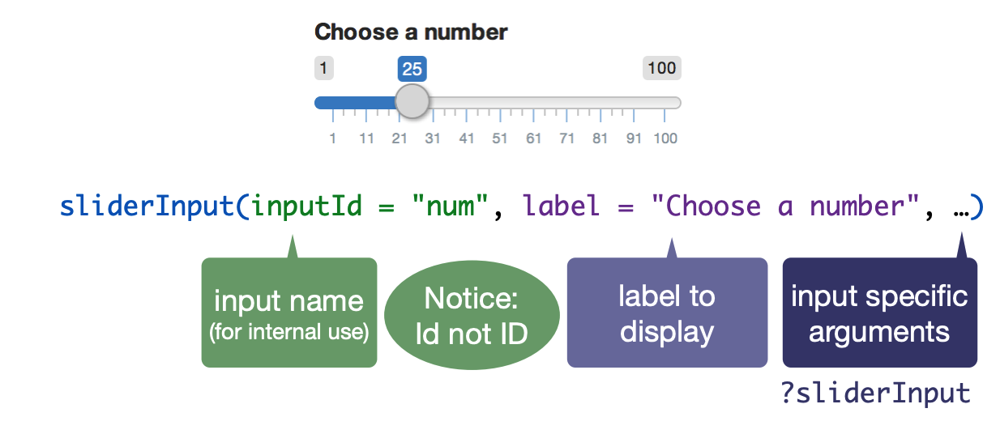

---

### Reactivity:  and 

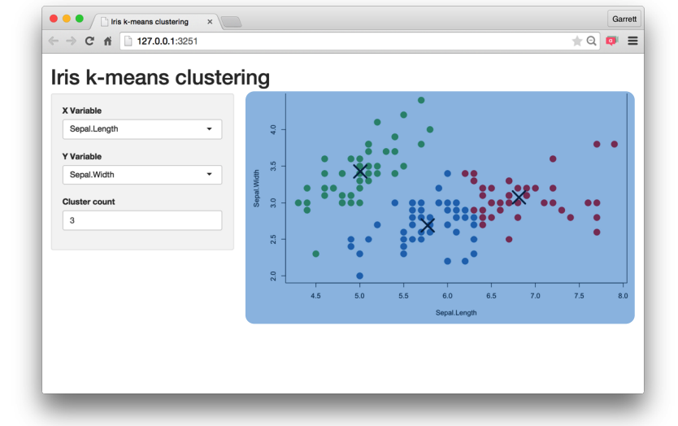

---

### Reactivity:  Types

![:space 10]

.center[
|Function| Inserts|
|---------|------------|
| `dataTableOutput()` | an interactive table |
| `htmlOutput()` | raw HTML |
| `imageOutput()` | image |
| `plotOutput()` | plot |
| `tableOutput()` | table |
| `textOutput()` | text |
| `uiOutput()` | a Shiny UI element |
| `verbatimTextOutput()` | a Shiny UI element |
]

---

![:space 4]

```{r,highlight=T,eval=FALSE}
ui <- fluidPage(

    # Application title
    titlePanel("Old Faithful Geyser Data"),

    # Sidebar with a slider input for number of bins
    sidebarLayout(
        sidebarPanel(
            sliderInput("bins",
                        "Number of bins:",
                        min = 1,
                        max = 50,
                        value = 30)
        ),

        # Show a plot of the generated distribution
        mainPanel(
           plotOutput("distPlot") #<<
        )
    )
)
```

---

![:space 15]

```{r,highlight=T,eval=FALSE}
# Define server logic required to draw a histogram
server <- function(input, output) {

    output$distPlot <- #<<
      renderPlot({ 
        # generate bins based on input$bins from ui.R
        x    <- faithful[, 2]
        bins <- seq(min(x), max(x), length.out = input$bins + 1)
        
        # draw the histogram with the specified number of bins
        hist(x, breaks = bins, col = 'darkgray', border = 'white')
      }) 
}

```

---

### Telling the server what to render

![:space 5]

```{r,highlight=T,eval=FALSE}
# Define server logic required to draw a histogram
server <- function(input, output) {

    output$distPlot <- 
      renderPlot({ #<<
        # generate bins based on input$bins from ui.R
        x    <- faithful[, 2]
        bins <- seq(min(x), max(x), length.out = input$bins + 1)
        
        # draw the histogram with the specified number of bins
        hist(x, breaks = bins, col = 'darkgray', border = 'white')
      }) 
}

```

---

### Telling the server what to render

1. Save objects to display to `output$`

```r
server <- function(input,output){
    output$hist <- # code
}
```
.center[
**&darr;**
]
```r
plotOuput("hist")
```

---

### Telling the server what to render

1. Save objects to display to `output$`

2. Build objects to display with `render<Verb>()`

```r
server <- function(input,output){
    output$hist <- renderPlot({
        # Code
    })
}
```

---

### Telling the server what to render

1. Save objects to display to `output$`

2. Build objects to display with `render<Verb>()`

.center[
| Function | Generates | 
|-------------|-----------------|
| `renderDataTable()` | An interactive table |
| `renderImage()` | An image |
| `renderPlot()` | A Plot |
| `renderPrint()` | A code block of printed output |
| `renderTable()` | A table |
| `renderText()` | A character string |
| `renderUI()` | A Shiny UI Element |
]

---

### Telling the server what to render

1. Save objects to display to `output$`

2. Build objects to display with `render<Verb>()`

3. Access Input values with `input$`

```{r,highlight=T,eval=FALSE}
server <- function(input,output){
    output$hist <- renderPlot({
        hist(rnorm(input$num)) #<<
    })
}
```

---

### Telling the server what to render

1. Save objects to display to `output$`

2. Build objects to display with `render<Verb>()`

3. Access Input values with `input$`

<br>


---

### Telling the server what to render

1. Save objects to display to `output$`

2. Build objects to display with `render<Verb>()`

3. Access Input values with `input$`

  - Input values automatically change when the user changes the input

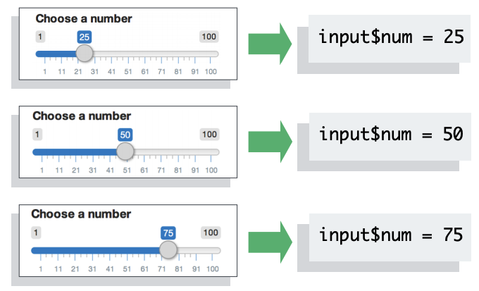

---

class: newsection

# Ethics

---

![:space 15]

.center[
**What are some ethical issues surrounding  the use of data?**
Provide Examples.
]

--

<br> <br> 

.center[
**For the causal user of data (e.g. an analyst) is data ethics an issue?** <br><br> Or is are ethical concerns more of a "large companies" issue?
]

---

### "Good" Data Science

As data becomes more prominent, a common set of **ethics standards** and practices are beginning to emerge. 

 - [Association for Computing Machinery's Committee on Professional Ethics](https://ethics.acm.org/code-of-ethics/)
 
 - [American Statistical Association](https://www.amstat.org//ASA/Your-Career/Ethical-Guidelines-for-Statistical-Practice.aspx)
 
 - [UK Data Ethics Framework](https://www.gov.uk/government/publications/data-ethics-framework/data-ethics-framework)

--
 
<br>
 
Along with tougher **regulations** regarding data usage and management.

 - [General Data Protection Regulation (GDPR)](https://eugdpr.org/)

 - [California Consumer Privacy Act](https://hbr.org/2018/07/what-you-need-to-know-about-californias-new-data-privacy-law)


---

### Ethical Checklist for Data Projects

- Have we listed how this technology can be attacked or abused? 
- Have we tested our training data to ensure it is fair and representative? 
- Have we studied and understood possible sources of bias in our data?
- Does our team reflect diversity of opinions, backgrounds, and kinds of thought? 
- What kind of user consent do we need to collect to use the data? 
- Do we have a mechanism for gathering consent from users? 
- ave we explained clearly what users are consenting to?
- Do we have a mechanism for redress if people are harmed by the results? 
- Can we shut down this software in production if it is behaving badly? 
- Have we tested for fairness with respect to different user groups? 
- Have we tested for disparate error rates among different user groups? 
- Do we test and monitor for model drift to ensure our software remains fair over time? 
- Do we have a plan to protect and secure user data?

---

# The Five Cs

![:space 5]

.center[
### Consent
]


--

.center[
### Clarity
]

--

.center[
### Consistency & Trust
]

--

.center[
### Control and Transparency
]

--

.center[
### Consequences
]

---

### Building Ethics into a Data-Driven Culture
<br>
- An individual needs to be empowered to stop the process before damage is done.

- Anyone should be able to escalate issues for remediation without fear of retaliation.

- An ethical challenge should be part of the hiring process.

- Product reviews must ask questions about the product’s impact.

- Teams must reflect diversity of thought, experiences, race, and background.

- Corporations must make their own principles clear.

---

.center[
## [Case Study: "Optimizing Schools"](https://aiethics.princeton.edu/wp-content/uploads/sites/587/2018/10/Princeton-AI-Ethics-Case-Study-3.pdf)
]

```{r,echo=F,fig.align="center",fig.width=9,fig.height=7}
set.seed(321)
read_csv(here::here("Students/Class_Roster_Spring_2019.csv")) %>% 
  select(`Student Name`) %>% 
  sample_frac(1) %>% 
  mutate(group = rep(1:5,5)) %>% 
  arrange(group) %>% 
  ggplot(aes(x=200*group,y=10*group,color=factor(group))) +
  geom_point(size=3) +
  ggrepel::geom_label_repel(size=6,aes(label=`Student Name`),
                            point.padding = unit(5, "mm"),
                            direction = "y",
                            nudge_x = .5) +
  ylim(0,60) + #xlim(-5,10) +
  theme_void() +
  ggthemes::scale_color_gdocs() +
  theme(legend.position = "none") 
```

